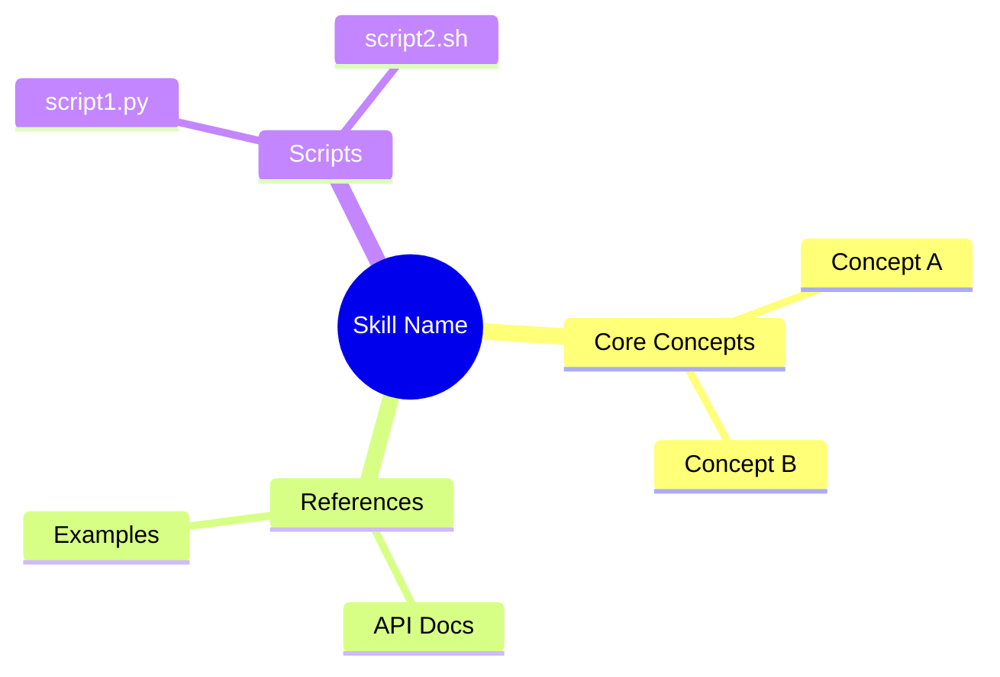
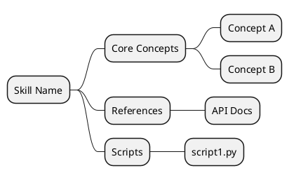
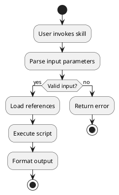
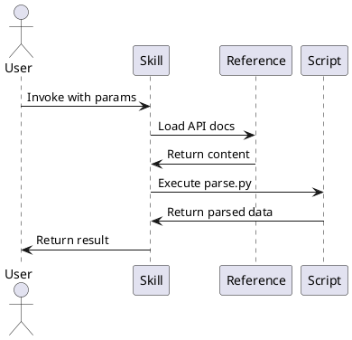

# Skill Debugger: Analysis & Visualization Features Implementation Plan

**Created**: 2025-11-18
**Status**: Approved - Ready for Implementation
**Timeline**: 30 days (6 weeks sequential, ~4 weeks parallel)

---

## 📋 Executive Summary

This document outlines the implementation plan for **four major features** that will transform Skill Debugger into a comprehensive skill analysis and visualization tool:

1. **Feature 021: Skill Evaluation & PDA Analysis** (12 days) - PRIORITY 1
2. **Feature 022: Mind Map Generation** (8 days)
3. **Feature 023: Use Case Analysis Diagrams** (10 days)
4. **Feature 024: Dependency Report** (NEW - 3-4 days)

All features share a common **async, non-blocking architecture** with Claude CLI/OpenCode CLI fallback for intelligent analysis.

---

## 🎯 Key Architectural Decisions

### ✅ Async Analysis with Polling (User-Defined)

**User Flow**:

1. User selects skill from list
2. User clicks "🔍 Analyze" button
3. Analysis starts in background (Rust async task)
4. Frontend polls every 2 seconds for updates
5. User can navigate away (non-blocking)
6. User can start multiple analyses concurrently
7. Results appear as they complete

**Benefits**:

- No UI freezing
- Parallel analysis of multiple skills
- Results stream in progressively

### ✅ CLI Fallback Chain

**Detection Order**:

1. Try `claude` CLI (primary)
2. Fall back to `opencode` CLI if not found
3. Show installation guide if both unavailable

**Graceful Degradation**:

- App remains fully functional
- Features disabled with clear messaging
- Installation instructions provided

### ✅ Dual Diagram Format Support

**Formats**:

- **Mermaid**: Default (consistent with Feature 016)
- **PlantUML**: Advanced diagrams (requires Java)

**UI**:

- Toggle button to switch between formats
- User preference saved per skill type

### ✅ Per-Skill Analysis (No Batch Mode)

**Scope**:

- Analyze skills individually as user selects
- Can trigger multiple analyses concurrently
- Results cached (24-hour TTL)

---

## 🏗️ Technical Architecture

### Backend: Async Task Pipeline (Rust)

```rust
// New file: src-tauri/src/commands/skill_analysis.rs

#[tauri::command]
pub async fn start_skill_analysis(skill_path: String) -> Result<String, String> {
    let analysis_id = Uuid::new_v4().to_string();

    // Spawn background task
    tokio::spawn(async move {
        let result = run_full_analysis(&skill_path).await;
        ANALYSIS_CACHE.lock().unwrap().insert(analysis_id.clone(), result);
    });

    Ok(analysis_id)  // Return immediately
}

#[tauri::command]
pub fn poll_analysis_status(analysis_id: String) -> AnalysisStatus {
    let cache = ANALYSIS_CACHE.lock().unwrap();

    if let Some(result) = cache.get(&analysis_id) {
        AnalysisStatus::Complete(result.clone())
    } else {
        AnalysisStatus::InProgress
    }
}

async fn run_full_analysis(skill_path: &str) -> SkillAnalysisResult {
    // 1. Spec validation (local, fast)
    let spec_compliance = validate_spec_compliance(skill_path)?;

    // 2. PDA analysis (Claude/OpenCode CLI - 10-20s)
    let pda_analysis = analyze_pda_with_cli_fallback(skill_path).await?;

    // 3. Mind map generation (Claude + Mermaid/PlantUML - 10-15s)
    let mind_maps = generate_mind_maps(skill_path).await?;

    // 4. Use case extraction (Claude + diagrams - 15-20s)
    let use_case_analysis = analyze_use_cases(skill_path).await?;

    // 5. Dependency analysis (NEW - local scan - 2-5s)
    let dependencies = analyze_dependencies(skill_path)?;

    SkillAnalysisResult {
        spec_compliance,
        pda_analysis,
        mind_maps,
        use_case_analysis,
        dependencies,
        timestamp: Utc::now(),
    }
}

async fn analyze_pda_with_cli_fallback(skill_path: &str) -> Result<PDAAnalysis> {
    // Try claude first
    if let Ok(result) = call_claude_cli(skill_path).await {
        return Ok(result);
    }

    // Fall back to opencode
    if let Ok(result) = call_opencode_cli(skill_path).await {
        return Ok(result);
    }

    // Both failed
    Err("Claude Code CLI not found. Install from: https://claude.ai/download")
}
```

### Frontend: Polling UI (React)

```tsx
// New component: src/components/AnalysisPanel.tsx

export const AnalysisPanel: React.FC<{ skill: Skill }> = ({ skill }) => {
  const [analysisId, setAnalysisId] = useState<string | null>(null);
  const [status, setStatus] = useState<'idle' | 'running' | 'complete'>('idle');
  const [results, setResults] = useState<SkillAnalysisResult | null>(null);

  const startAnalysis = async () => {
    setStatus('running');
    const id = await invoke<string>('start_skill_analysis', {
      skillPath: skill.path,
    });
    setAnalysisId(id);
  };

  useEffect(() => {
    if (status !== 'running' || !analysisId) return;

    const interval = setInterval(async () => {
      const pollResult = await invoke<AnalysisStatus>('poll_analysis_status', {
        analysisId,
      });

      if (pollResult.status === 'complete') {
        setResults(pollResult.data);
        setStatus('complete');
        clearInterval(interval);
      }
    }, 2000); // Poll every 2 seconds

    return () => clearInterval(interval);
  }, [status, analysisId]);

  return (
    <div className="p-6">
      {status === 'idle' && (
        <Button onClick={startAnalysis} className="btn-primary">
          🔍 Analyze Skill
        </Button>
      )}

      {status === 'running' && (
        <div className="flex items-center gap-3">
          <Spinner className="animate-spin" />
          <div>
            <p className="font-semibold">Analyzing skill...</p>
            <p className="text-sm text-gray-600">This may take 30-60 seconds</p>
          </div>
        </div>
      )}

      {status === 'complete' && results && (
        <Tabs>
          <TabPanel name="Evaluation">
            <EvaluationTab data={results.pda_analysis} />
          </TabPanel>
          <TabPanel name="Mind Map">
            <MindMapTab data={results.mind_maps} />
          </TabPanel>
          <TabPanel name="Use Cases">
            <UseCasesTab data={results.use_case_analysis} />
          </TabPanel>
          <TabPanel name="Dependencies">
            <DependenciesTab data={results.dependencies} />
          </TabPanel>
        </Tabs>
      )}
    </div>
  );
};
```

---

## 📊 Feature 021: Skill Evaluation & PDA Analysis

### Overview

Evaluates skills against the Anthropic Skills Specification and Progressive Disclosure Architecture (PDA) principles, providing actionable recommendations for improvement.

### User Stories

**US-021-001: Spec Compliance Validation** (Priority: P1)

_As a skill author, I want to know if my skill.md follows the Anthropic Skills Specification, so I can fix structural issues before publishing._

**Acceptance Scenarios**:

1. ✅ Missing `name` field → Error with fix guidance
2. ✅ Name mismatch (directory vs YAML) → Warning shown
3. ✅ Valid structure → Green checkmark displayed

---

**US-021-002: PDA Score & Recommendations** (Priority: P1)

_As a skill author, I want a PDA optimization score (0-100) with actionable recommendations, so I can improve token efficiency._

**Acceptance Scenarios**:

1. ✅ SKILL.md >5000 words → "Split into references/" recommendation
2. ✅ No references directory → "Extract detailed docs" recommendation
3. ✅ Optimal PDA (90+ score) → "Well optimized" badge

---

**US-021-003: Permissions Review** (Priority: P2)

_As a skill author, I want to review `allowed-tools` configuration, so I can follow principle of least privilege._

**Acceptance Scenarios**:

1. ✅ `allowed-tools: ["*"]` → Security warning
2. ✅ Skill uses Bash but not listed → Recommendation to add
3. ✅ Minimal permissions → "Secure" badge

---

**US-021-004: Trigger Analysis** (Priority: P2)

_As a skill author, I want analysis of when my skill activates, so I can optimize SKILLS.md entries._

**Acceptance Scenarios**:

1. ✅ Description mentions "PDF" → Suggest triggers: "pdf", "form"
2. ✅ Vague description → Recommendation to add keywords
3. ✅ Optimal triggers → List with confidence scores

### Implementation Phases

#### Phase 1: Spec Validation (Days 1-2)

**Tasks**:

- [ ] Parse YAML frontmatter validation
- [ ] Check required fields (`name`, `description`)
- [ ] Validate name matches directory name
- [ ] Generate validation report with fix guidance
- [ ] Write unit tests (>80% coverage)

**Deliverables**:

- `src-tauri/src/utils/spec_validator.rs`
- Unit tests in same file
- `SpecCompliance` data model

---

#### Phase 2: Claude/OpenCode CLI Integration (Days 3-5)

**Tasks**:

- [ ] Implement `call_claude_cli()` with timeout (30s)
- [ ] Implement `call_opencode_cli()` fallback
- [ ] Parse JSON responses with error handling
- [ ] Add CLI detection + installation guide UI
- [ ] Write integration tests

**CLI Command Example**:

```bash
claude -p "Analyze this skill for PDA..." \
  --output-format json \
  --tools "" \
  --model sonnet
```

**Deliverables**:

- `src-tauri/src/utils/cli_executor.rs`
- Error handling for timeouts/failures
- Integration tests

---

#### Phase 3: PDA Scoring Engine (Days 6-8)

**Tasks**:

- [ ] Calculate token estimates (word count × 5)
- [ ] Analyze reference file structure
- [ ] Generate split recommendations
- [ ] Create PDA rubric (0-100 score)
- [ ] Test with 10+ real skills

**Scoring Formula**:

```
PDA Score =
  (30 × SKILL.md_size_score) +
  (25 × references_structure_score) +
  (20 × lazy_loading_score) +
  (15 × metadata_quality_score) +
  (10 × token_efficiency_score)

Where each sub-score is 0-100
```

**Deliverables**:

- `src-tauri/src/analyzers/pda_scorer.rs`
- Recommendation generator
- Unit tests for scoring logic

---

#### Phase 4: Permissions & Triggers (Days 9-10)

**Tasks**:

- [ ] Parse `allowed-tools` from frontmatter
- [ ] Detect security anti-patterns (`["*"]`)
- [ ] Extract keywords from description/content
- [ ] Generate trigger suggestions with confidence
- [ ] Check reference linking patterns

**Detection Patterns**:

```rust
// Security warnings
if allowed_tools.contains(&"*".to_string()) {
    warnings.push("Overly permissive - use specific tools");
}

// Missing tools
if content.contains("Bash(") && !allowed_tools.contains(&"Bash") {
    recommendations.push("Add 'Bash' to allowed-tools");
}
```

**Deliverables**:

- `src-tauri/src/analyzers/permissions_analyzer.rs`
- `src-tauri/src/analyzers/trigger_analyzer.rs`
- Unit tests

---

#### Phase 5: Frontend UI (Days 11-12)

**Tasks**:

- [ ] Create EvaluationTab component
- [ ] Design score cards (spec, PDA, permissions)
- [ ] Add progress indicators
- [ ] Add error states with actionable messages
- [ ] Write component tests (>80% coverage)

**UI Layout**:

```
┌─────────────────────────────────────────┐
│ 📋 Spec Compliance            ✅ PASS   │
│ • name: ✅ Valid                        │
│ • description: ✅ Valid                 │
│ • frontmatter: ✅ Valid                 │
├─────────────────────────────────────────┤
│ 🎯 PDA Score: 85/100          🟢        │
│                                         │
│ Recommendations:                        │
│ • Split API docs → references/api.md   │
│ • Extract examples → references/ex.md  │
├─────────────────────────────────────────┤
│ 🔒 Permissions Review         ⚠️ WARN  │
│ • allowed-tools: Bash, Read, Edit      │
│ • Warning: Consider restricting Bash   │
├─────────────────────────────────────────┤
│ 🏷️ Trigger Suggestions                 │
│ • "pdf" (confidence: 0.95)             │
│ • "form" (confidence: 0.82)            │
│ • "document" (confidence: 0.78)        │
└─────────────────────────────────────────┘
```

**Deliverables**:

- `src/components/analysis/EvaluationTab.tsx`
- Score card components
- Unit + integration tests

### Success Criteria

- [ ] **SC-021-001**: Spec validation <2s per skill
- [ ] **SC-021-002**: PDA scores 90%+ accurate vs manual review
- [ ] **SC-021-003**: Claude CLI calls <5% error rate
- [ ] **SC-021-004**: Trigger suggestions 80%+ relevant (user feedback)
- [ ] **SC-021-005**: >80% test coverage

---

## 🧠 Feature 022: Mind Map Generation

### Overview

Generates interactive mind maps showing all concepts, references, and scripts covered by a skill using Mermaid or PlantUML.

### User Stories

**US-022-001: Concept Extraction** (Priority: P1)

_As a user, I want to see a mind map of all concepts covered by a skill, so I can quickly understand its scope._

**Acceptance Scenarios**:

1. ✅ PDF skill → Branches: Forms, Extraction, Annotations, API
2. ✅ Includes concepts from SKILL.md + references
3. ✅ Shows "Tools" branch with script names

---

**US-022-002: Interactive Exploration** (Priority: P2)

_As a user, I want to click on mind map nodes to navigate to relevant sections, so I can explore concepts interactively._

**Acceptance Scenarios**:

1. ✅ Click "API Documentation" → Jump to reference
2. ✅ Click "Script: parse.py" → Open Scripts tab
3. ✅ Zoom/pan controls work (Feature 016)

### Implementation Phases

#### Phase 1: Concept Extraction (Days 1-2)

**Tasks**:

- [ ] Call Claude/OpenCode to extract concepts
- [ ] Parse skill content + references
- [ ] Generate hierarchical concept tree
- [ ] Handle edge cases (empty skills, large files)

**Claude Prompt**:

```
Analyze this skill and extract key concepts as a hierarchical tree.

Skill: [name]
Content: [SKILL.md]
References: [list]

Output JSON:
{
  "root": "Skill Name",
  "branches": [
    {
      "category": "Core Concepts",
      "items": ["Concept A", "Concept B", ...]
    },
    ...
  ]
}
```

**Deliverables**:

- `src-tauri/src/generators/concept_extractor.rs`
- `ConceptTree` data model
- Unit tests

---

#### Phase 2: Diagram Generation (Days 3-5)

**Tasks**:

- [ ] Generate Mermaid mind map syntax
- [ ] Generate PlantUML mind map syntax
- [ ] Add format toggle UI
- [ ] Reuse `mermaid_renderer.rs` for SVG

**Mermaid Syntax**:



**PlantUML Syntax**:



**Deliverables**:

- `src-tauri/src/generators/mindmap_generator.rs`
- Mermaid generator function
- PlantUML generator function
- Unit tests

---

#### Phase 3: PlantUML Integration (Days 6-7)

**Tasks**:

- [ ] Implement `render_plantuml_to_svg()` (similar to `mermaid_renderer.rs`)
- [ ] Handle Java/PlantUML CLI errors
- [ ] Add fallback to Mermaid if PlantUML fails

**PlantUML CLI Command**:

```bash
plantuml -tsvg input.puml -o /tmp/output/
```

**Deliverables**:

- `src-tauri/src/renderers/plantuml_renderer.rs`
- Error handling for missing Java/PlantUML
- Integration tests

---

#### Phase 4: Frontend + Testing (Day 8)

**Tasks**:

- [ ] Create MindMapTab component
- [ ] Reuse InteractiveDiagram (zoom/pan from Feature 016)
- [ ] Add format selector dropdown
- [ ] Write component tests

**UI Layout**:

```
┌─────────────────────────────────────────┐
│ Mind Map                                │
│                                         │
│ Format: [Mermaid ▼]  [🔄 Regenerate]   │
├─────────────────────────────────────────┤
│                                         │
│        [Interactive Mind Map SVG]       │
│        (zoom/pan controls from F016)    │
│                                         │
└─────────────────────────────────────────┘
```

**Deliverables**:

- `src/components/analysis/MindMapTab.tsx`
- Format selector component
- Integration with InteractiveDiagram
- E2E tests

### Success Criteria

- [ ] **SC-022-001**: Mind maps generated <15s per skill
- [ ] **SC-022-002**: Both Mermaid and PlantUML work
- [ ] **SC-022-003**: Zoom/pan controls functional
- [ ] **SC-022-004**: Concepts extracted with >85% accuracy

---

## 🔄 Feature 023: Use Case Analysis Diagrams

### Overview

Identifies skill use cases and generates activity/sequence diagrams showing invocation flows and component interactions.

### User Stories

**US-023-001: Use Case Identification** (Priority: P1)

_As a user, I want to see all use cases a skill supports, so I can understand when to invoke it._

**Acceptance Scenarios**:

1. ✅ PDF skill → Use cases: "Fill Forms", "Extract Text", "Merge PDFs"
2. ✅ Extracts from examples sections
3. ✅ Infers from script purposes

---

**US-023-002: Activity Diagrams** (Priority: P1)

_As a user, I want activity diagrams showing skill invocation flow, so I can understand the execution sequence._

**Acceptance Scenarios**:

1. ✅ Shows: Start → Parse Input → Execute Script → Return Result
2. ✅ Decision nodes for branches (if/else)
3. ✅ Loop constructs shown

---

**US-023-003: Sequence Diagrams** (Priority: P2)

_As a user, I want sequence diagrams showing interactions between skill components, so I can understand data flow._

**Acceptance Scenarios**:

1. ✅ Shows: User → Skill → Reference → File
2. ✅ Shows: Skill → Script → External Tool
3. ✅ Error paths included

### Implementation Phases

#### Phase 1: Use Case Extraction (Days 1-3)

**Tasks**:

- [ ] Analyze skill content for use cases
- [ ] Extract from examples/scripts
- [ ] Identify input/output patterns
- [ ] Generate use case list with confidence

**Claude Prompt**:

```
Analyze this skill and identify all supported use cases.

Skill: [name]
Content: [text]
Scripts: [list]

For each use case:
1. Name (e.g. "Fill PDF Form")
2. Description
3. Input parameters
4. Execution steps
5. Output format

Output as JSON array.
```

**Deliverables**:

- `src-tauri/src/analyzers/usecase_extractor.rs`
- `UseCase` data model
- Unit tests

---

#### Phase 2: Activity Diagrams (Days 4-6)

**Tasks**:

- [ ] Generate PlantUML activity diagram per use case
- [ ] Show decision nodes (if/else)
- [ ] Show loops and error paths
- [ ] Render to SVG

**PlantUML Activity Diagram**:



**Deliverables**:

- `src-tauri/src/generators/activity_diagram_generator.rs`
- Activity diagram renderer
- Unit tests

---

#### Phase 3: Sequence Diagrams (Days 7-9)

**Tasks**:

- [ ] Generate PlantUML sequence diagrams
- [ ] Show skill → reference → script interactions
- [ ] Add error handling flows
- [ ] Render to SVG

**PlantUML Sequence Diagram**:



**Deliverables**:

- `src-tauri/src/generators/sequence_diagram_generator.rs`
- Sequence diagram renderer
- Unit tests

---

#### Phase 4: UI + Testing (Day 10)

**Tasks**:

- [ ] Create UseCasesTab component
- [ ] Grid layout (activity + sequence side-by-side)
- [ ] Multi-use-case support
- [ ] Write tests

**UI Layout**:

```
┌─────────────────────────────────────────┐
│ Use Cases                               │
├─────────────────────────────────────────┤
│ 📋 Use Case 1: Fill PDF Form           │
│                                         │
│ ┌──────────────┐ ┌──────────────┐     │
│ │  Activity    │ │  Sequence    │     │
│ │  Diagram     │ │  Diagram     │     │
│ │   (SVG)      │ │   (SVG)      │     │
│ └──────────────┘ └──────────────┘     │
├─────────────────────────────────────────┤
│ 📋 Use Case 2: Extract Text            │
│ ...                                     │
└─────────────────────────────────────────┘
```

**Deliverables**:

- `src/components/analysis/UseCasesTab.tsx`
- Grid layout component
- E2E tests

### Success Criteria

- [ ] **SC-023-001**: Use cases extracted with >80% accuracy
- [ ] **SC-023-002**: Activity diagrams render correctly
- [ ] **SC-023-003**: Sequence diagrams show interactions
- [ ] **SC-023-004**: Multiple use cases per skill supported

---

## 🔗 Feature 024: Dependency Report (NEW)

### Overview

Analyzes and reports all dependencies for a skill, including other skills, CLIs, hooks, MCP servers, APIs, auth tokens, and agents. Distinguishes between hard (required) and soft (optional) dependencies.

### User Stories

**US-024-001: Dependency Detection** (Priority: P1)

_As a skill author, I want to see all dependencies my skill requires, so I can document them properly._

**Acceptance Scenarios**:

1. ✅ Skill references "use mermaid skill" → Detects soft dependency on mermaid
2. ✅ Skill has `Bash(plantuml:*)` → Detects hard dependency on PlantUML CLI
3. ✅ Skill calls GitHub API → Detects API + auth token dependency

---

**US-024-002: Hard vs Soft Dependencies** (Priority: P1)

_As a user, I want to know which dependencies are required vs optional, so I can install only what's necessary._

**Acceptance Scenarios**:

1. ✅ "MUST have plantuml" → Hard dependency
2. ✅ "use mermaid if available" → Soft dependency
3. ✅ Clear visual distinction (🔴 vs 🟡)

### Dependency Types

#### 1. Other Skills

**Detection**:

- Search for "use the [skill-name] skill"
- Search for "invoke [skill-name]"
- Parse references to `~/.claude/skills/[name]`

**Classification**:

- Hard: "MUST use", "requires", "depends on"
- Soft: "can use", "if available", "optionally use"

---

#### 2. Commands/CLIs

**Detection**:

- Parse `Bash(command:*)` from allowed-tools
- Search for CLI commands in scripts (e.g., `plantuml`, `gh`, `npm`)
- Check for system requirements in content

**Classification**:

- Hard: Used in core workflow
- Soft: Used for optional features

---

#### 3. Hooks

**Detection**:

- Search for hook references: "pre-commit", "post-checkout"
- Check for `.git/hooks` mentions
- Parse hook configuration

**Classification**:

- Hard: Workflow depends on hook
- Soft: Hook enhances workflow

---

#### 4. MCP Servers

**Detection**:

- Parse `mcp__[server]__[function]` patterns
- Search for MCP server names: "github", "filesystem", "notion"
- Check for server configuration references

**Classification**:

- Hard: Core feature requires server
- Soft: Optional enhancement

---

#### 5. REST APIs

**Detection**:

- Search for API endpoints: `https://api.github.com`, `https://api.notion.com`
- Parse `curl` commands
- Check for HTTP client usage

**Classification**:

- Hard: Skill purpose requires API
- Soft: Optional integration

---

#### 6. Auth Tokens/Keys

**Detection**:

- Search for environment variable references: `$GITHUB_TOKEN`, `$NOTION_TOKEN`
- Check for `.env` file mentions
- Parse authentication instructions

**Classification**:

- Hard: API requires authentication
- Soft: Enhances functionality

---

#### 7. Agents

**Detection**:

- Search for agent references: "code-quality-reviewer", "architect-grader"
- Parse task delegation patterns
- Check for agent invocation syntax

**Classification**:

- Hard: Workflow delegates to agent
- Soft: Optional enhancement

### Implementation Phases

#### Phase 1: Dependency Scanner (Days 1-2)

**Tasks**:

- [ ] Scan skill content for dependency patterns
- [ ] Parse scripts for CLI usage
- [ ] Detect MCP server calls
- [ ] Extract API endpoints
- [ ] Write unit tests

**Scanner Algorithm**:

```rust
fn scan_dependencies(skill: &Skill) -> DependencyReport {
    let mut deps = DependencyReport::new();

    // Scan content
    deps.skills = detect_skill_dependencies(&skill.content);
    deps.clis = detect_cli_dependencies(&skill.content, &skill.scripts);
    deps.hooks = detect_hook_dependencies(&skill.content);
    deps.mcp_servers = detect_mcp_dependencies(&skill.content);
    deps.apis = detect_api_dependencies(&skill.content);
    deps.auth_tokens = detect_auth_dependencies(&skill.content);
    deps.agents = detect_agent_dependencies(&skill.content);

    deps
}
```

**Deliverables**:

- `src-tauri/src/analyzers/dependency_scanner.rs`
- `DependencyReport` data model
- Pattern matching functions
- Unit tests

---

#### Phase 2: Hard vs Soft Classification (Day 3)

**Tasks**:

- [ ] Implement keyword-based classification
- [ ] Add confidence scores
- [ ] Handle edge cases
- [ ] Write classification tests

**Classification Rules**:

```rust
enum DependencyType {
    Hard,   // MUST have, requires, depends on
    Soft,   // can use, if available, optionally
}

fn classify_dependency(context: &str) -> (DependencyType, f32) {
    if context.contains("MUST") || context.contains("requires") {
        (DependencyType::Hard, 0.95)
    } else if context.contains("can use") || context.contains("optionally") {
        (DependencyType::Soft, 0.85)
    } else {
        (DependencyType::Soft, 0.60)  // Default to soft with lower confidence
    }
}
```

**Deliverables**:

- Classification function
- Confidence scoring
- Edge case handling
- Unit tests

---

#### Phase 3: Frontend UI (Day 4)

**Tasks**:

- [ ] Create DependenciesTab component
- [ ] Section layout (one per dependency type)
- [ ] Visual distinction (🔴 hard, 🟡 soft)
- [ ] Add installation links
- [ ] Write component tests

**UI Layout**:

```
┌─────────────────────────────────────────┐
│ Dependencies                            │
├─────────────────────────────────────────┤
│ 🎯 Other Skills                         │
│ • 🔴 mermaid (REQUIRED)                 │
│ • 🟡 plantuml (OPTIONAL)                │
├─────────────────────────────────────────┤
│ 🛠️ Commands/CLIs                        │
│ • 🔴 plantuml (REQUIRED) [Install →]    │
│ • 🔴 gh (REQUIRED) [Install →]          │
├─────────────────────────────────────────┤
│ 🪝 Hooks                                 │
│ • 🟡 pre-commit (OPTIONAL)              │
├─────────────────────────────────────────┤
│ 🔌 MCP Servers                          │
│ • 🔴 github (REQUIRED)                  │
│ • 🔴 filesystem (REQUIRED)              │
├─────────────────────────────────────────┤
│ 🌐 REST APIs                            │
│ • 🔴 GitHub API (REQUIRED)              │
│   - Token: GITHUB_TOKEN                 │
├─────────────────────────────────────────┤
│ 🔑 Auth Tokens                          │
│ • 🔴 GITHUB_TOKEN (REQUIRED)            │
│ • 🟡 NOTION_TOKEN (OPTIONAL)            │
├─────────────────────────────────────────┤
│ 🤖 Agents                               │
│ • 🟡 code-quality-reviewer (OPTIONAL)   │
└─────────────────────────────────────────┘
```

**Deliverables**:

- `src/components/analysis/DependenciesTab.tsx`
- Section components
- Installation link helpers
- Unit + integration tests

### Success Criteria

- [ ] **SC-024-001**: Dependency detection >85% accurate
- [ ] **SC-024-002**: Hard/soft classification >80% accurate
- [ ] **SC-024-003**: All dependency types detected
- [ ] **SC-024-004**: Installation links work correctly

---

## 📅 Implementation Roadmap

### Week 1-2: Feature 021 (Evaluation & PDA)

**Days 1-2**: Spec validation + unit tests
**Days 3-5**: Claude/OpenCode CLI integration
**Days 6-8**: PDA scoring engine
**Days 9-10**: Permissions & triggers
**Days 11-12**: Frontend UI + tests

**Milestone**: Evaluation tab functional with PDA scores

---

### Week 3: Feature 022 (Mind Maps)

**Days 1-2**: Concept extraction with Claude
**Days 3-5**: Mermaid + PlantUML generation
**Days 6-7**: PlantUML renderer integration
**Day 8**: Frontend UI + tests

**Milestone**: Mind map tab functional with format toggle

---

### Week 4: Feature 024 (Dependencies) - PRIORITIZED

**Days 1-2**: Dependency scanner implementation
**Day 3**: Hard/soft classification
**Day 4**: Frontend UI + tests

**Milestone**: Dependencies tab shows all dependency types

---

### Week 5-6: Feature 023 (Use Cases)

**Days 1-3**: Use case extraction
**Days 4-6**: Activity diagrams
**Days 7-9**: Sequence diagrams
**Day 10**: Frontend UI + tests

**Milestone**: Use cases tab with activity + sequence diagrams

---

## 🎯 Success Metrics

### Performance

- [ ] Analysis completes <60s per skill
- [ ] UI never blocks (async polling works)
- [ ] Can analyze 5 skills concurrently
- [ ] Cache hit rate >70% (24hr TTL)

### Quality

- [ ] > 80% test coverage (all new code)
- [ ] PDA scores 90%+ accurate
- [ ] Diagrams render successfully >95%
- [ ] Dependency detection >85% accurate

### UX

- [ ] Clear loading states
- [ ] Actionable error messages
- [ ] Results cached appropriately
- [ ] Installation guides helpful

---

## 🚨 Risk Mitigation

### Technical Risks

| Risk                                  | Probability | Impact | Mitigation                                  |
| ------------------------------------- | ----------- | ------ | ------------------------------------------- |
| Claude CLI generates invalid diagrams | Medium      | High   | Add validation step, retry with corrections |
| PlantUML/Mermaid CLI failures         | Low         | Medium | Graceful degradation, show raw code         |
| Performance issues (>60s)             | Medium      | Medium | Add caching, timeout warnings               |
| Test coverage <80%                    | Low         | High   | TDD from day 1, mandatory reviews           |

### Product Risks

| Risk                        | Probability | Impact | Mitigation                                |
| --------------------------- | ----------- | ------ | ----------------------------------------- |
| Users don't have Claude CLI | High        | Medium | Show installation guide, optional feature |
| PDA scores inaccurate       | Medium      | Medium | Calibrate with real skills, feedback loop |
| Mind maps too complex       | Low         | Medium | Add simplification, zoom controls         |
| Dependency detection misses | Medium      | Low    | Manual editing support                    |

---

## 📦 Deliverables Summary

### New Rust Files

- `src-tauri/src/commands/skill_analysis.rs` - Async orchestrator
- `src-tauri/src/analyzers/pda_scorer.rs` - PDA scoring
- `src-tauri/src/analyzers/dependency_scanner.rs` - Dependency detection
- `src-tauri/src/generators/mindmap_generator.rs` - Mind map creation
- `src-tauri/src/generators/activity_diagram_generator.rs` - Activity diagrams
- `src-tauri/src/generators/sequence_diagram_generator.rs` - Sequence diagrams
- `src-tauri/src/renderers/plantuml_renderer.rs` - PlantUML renderer
- `src-tauri/src/utils/cli_executor.rs` - CLI execution utilities
- `src-tauri/src/models/analysis.rs` - Data models

### New React Components

- `src/components/analysis/AnalysisPanel.tsx` - Main panel with button
- `src/components/analysis/EvaluationTab.tsx` - Spec + PDA results
- `src/components/analysis/MindMapTab.tsx` - Mind map viewer
- `src/components/analysis/UseCasesTab.tsx` - Use case diagrams
- `src/components/analysis/DependenciesTab.tsx` - Dependency report

### Modified Files

- `src-tauri/src/lib.rs` - Register new commands
- `src/components/SkillViewer.tsx` - Integrate AnalysisPanel
- `src/types/skill.ts` - Add analysis types

---

## ✅ Next Steps After Approval

1. **Create Feature Branches**

   ```bash
   git checkout main
   git pull
   git checkout -b 021-skill-evaluation
   git checkout -b 022-mind-map-generation
   git checkout -b 023-use-case-diagrams
   git checkout -b 024-dependency-report
   ```

2. **Initialize Feature 021 with SDD**

   ```bash
   /speckit.specify "Feature 021: Skill Evaluation & PDA Analysis..."
   /speckit.plan
   /speckit.tasks
   /speckit.analyze
   /speckit.implement
   ```

3. **Implement with TDD**
   - Write tests before code
   - Maintain >80% coverage
   - Follow tasks.md strictly
   - Mark tasks in real-time

4. **Review & Merge**
   - Create PR when complete
   - Run full test suite
   - Code review
   - Merge to main

---

## 📚 References

- [Anthropic Skills Specification](https://github.com/anthropics/skills/blob/main/agent_skills_spec.md)
- [Tauri Commands Guide](https://tauri.app/develop/calling-rust/)
- [Mermaid Mind Maps](https://mermaid.js.org/syntax/mindmap.html)
- [PlantUML Activity Diagrams](https://plantuml.com/activity-diagram-beta)
- [PlantUML Sequence Diagrams](https://plantuml.com/sequence-diagram)
- Feature 016: Improved UI Layout (diagram patterns)
- Feature 020: Test Backfill (TDD patterns)

---

**Document Version**: 1.0
**Last Updated**: 2025-11-18
**Status**: ✅ Approved - Ready for Implementation
