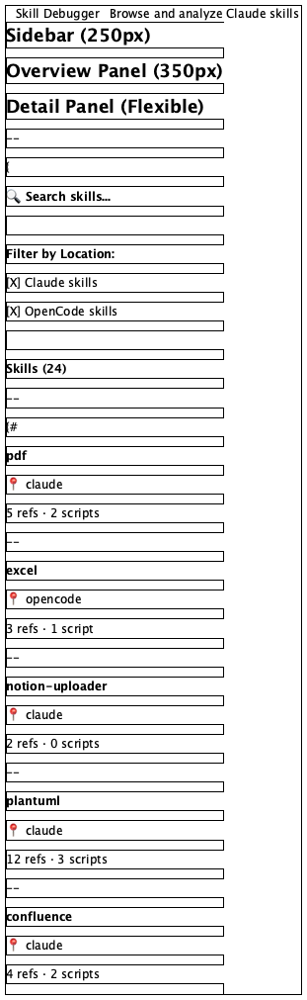
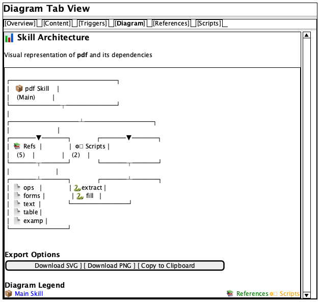

# Skill Debugger UI Specification

## Overview

This document defines the visual design, layout, and user experience for the Skill Debugger desktop application. The goal is to create a professional, scannable, and intuitive interface for browsing and analyzing Claude Code skills.

## Design Principles

### 1. Visual Hierarchy
- **Primary Focus**: Skill name and description should be immediately visible
- **Secondary Focus**: Quick stats (references, scripts, triggers)
- **Tertiary Focus**: Detailed content sections

### 2. Information Density
- **Scannable**: Users should quickly understand a skill at a glance
- **Progressive Disclosure**: Show summaries first, details on demand
- **Whitespace**: Use generous spacing to reduce cognitive load

### 3. Professional Appearance
- **Modern**: Clean, contemporary design language
- **Consistent**: Uniform spacing, typography, and color usage
- **Polished**: Attention to details like shadows, borders, and transitions

### 4. Usability
- **Clear Navigation**: Obvious how to move between skills and views
- **Responsive**: Instant feedback on interactions
- **Accessible**: Good contrast, readable fonts, clear affordances

## Layout Structure

### Three-Column Layout

```
┌─────────────────────────────────────────────────────────────────┐
│ [Sidebar] │ [Skill Overview Panel] │ [Detail Panel]            │
│  250px    │       350px            │     Flexible              │
└─────────────────────────────────────────────────────────────────┘
```

#### Left Sidebar (250px)
- **Purpose**: Skill navigation and filtering
- **Components**:
  - Application branding
  - Search bar
  - Location filter (Claude/OpenCode)
  - Scrollable skill list
  - Skill count indicator

#### Middle Panel - Skill Overview (350px)
- **Purpose**: At-a-glance skill information
- **Components**:
  - Skill header (name, description, location badge)
  - Quick stats cards
  - Trigger keywords preview
  - Action buttons (View Details, Export, etc.)

#### Right Panel - Detail View (Flexible)
- **Purpose**: Deep content display
- **Components**:
  - Tab navigation (Overview, Content, Triggers, Diagram, References, Scripts)
  - Tab content area
  - Collapsible sections

## Component Specifications

### 1. Skill List Item (Sidebar)

**Visual Design**:
- Height: 72px
- Padding: 12px
- Border-bottom: 1px solid #E5E7EB
- Hover: Background #F9FAFB
- Selected: Background #EEF2FF, left border 3px #4F46E5

**Content**:
```
┌──────────────────────────────┐
│ Skill Name                   │
│ 📍 claude                    │
│ 2 refs · 1 script            │
└──────────────────────────────┘
```

**Typography**:
- Skill Name: 14px, font-weight 600, color #111827
- Location: 12px, color #6B7280
- Stats: 11px, color #9CA3AF

### 2. Skill Overview Panel

**Header Section** (80px height):
```
┌────────────────────────────────────┐
│ Skill Name                    ⚙️ ⋮ │
│ Brief one-line description         │
│ 📍 claude  │  Updated: 2 days ago  │
└────────────────────────────────────┘
```

**Quick Stats Cards** (Grid of 2x2, 160px total height):
```
┌─────────────┬─────────────┐
│ 📚 References│ 🔧 Scripts │
│     12      │      3      │
└─────────────┴─────────────┘
┌─────────────┬─────────────┐
│ 🎯 Triggers │ 📏 Lines   │
│     24      │    1,245    │
└─────────────┴─────────────┘
```

**Trigger Preview** (120px height):
```
┌────────────────────────────────────┐
│ Common Triggers:                   │
│ [pdf] [excel] [generate] [convert] │
│ View all 24 triggers →             │
└────────────────────────────────────┘
```

**Action Bar** (48px height):
```
┌────────────────────────────────────┐
│ [View Full Details →] [⋮ More]    │
└────────────────────────────────────┘
```

### 3. Detail Panel - Tab Interface

**Tab Navigation** (48px height):
```
┌────────────────────────────────────────────────────┐
│ [Overview] [Content] [Triggers] [Diagram] [Refs]  │
└────────────────────────────────────────────────────┘
```

**Tab: Overview**

Shows comprehensive skill information in organized cards:

```
┌─────────────────────────────────────┐
│ 📝 Description                      │
│ Detailed multi-line description of  │
│ what this skill does and when to    │
│ use it.                             │
└─────────────────────────────────────┘

┌─────────────────────────────────────┐
│ 🎯 Trigger Keywords (24)            │
│                                     │
│ Actions (6):                        │
│ [create] [generate] [build]...     │
│                                     │
│ Technologies (8):                   │
│ [pdf] [excel] [markdown]...        │
│                                     │
│ Formats (4):                        │
│ [xlsx] [docx] [json]...            │
└─────────────────────────────────────┘

┌─────────────────────────────────────┐
│ 📚 References (12)                  │
│ ┌─────────────────────────────────┐ │
│ │ 📄 reference1.md                │ │
│ │ 📄 reference2.md                │ │
│ │ 📄 reference3.md                │ │
│ │ ... and 9 more                  │ │
│ └─────────────────────────────────┘ │
│ [Expand All →]                      │
└─────────────────────────────────────┘

┌─────────────────────────────────────┐
│ 🔧 Scripts (3)                      │
│ ┌─────────────────────────────────┐ │
│ │ 🐍 setup.py                     │ │
│ │ 📜 convert.sh                   │ │
│ │ 🟦 process.ts                   │ │
│ └─────────────────────────────────┘ │
└─────────────────────────────────────┘
```

**Tab: Content**

```
┌─────────────────────────────────────┐
│ 📄 Skill Documentation              │
│                                     │
│ # Heading 1                         │
│                                     │
│ Rendered markdown content with      │
│ proper syntax highlighting and      │
│ formatting.                         │
│                                     │
│ - Bullet points                     │
│ - Code blocks                       │
│ - Tables                            │
└─────────────────────────────────────┘
```

**Tab: Triggers**

```
┌─────────────────────────────────────┐
│ 🎯 Trigger Keyword Analysis          │
│                                     │
│ These keywords may trigger this     │
│ skill when mentioned in queries:    │
│                                     │
│ ┌───────────────────────────────┐   │
│ │ Action Keywords (6):          │   │
│ │ [create] [generate] [build]   │   │
│ │ [analyze] [convert] [export]  │   │
│ └───────────────────────────────┘   │
│                                     │
│ ┌───────────────────────────────┐   │
│ │ Technology Keywords (8):      │   │
│ │ [pdf] [excel] [word] [ppt]    │   │
│ │ [markdown] [json] [yaml]      │   │
│ └───────────────────────────────┘   │
│                                     │
│ Example Queries:                    │
│ • "create a pdf"                    │
│ • "help me generate excel"          │
│ • "work with pdf"                   │
└─────────────────────────────────────┘
```

**Tab: Diagram**

```
┌─────────────────────────────────────┐
│ 📊 Skill Architecture                │
│                                     │
│ ┌─────────────────────────────────┐ │
│ │                                 │ │
│ │   [Mermaid Diagram Display]     │ │
│ │                                 │ │
│ │   Shows skill relationships     │ │
│ │   with references and scripts   │ │
│ │                                 │ │
│ └─────────────────────────────────┘ │
│                                     │
│ [Download SVG] [Download PNG]       │
└─────────────────────────────────────┘
```

### 4. Color Palette

**Primary Colors**:
- Primary Blue: `#4F46E5` (Indigo-600)
- Primary Hover: `#4338CA` (Indigo-700)

**Background Colors**:
- App Background: `#F9FAFB` (Gray-50)
- Card Background: `#FFFFFF` (White)
- Hover Background: `#F3F4F6` (Gray-100)
- Selected Background: `#EEF2FF` (Indigo-50)

**Text Colors**:
- Primary Text: `#111827` (Gray-900)
- Secondary Text: `#6B7280` (Gray-500)
- Muted Text: `#9CA3AF` (Gray-400)

**Border Colors**:
- Default Border: `#E5E7EB` (Gray-200)
- Hover Border: `#D1D5DB` (Gray-300)
- Focus Border: `#4F46E5` (Indigo-600)

**Badge Colors**:
- Claude Badge: `#8B5CF6` (Purple-500) background, `#FFFFFF` text
- OpenCode Badge: `#10B981` (Green-500) background, `#FFFFFF` text
- Action Keyword: `#3B82F6` (Blue-500) background, `#FFFFFF` text
- Tech Keyword: `#8B5CF6` (Purple-500) background, `#FFFFFF` text
- Format Keyword: `#10B981` (Green-500) background, `#FFFFFF` text

### 5. Typography Scale

**Headings**:
- H1 (Page Title): 24px, font-weight 700, line-height 1.2
- H2 (Section Title): 20px, font-weight 600, line-height 1.3
- H3 (Subsection): 16px, font-weight 600, line-height 1.4

**Body Text**:
- Large: 16px, font-weight 400, line-height 1.6
- Medium: 14px, font-weight 400, line-height 1.5
- Small: 12px, font-weight 400, line-height 1.4

**Code**:
- Inline: 14px, font-family: 'Monaco', 'Courier New', monospace
- Block: 13px, font-family: 'Monaco', 'Courier New', monospace

### 6. Spacing System

Use consistent 8px grid:
- xs: 4px
- sm: 8px
- md: 16px
- lg: 24px
- xl: 32px
- 2xl: 48px

### 7. Shadows

**Card Shadow**: `0 1px 3px 0 rgba(0, 0, 0, 0.1), 0 1px 2px 0 rgba(0, 0, 0, 0.06)`
**Hover Shadow**: `0 4px 6px -1px rgba(0, 0, 0, 0.1), 0 2px 4px -1px rgba(0, 0, 0, 0.06)`
**Modal Shadow**: `0 20px 25px -5px rgba(0, 0, 0, 0.1), 0 10px 10px -5px rgba(0, 0, 0, 0.04)`

## User Interactions

### 1. Skill Selection
- **Action**: Click skill in sidebar
- **Response**:
  - Overview panel updates immediately
  - Detail panel shows "Overview" tab by default
  - Smooth transition animation (200ms)

### 2. Search
- **Action**: Type in search box
- **Response**:
  - Real-time filtering of skill list
  - Highlight matching text
  - Show count of filtered results

### 3. Tab Navigation
- **Action**: Click tab
- **Response**:
  - Active tab highlighted with bottom border
  - Content area fades in (150ms)
  - Scroll to top of content

### 4. Expand/Collapse
- **Action**: Click "[Expand All]" or section header
- **Response**:
  - Smooth accordion animation (250ms)
  - Rotate chevron icon
  - Persist state per session

## Responsive Behavior

### Window Width < 1200px
- Hide middle overview panel
- Show overview as tab in detail panel
- Two-column layout: Sidebar + Detail

### Window Width < 768px
- Collapsible sidebar (hamburger menu)
- Full-width detail panel
- Bottom navigation for tabs

## Accessibility

### Keyboard Navigation
- **Tab**: Move through interactive elements
- **Enter/Space**: Activate buttons
- **Arrow Keys**: Navigate lists
- **Escape**: Close modals/overlays

### Screen Readers
- Proper ARIA labels on all interactive elements
- Semantic HTML structure
- Alt text for icons and images
- Status announcements for dynamic content

### Color Contrast
- All text meets WCAG AA standards (4.5:1 minimum)
- Interactive elements have 3:1 contrast with background
- Focus indicators visible and high-contrast

## Animation & Transitions

### Micro-interactions
- Button hover: scale(1.02), 100ms
- Card hover: shadow transition, 150ms
- Tab switch: opacity fade, 150ms
- List item select: background color, 200ms

### Loading States
- Skeleton screens for content loading
- Spinner for actions < 2 seconds
- Progress bar for actions > 2 seconds

## Future Enhancements

### Phase 2
- [ ] Skill comparison view (side-by-side)
- [ ] Export skill data (JSON, Markdown)
- [ ] Custom skill collections/favorites
- [ ] Skill usage statistics

### Phase 3
- [ ] Dark mode theme
- [ ] Customizable layout (drag-and-drop panels)
- [ ] Skill editing capabilities
- [ ] Version history for skills

## Visual Mockups

The following PlantUML Salt mockups illustrate the proposed UI design. These mockups are available in `docs/mockups/` and can be converted to images using PlantUML.

### 1. Main Layout (Three-Column Design)



See also: `docs/mockups/01_main_layout.puml`

This mockup shows the complete layout with:
- **Left**: Sidebar with search, filters, and skill list
- **Middle**: Skill overview panel with quick stats and trigger preview
- **Right**: Detail panel with tab navigation

**Key Features Illustrated**:
- Hierarchical information display
- Visual separation of concerns
- Quick stats cards for at-a-glance information
- Trigger keyword preview with category badges
- Clean typography and spacing

### 2. Content Tab View


See also: `docs/mockups/02_content_tab.puml`

Shows the Content tab displaying:
- Rendered markdown documentation
- Proper heading hierarchy
- Code syntax highlighting
- Bullet lists and formatted text

**Design Highlights**:
- Generous whitespace for readability
- Clear visual hierarchy
- Professional typography

### 3. Triggers Tab View


See also: `docs/mockups/03_triggers_tab.puml`

Displays trigger keyword analysis with:
- Keywords grouped by category (Action, Technology, Format, Topic)
- Color-coded badges for each category
- Example queries that would trigger the skill
- Summary statistics

**Interactive Elements**:
- Expandable keyword categories
- Copy-to-clipboard functionality for example queries
- Visual stats summary

### 4. Diagram Tab View



See also: `docs/mockups/04_diagram_tab.puml`

Shows the skill architecture visualization with:
- Mermaid diagram display
- Clear relationship between skill, references, and scripts
- Export options (SVG, PNG)
- Legend explaining diagram elements

**User Benefits**:
- Visual understanding of skill structure
- Easy export for documentation
- Interactive diagram exploration

## Generating Mockup Images

To convert the PlantUML mockups to images:

```bash
# Navigate to mockups directory
cd docs/mockups

# Convert individual mockup
java -jar ~/plantuml.jar 01_main_layout.puml

# Convert all mockups
java -jar ~/plantuml.jar *.puml

# Or use the PlantUML skill conversion script
python ~/.claude/skills/plantuml/scripts/convert_puml.py 01_main_layout.puml --format png
```

## Design Rationale

### Why Three Columns?

1. **Progressive Information Disclosure**:
   - Sidebar: Browse and filter (navigation)
   - Overview: Quick understanding (summary)
   - Detail: Deep dive (comprehensive)

2. **Efficient Screen Usage**:
   - No wasted space
   - Related information grouped
   - Clear visual hierarchy

3. **Reduced Cognitive Load**:
   - Users don't need to scroll through everything
   - Quick stats answer "what is this?" immediately
   - Details available when needed

### Why Cards and Sections?

1. **Visual Grouping**: Related information stays together
2. **Scannability**: Easy to find specific information
3. **Expandability**: Can add new sections without cluttering
4. **Modern Aesthetics**: Professional, contemporary appearance

### Why Color-Coded Badges?

1. **Quick Recognition**: Users learn category colors quickly
2. **Visual Scanning**: Find specific trigger types at a glance
3. **Professional Appearance**: Adds visual interest without clutter
4. **Accessibility**: Used in addition to text labels, not instead of

## Comparison to Current Implementation

### Current Issues

1. **Single-column layout**: Everything stacked vertically
2. **No overview panel**: Must open skill to see any details
3. **Raw metadata display**: JSON dump is not user-friendly
4. **Limited visual hierarchy**: Hard to scan quickly
5. **Cluttered interface**: Too much information at once

### Proposed Improvements

1. **Three-column layout**: Better information architecture
2. **Quick stats panel**: Understand skill at a glance
3. **Structured metadata**: Cards and sections instead of JSON
4. **Clear hierarchy**: Typography, spacing, and color guide the eye
5. **Progressive disclosure**: Show summaries, expand for details

## Implementation Priority

### Phase 1: Core Layout
- [ ] Implement three-column layout with flexbox/grid
- [ ] Create reusable card component
- [ ] Add proper typography scale
- [ ] Implement color palette

### Phase 2: Components
- [ ] Build skill list items with proper styling
- [ ] Create quick stats cards
- [ ] Design trigger keyword badges
- [ ] Implement tab navigation

### Phase 3: Polish
- [ ] Add transitions and micro-interactions
- [ ] Implement hover states
- [ ] Add loading states
- [ ] Ensure responsive behavior

### Phase 4: Enhancement
- [ ] Add search highlighting
- [ ] Implement collapsible sections
- [ ] Add export functionality
- [ ] Create keyboard shortcuts

## Conclusion

This specification provides a foundation for a professional, user-friendly Skill Debugger UI. The design emphasizes clarity, scannability, and progressive disclosure of information, making it easy for users to quickly understand and explore Claude Code skills.

The mockups in `docs/mockups/` provide visual examples of the proposed design. Review these images and provide feedback to refine the design before implementation.
