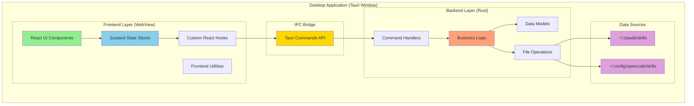
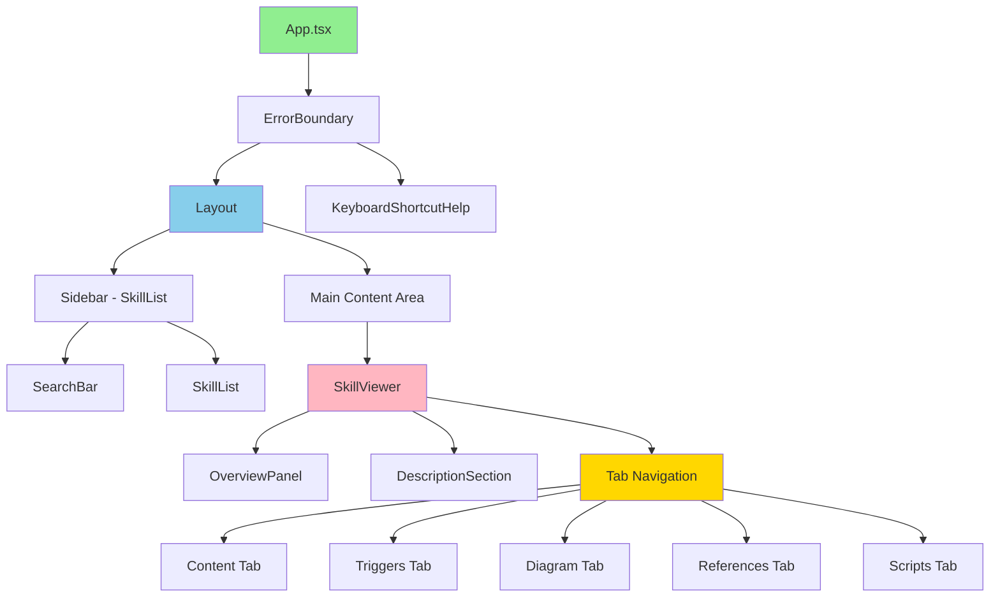
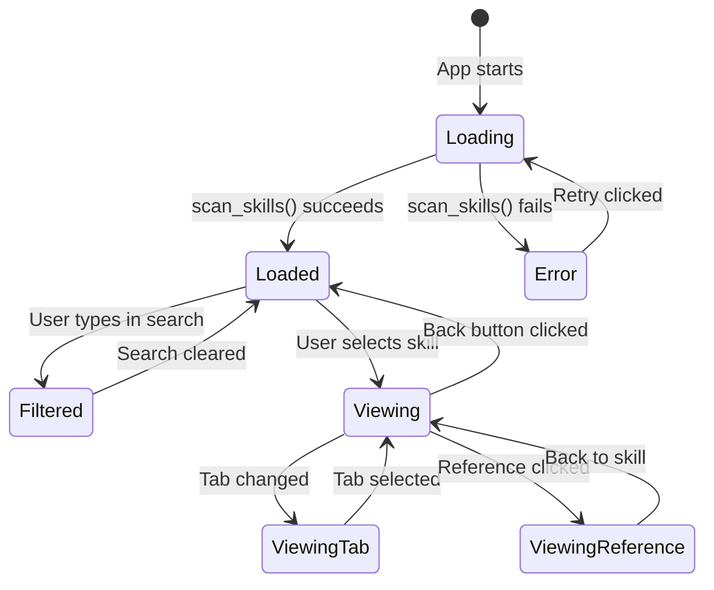

# Architecture Overview - Skill Debugger

**Document Version**: 1.0.0
**Last Updated**: 2025-11-13
**Status**: Active
**Author**: Claude Code Architecture Analysis

## Table of Contents

1. [Executive Summary](#executive-summary)
2. [Project Overview](#project-overview)
3. [Technology Stack](#technology-stack)
4. [High-Level Architecture](#high-level-architecture)
5. [Directory Structure](#directory-structure)
6. [Frontend Architecture](#frontend-architecture)
7. [Backend Architecture](#backend-architecture)
8. [State Management](#state-management)
9. [Communication Layer (IPC)](#communication-layer-ipc)
10. [Data Models](#data-models)
11. [Build System](#build-system)
12. [Development Workflow](#development-workflow)
13. [Testing Infrastructure](#testing-infrastructure)
14. [Performance Optimizations](#performance-optimizations)
15. [Security Architecture](#security-architecture)
16. [Deployment](#deployment)
17. [Key Design Decisions](#key-design-decisions)
18. [Future Enhancements](#future-enhancements)

---

## Executive Summary

**Skill Debugger** is a desktop application built with Tauri 2.x (Rust backend) and React 19 (TypeScript frontend) that provides a comprehensive interface for exploring, debugging, and optimizing Claude Code skills. The application scans local skill directories (`~/.claude/skills` and `~/.config/opencode/skills`), parses skill metadata, and presents a rich multi-tab viewer with features including:

- Real-time skill scanning and loading
- Markdown content rendering with syntax highlighting
- Trigger keyword analysis
- Interactive Mermaid diagram visualization
- Reference and script file management
- Keyboard shortcuts for power users (Cmd/Ctrl+F, arrow keys, Cmd/Ctrl+1-6, ?)

**Architecture Characteristics**:

- **Read-only by design**: No file modifications, only safe reads
- **Offline-first**: No network requests required
- **Type-safe**: TypeScript strict mode + Rust type system
- **Desktop-native**: Native performance via Tauri
- **Cross-platform**: macOS, Linux, Windows support

---

## Project Overview

### Purpose

Skill Debugger is a developer tool for developers who create and maintain Claude Code skills. It addresses the challenge of understanding complex skill structures, dependencies, and trigger patterns by providing a visual, searchable interface.

### Key Features

1. **Skill Discovery**: Automatically scans configured directories
2. **Multi-Tab Viewer**: Overview, Content, Triggers, Diagram, References, Scripts
3. **Search & Filter**: Real-time client-side search
4. **Syntax Highlighting**: Code blocks rendered with highlight.js
5. **Mermaid Diagrams**: Auto-generated skill relationship graphs
6. **Keyboard Navigation**: Power-user shortcuts for efficiency
7. **Error Handling**: Graceful degradation with user-friendly error messages

### Target Users

- Claude Code skill developers
- Power users managing multiple skills
- Teams collaborating on skill development
- Developers debugging skill behavior

---

## Technology Stack

### Frontend Technologies

| Technology                    | Version | Purpose                  | Bundle Impact     |
| ----------------------------- | ------- | ------------------------ | ----------------- |
| **React**                     | 19.1.0  | UI framework             | ~140 KB           |
| **TypeScript**                | 5.8.3   | Type safety              | Compile-time only |
| **Zustand**                   | 5.0.8   | State management         | ~1 KB             |
| **TailwindCSS**               | 4.1.17  | Styling                  | ~10 KB (purged)   |
| **@tailwindcss/typography**   | 0.5.19  | Markdown typography      | ~5 KB             |
| **react-markdown**            | 10.1.0  | Markdown rendering       | ~50 KB            |
| **remark-gfm**                | 4.0.1   | GitHub Flavored Markdown | ~20 KB            |
| **rehype-highlight**          | 7.0.2   | Syntax highlighting      | ~15 KB            |
| **highlight.js**              | 11.11.1 | Code highlighting        | ~80 KB            |
| **Mermaid**                   | 11.12.1 | Diagram rendering        | ~500 KB           |
| **Vite**                      | 7.0.4   | Build tool & dev server  | Dev only          |
| **@tauri-apps/api**           | 2.x     | Tauri frontend API       | ~30 KB            |
| **@tauri-apps/plugin-opener** | 2.x     | Open files/URLs          | ~5 KB             |

**Total Frontend Bundle**: ~856 KB (gzipped: ~250 KB)

### Backend Technologies

| Technology              | Version | Purpose              |
| ----------------------- | ------- | -------------------- |
| **Rust**                | 1.75+   | Backend runtime      |
| **Tauri**               | 2.x     | Desktop framework    |
| **tauri-plugin-opener** | 2.x     | File opening         |
| **serde**               | 1.x     | Serialization        |
| **serde_json**          | 1.x     | JSON handling        |
| **serde_yaml**          | 0.9     | YAML parsing         |
| **dirs**                | 5.0     | Cross-platform paths |

**Total Backend Binary**: ~8-10 MB (platform-specific)

### Development Tools

| Tool            | Version    | Purpose            |
| --------------- | ---------- | ------------------ |
| **Vitest**      | 4.0.8      | Unit testing       |
| **Playwright**  | 1.56.1     | E2E testing        |
| **ESLint**      | 9.39.1     | TypeScript linting |
| **Prettier**    | 3.6.2      | Code formatting    |
| **Husky**       | 9.1.7      | Git hooks          |
| **lint-staged** | 16.2.6     | Pre-commit linting |
| **Task**        | (external) | Build automation   |

### Build System

- **Task (Taskfile.yml)**: Modern task runner for unified build commands
- **npm scripts**: Frontend package management
- **Cargo**: Rust dependency management and building
- **Vite**: Frontend bundling and HMR
- **Tauri CLI**: Desktop application bundling

---

## High-Level Architecture

### System Architecture Diagram



### Architecture Layers

1. **Presentation Layer** (React Components)
   - UI rendering and user interaction
   - Component composition and layout
   - Event handling and validation

2. **State Management Layer** (Zustand Stores)
   - Application state (skills, selected skill, loading states)
   - Keyboard interaction state (shortcuts, focus, navigation)
   - Derived state via React hooks

3. **Service Layer** (Custom Hooks & Utilities)
   - `useSkills`: Skill loading and reload logic
   - `useKeyboardShortcuts`: Global keyboard event handling
   - `useListNavigation`: List navigation with arrow keys
   - `triggerAnalyzer`: Client-side trigger pattern matching
   - `diagramGenerator`: Mermaid diagram generation

4. **Communication Layer** (Tauri IPC)
   - Type-safe command invocation
   - Async request-response pattern
   - Automatic serialization/deserialization

5. **Business Logic Layer** (Rust Commands)
   - `scan_skills()`: Directory scanning and skill loading
   - `read_file_content()`: Safe file reading

6. **Data Access Layer** (Rust Utilities)
   - File system operations (read-only)
   - YAML parsing
   - Path resolution (cross-platform)

7. **Data Layer** (File System)
   - `~/.claude/skills/` directory
   - `~/.config/opencode/skills/` directory

---

## Directory Structure

### Complete Project Structure

```
skill-debugger/
├── .github/                    # GitHub workflows (future)
├── docs/                       # Documentation
│   ├── design/                 # Architecture docs
│   │   ├── ARCHITECTURE_OVERVIEW.md (this file)
│   │   ├── BACKEND_DOCUMENTATION.md
│   │   └── FRONTEND_DOCUMENTATION.md
│   ├── requirements/           # Product requirements
│   │   ├── main.md
│   │   ├── technical-architecture.md
│   │   ├── functional-requirements.md
│   │   ├── non-functional-requirements.md
│   │   └── user-stories.md
│   └── v0.2-enhancement-suite/ # Future feature docs
├── specs/                      # SDD specifications
│   ├── 001-core-skill-explorer/
│   ├── 002-ui-redesign/
│   ├── 003-keyboard-shortcuts/
│   ├── 004-ui-ux-polish/
│   └── BACKLOG.md
├── src/                        # React frontend source
│   ├── components/             # React components
│   │   ├── index.ts            # Component exports
│   │   ├── Layout.tsx          # Main layout (sidebar + content)
│   │   ├── SkillList.tsx       # Skill list with search
│   │   ├── SearchBar.tsx       # Search input
│   │   ├── SkillViewer.tsx     # Multi-tab skill viewer
│   │   ├── OverviewPanel.tsx   # Skill overview section
│   │   ├── DescriptionSection.tsx
│   │   ├── ReferencesTab.tsx   # References management
│   │   ├── ScriptsTab.tsx      # Scripts display
│   │   ├── TriggerAnalysis.tsx # Trigger analysis view
│   │   ├── DiagramView.tsx     # Mermaid diagram rendering
│   │   ├── KeyboardShortcutHelp.tsx # Help modal
│   │   ├── ErrorBoundary.tsx   # Error handling
│   │   └── TestFormatComponent.tsx
│   ├── stores/                 # Zustand state stores
│   │   ├── index.ts
│   │   ├── useSkillStore.ts    # Skill state
│   │   └── keyboardStore.ts    # Keyboard state
│   ├── hooks/                  # Custom React hooks
│   │   ├── index.ts
│   │   ├── useSkills.ts        # Skill loading
│   │   ├── useKeyboardShortcuts.ts # Keyboard events
│   │   ├── useListNavigation.ts
│   │   └── usePlatformModifier.ts
│   ├── types/                  # TypeScript types
│   │   ├── index.ts
│   │   ├── skill.ts
│   │   ├── reference.ts
│   │   ├── script.ts
│   │   └── keyboard.ts
│   ├── utils/                  # Frontend utilities
│   │   ├── triggerAnalyzer.ts  # Pattern matching
│   │   ├── diagramGenerator.ts # Mermaid generation
│   │   └── keyboardUtils.ts    # Keyboard helpers
│   ├── App.tsx                 # Root component
│   ├── App.css                 # Global styles
│   ├── main.tsx                # React entry point
│   └── vite-env.d.ts           # Vite types
├── src-tauri/                  # Rust backend source
│   ├── src/
│   │   ├── main.rs             # Entry point
│   │   ├── lib.rs              # Tauri setup
│   │   ├── commands/           # Tauri commands
│   │   │   ├── mod.rs
│   │   │   ├── skill_scanner.rs
│   │   │   └── file_reader.rs
│   │   ├── models/             # Data structures
│   │   │   ├── mod.rs
│   │   │   ├── skill.rs
│   │   │   ├── reference.rs
│   │   │   └── script.rs
│   │   └── utils/              # Backend utilities
│   │       ├── mod.rs
│   │       ├── paths.rs
│   │       └── yaml_parser.rs
│   ├── Cargo.toml              # Rust dependencies
│   ├── Cargo.lock              # Dependency lockfile
│   ├── tauri.conf.json         # Tauri config
│   ├── build.rs                # Build script
│   ├── capabilities/           # Tauri permissions
│   └── icons/                  # App icons
├── tests/                      # Test suites
│   ├── unit/                   # Vitest unit tests
│   │   ├── components/
│   │   ├── hooks/
│   │   ├── stores/
│   │   └── utils/
│   ├── e2e/                    # Playwright E2E tests
│   │   ├── keyboard-shortcuts.spec.ts
│   │   └── regression-blank-screen.spec.ts
│   ├── fixtures/               # Test data
│   └── setup.ts                # Test setup
├── public/                     # Static assets
│   └── icons/                  # Public icons
├── coverage/                   # Test coverage reports
├── dist/                       # Vite build output
├── node_modules/               # npm dependencies
├── index.html                  # HTML entry point
├── package.json                # npm configuration
├── package-lock.json           # npm lockfile
├── tsconfig.json               # TypeScript config
├── tsconfig.node.json          # TypeScript config (Node)
├── vite.config.ts              # Vite configuration
├── vitest.config.ts            # Vitest configuration
├── playwright.config.ts        # Playwright configuration
├── eslint.config.js            # ESLint configuration
├── tailwind.config.js          # TailwindCSS config
├── postcss.config.js           # PostCSS config
├── Taskfile.yml                # Task automation
├── CHANGELOG.md                # Version history
└── README.md                   # Project readme
```

### Key Directories Explained

#### `/src` (Frontend)

- **components/**: React UI components (presentational + container)
- **stores/**: Zustand state management (global state)
- **hooks/**: Custom React hooks (reusable logic)
- **types/**: TypeScript interfaces (type definitions)
- **utils/**: Pure functions (no side effects)

#### `/src-tauri` (Backend)

- **commands/**: Tauri command handlers (IPC endpoints)
- **models/**: Rust data structures (serializable)
- **utils/**: Helper functions (file I/O, parsing)

#### `/tests`

- **unit/**: Component and hook tests (Vitest + React Testing Library)
- **e2e/**: End-to-end tests (Playwright)
- **fixtures/**: Mock data for testing

#### `/docs`

- **design/**: Architecture documentation (this file)
- **requirements/**: Product requirements and specs
- **v0.2-enhancement-suite/**: Future feature planning

#### `/specs`

- SDD (Specification-Driven Development) artifacts
- Feature specs, plans, tasks, deviations

---

## Frontend Architecture

### Component Hierarchy



### Component Responsibilities

#### Core Components

**App.tsx** (`/src/App.tsx`)

- Root component
- Initializes keyboard shortcuts
- Mounts ErrorBoundary, Layout, KeyboardShortcutHelp
- Detects platform (macOS vs Windows/Linux)

**Layout.tsx** (`/src/components/Layout.tsx`)

- Two-column layout (sidebar + main)
- Sidebar: 320px fixed width
- Main: Flexible content area
- Responsive design (flexbox)

**SkillList.tsx** (`/src/components/SkillList.tsx`)

- Renders skill list with search
- Handles skill selection
- Implements keyboard navigation (arrow keys)
- Displays skill count and loading states
- **Key logic**:
  - Uses `useSkills()` hook to load skills
  - Filters skills via `useMemo` based on search query
  - Highlights selected skill with visual indicator

**SkillViewer.tsx** (`/src/components/SkillViewer.tsx`)

- Multi-tab skill detail viewer
- Tab order: Overview, Content, Triggers, Diagram, References, Scripts
- Keyboard shortcuts (Cmd/Ctrl+1-6) for tab switching
- **Key logic**:
  - Reads `selectedSkill` from Zustand store
  - Syncs `activeTabIndex` from keyboard store
  - Conditionally renders tab content

#### Tab Components

**OverviewPanel.tsx** (`/src/components/OverviewPanel.tsx`)

- Displays skill metadata (name, location, path, description)
- Shows quick stats (reference count, script count)
- Provides navigation shortcuts to other tabs

**ContentTab** (rendered in SkillViewer.tsx)

- Renders skill markdown with react-markdown
- Syntax highlighting via rehype-highlight
- GitHub Flavored Markdown support (remark-gfm)
- Uses `content_clean` (YAML frontmatter stripped)

**TriggerAnalysis.tsx** (`/src/components/TriggerAnalysis.tsx`)

- Analyzes skill content for trigger keywords
- Categories: Actions, File Types, Commands, Technologies
- Uses `triggerAnalyzer` utility (regex-based)
- Client-side processing (no backend call)

**DiagramView.tsx** (`/src/components/DiagramView.tsx`)

- Generates Mermaid diagram from skill structure
- Shows skill → references → scripts relationships
- Interactive diagram (zoom, pan)
- Uses `diagramGenerator` utility

**ReferencesTab.tsx** (`/src/components/ReferencesTab.tsx`)

- Lists reference files in `references/` directory
- Click reference to view content (via `read_file_content()` command)
- Markdown rendering for reference files
- Detects file type by extension

**ScriptsTab.tsx** (`/src/components/ScriptsTab.tsx`)

- Lists script files in `scripts/` directory
- Syntax highlighting based on file extension
- Copy-to-clipboard functionality
- Language detection (sh, py, js, etc.)

**KeyboardShortcutHelp.tsx** (`/src/components/KeyboardShortcutHelp.tsx`)

- Modal help overlay (triggered by `?` key)
- Lists all keyboard shortcuts with descriptions
- Platform-aware (shows ⌘ on Mac, Ctrl on Windows/Linux)
- Escape key to close

### Custom Hooks

**useSkills.ts** (`/src/hooks/useSkills.ts`)

```typescript
export function useSkills() {
  const { skills, isLoading, error, setSkills, setLoading, setError } = useSkillStore();

  const loadSkills = async () => {
    try {
      setLoading(true);
      setError(null);
      const result = await invoke<Skill[]>('scan_skills');
      setSkills(result);
    } catch (err) {
      setError(err instanceof Error ? err.message : 'Failed to load skills');
    } finally {
      setLoading(false);
    }
  };

  useEffect(() => {
    loadSkills();
  }, []);

  return { skills, isLoading, error, reload: loadSkills };
}
```

- Loads skills on mount
- Provides reload function
- Handles loading and error states
- Called once at app level

**useKeyboardShortcuts.ts** (`/src/hooks/useKeyboardShortcuts.ts`)

- Global keyboard event listener (window.addEventListener)
- Handles:
  - Cmd/Ctrl+F (search focus)
  - Cmd/Ctrl+1-6 (tab navigation)
  - Arrow keys (list navigation)
  - ? key (help modal)
  - Escape (clear highlight)
- Platform-aware (macOS uses metaKey, Windows/Linux use ctrlKey)
- Prevents shortcuts in input fields (except Cmd/Ctrl+F)

**useListNavigation.ts** (`/src/hooks/useListNavigation.ts`)

- Manages list highlight and selection
- Arrow keys navigate visible skills
- Enter key selects highlighted skill
- Escape key clears highlight

**usePlatformModifier.ts** (`/src/hooks/usePlatformModifier.ts`)

- Detects platform (macOS, Windows, Linux)
- Returns appropriate modifier key (Cmd vs Ctrl)
- Returns display symbol (⌘ vs Ctrl)

### Frontend Utilities

**triggerAnalyzer.ts** (`/src/utils/triggerAnalyzer.ts`)

- Analyzes skill content for trigger keywords
- Regex-based pattern matching
- Categories:
  - **Actions**: create, update, delete, analyze, debug, etc.
  - **File Types**: .py, .js, .md, .json, etc.
  - **Commands**: git, npm, docker, etc.
  - **Technologies**: React, Python, TypeScript, etc.
- Returns counts and examples

**diagramGenerator.ts** (`/src/utils/diagramGenerator.ts`)

- Generates Mermaid syntax from skill object
- Creates nodes for:
  - Skill (central node)
  - References (file nodes)
  - Scripts (script nodes)
- Creates edges (skill → reference, skill → script)
- Handles special cases (glob patterns, missing data)

**keyboardUtils.ts** (`/src/utils/keyboardUtils.ts`)

- Key code mappings
- Modifier key detection helpers
- Platform-specific key handling

### Styling Approach

**TailwindCSS** (utility-first CSS)

- All styles inline via utility classes
- Responsive design with breakpoint prefixes (`md:`, `lg:`)
- Custom theme extensions in `tailwind.config.js`
- Typography plugin for markdown rendering

**CSS Organization**:

- `App.css`: Global styles (CSS reset, Tailwind directives)
- Component styles: Inline Tailwind classes
- No CSS modules or styled-components

---

## Backend Architecture

### Rust Module Structure

```
src-tauri/src/
├── main.rs                # Entry point (calls lib.rs::run)
├── lib.rs                 # Tauri setup and command registration
├── commands/              # IPC command handlers
│   ├── mod.rs            # Command exports
│   ├── skill_scanner.rs  # scan_skills() command
│   └── file_reader.rs    # read_file_content() command
├── models/               # Data structures (Serialize + Deserialize)
│   ├── mod.rs           # Model exports
│   ├── skill.rs         # Skill struct
│   ├── reference.rs     # Reference struct
│   └── script.rs        # Script struct
└── utils/               # Helper functions
    ├── mod.rs          # Utility exports
    ├── paths.rs        # Path resolution (cross-platform)
    └── yaml_parser.rs  # YAML frontmatter parsing
```

### Command Layer

**lib.rs** (`/src-tauri/src/lib.rs`)

```rust
pub fn run() {
    tauri::Builder::default()
        .plugin(tauri_plugin_opener::init())
        .invoke_handler(tauri::generate_handler![
            greet,
            commands::scan_skills,
            commands::read_file_content
        ])
        .run(tauri::generate_context!())
        .expect("error while running tauri application");
}
```

- Registers Tauri commands
- Initializes plugins (tauri-plugin-opener)
- Configures application lifecycle

**skill_scanner.rs** (`/src-tauri/src/commands/skill_scanner.rs`)

Key functions:

1. `scan_skills()` [Lines 6-23]
   - Tauri command (exposed to frontend)
   - Scans both Claude and OpenCode directories
   - Returns `Result<Vec<Skill>, String>`

2. `scan_directory()` [Lines 25-47]
   - Recursively scans skill directories
   - Looks for `SKILL.md` files
   - Ignores errors (continues scanning)

3. `load_skill()` [Lines 49-86]
   - Reads `SKILL.md` content
   - Extracts YAML frontmatter
   - Extracts description (first paragraph)
   - Loads references from `references/` subdirectory
   - Loads scripts from `scripts/` subdirectory

4. `load_references()` [Lines 88-121]
   - Scans `references/` directory
   - Detects glob patterns (`*` in filename)
   - Returns empty vector if directory doesn't exist

5. `load_scripts()` [Lines 123-160]
   - Scans `scripts/` directory
   - Determines language from file extension
   - Reads script content
   - Returns empty vector if directory doesn't exist

**file_reader.rs** (`/src-tauri/src/commands/file_reader.rs`)

```rust
#[tauri::command]
pub fn read_file_content(path: String) -> Result<String, String> {
    fs::read_to_string(&path)
        .map_err(|e| format!("Failed to read file {}: {}", path, e))
}
```

- Simple file reader (no validation)
- Used for viewing reference files
- Returns UTF-8 content or error

### Model Layer

**Skill** (`/src-tauri/src/models/skill.rs`)

```rust
#[derive(Debug, Clone, Serialize, Deserialize)]
pub struct Skill {
    pub name: String,
    pub description: Option<String>,
    pub location: String,
    pub path: String,
    pub content: String,
    pub content_clean: String,
    pub references: Vec<Reference>,
    pub scripts: Vec<Script>,
    pub metadata: Option<serde_json::Value>,
}
```

- Core data structure
- Serializable to JSON (via Serde)
- `content_clean`: Markdown without YAML frontmatter

**Reference** (`/src-tauri/src/models/reference.rs`)

```rust
#[derive(Debug, Clone, Serialize, Deserialize)]
pub struct Reference {
    pub path: String,
    pub ref_type: String,  // "file", "glob", "directory"
    pub required: bool,
}
```

**Script** (`/src-tauri/src/models/script.rs`)

```rust
#[derive(Debug, Clone, Serialize, Deserialize)]
pub struct Script {
    pub name: String,
    pub language: String,
    pub content: String,
    pub line_number: Option<usize>,
}
```

### Utility Layer

**paths.rs** (`/src-tauri/src/utils/paths.rs`)

- `get_claude_skills_dir()`: Returns `~/.claude/skills`
- `get_opencode_skills_dir()`: Returns `~/.config/opencode/skills`
- `get_skill_directories()`: Returns both directories as vector
- Cross-platform (uses `dirs` crate for home directory)

**yaml_parser.rs** (`/src-tauri/src/utils/yaml_parser.rs`)

- `extract_frontmatter()`: Extracts YAML between `---` delimiters
- `parse_yaml_to_json()`: Converts YAML to JSON (internal)
- `extract_description()`: Extracts first paragraph from markdown
- Handles missing frontmatter gracefully (returns None)

### Error Handling Strategy

**Pattern 1: Propagate with `?`**

```rust
let content = fs::read_to_string(path)
    .map_err(|e| format!("Failed to read file: {}", e))?;
```

**Pattern 2: Log and Continue**

```rust
match load_skill(&skill_file, location) {
    Ok(skill) => skills.push(skill),
    Err(e) => eprintln!("Error loading skill: {}", e),
}
```

**Pattern 3: Return Empty on Missing**

```rust
if !refs_dir.exists() {
    return Vec::new();
}
```

---

## State Management

### Zustand Store Architecture

Skill Debugger uses **Zustand** for global state management (not Redux or Context API).

**Why Zustand?**

- Minimal boilerplate (~1 KB bundle size)
- No provider wrapper needed
- Hook-based API (no connect() HOC)
- Excellent TypeScript support
- Sufficient for this app's complexity

### Primary Store: useSkillStore

**Location**: `/src/stores/useSkillStore.ts`

```typescript
interface SkillStore {
  // State
  skills: Skill[];
  selectedSkill: Skill | null;
  isLoading: boolean;
  error: string | null;

  // Actions
  setSkills: (skills: Skill[]) => void;
  selectSkill: (skill: Skill | null) => void;
  setLoading: (loading: boolean) => void;
  setError: (error: string | null) => void;
  clearError: () => void;
}
```

**State Lifecycle**:

1. App mounts → `useSkills()` hook calls `scan_skills()` command
2. Loading state set to `true`
3. Backend scans directories and returns skills
4. Skills stored in Zustand store
5. Loading state set to `false`
6. Components re-render with new skills

**Usage in Components**:

```typescript
// Read state
const skills = useSkillStore((state) => state.skills);
const selectedSkill = useSkillStore((state) => state.selectedSkill);

// Write state
const selectSkill = useSkillStore((state) => state.selectSkill);
selectSkill(skill);
```

### Keyboard Store: keyboardStore

**Location**: `/src/stores/keyboardStore.ts`

```typescript
interface KeyboardState {
  // Search focus (US1: Cmd/Ctrl+F)
  searchFocusRequested: boolean;
  setSearchFocusRequested: (requested: boolean) => void;

  // List navigation (US3: Arrow keys)
  highlightedSkillIndex: number | null;
  setHighlightedSkillIndex: (index: number | null) => void;
  visibleSkillCount: number;
  setVisibleSkillCount: (count: number) => void;

  // Tab navigation (US2: Cmd/Ctrl+1-6)
  activeTabIndex: number | null;
  setActiveTabIndex: (index: number | null) => void;

  // Help modal (US4: ? key)
  isHelpModalOpen: boolean;
  setHelpModalOpen: (open: boolean) => void;

  // Platform detection
  platform: PlatformType;
  modifierKey: ModifierKey;
  modifierSymbol: ModifierSymbol;
  detectPlatform: () => void;

  // Reset
  reset: () => void;
}
```

**Key Features**:

- Platform detection (macOS vs Windows/Linux)
- Ephemeral state (not persisted)
- Centralized keyboard interaction state

### State Flow Diagram



---

## Communication Layer (IPC)

### Tauri IPC Architecture

Tauri uses a **request-response** pattern for frontend-backend communication.

```
┌─────────────────────────────────────────────────────┐
│              React Frontend (TypeScript)            │
│                                                     │
│  import { invoke } from '@tauri-apps/api/core';    │
│  const skills = await invoke<Skill[]>('scan_skills');│
└──────────────────────┬──────────────────────────────┘
                       │
                       │ invoke('scan_skills', args)
                       ▼
┌─────────────────────────────────────────────────────┐
│               Tauri IPC Bridge                      │
│                                                     │
│  - Serializes request to JSON                      │
│  - Routes to Rust command handler                  │
│  - Deserializes response from Rust                 │
│  - Returns typed result to frontend                │
└──────────────────────┬──────────────────────────────┘
                       │
                       │ scan_skills() → Result<Vec<Skill>, String>
                       ▼
┌─────────────────────────────────────────────────────┐
│              Rust Backend                           │
│                                                     │
│  #[tauri::command]                                 │
│  pub fn scan_skills() -> Result<Vec<Skill>, String>│
└─────────────────────────────────────────────────────┘
```

### Type Safety Across IPC

**TypeScript Types** (Frontend):

```typescript
export interface Skill {
  name: string;
  description?: string;
  location: string;
  path: string;
  content: string;
  content_clean: string;
  references: Reference[];
  scripts: Script[];
  metadata?: Record<string, unknown>;
}
```

**Rust Types** (Backend):

```rust
#[derive(Serialize, Deserialize)]
pub struct Skill {
    pub name: String,
    pub description: Option<String>,
    pub location: String,
    pub path: String,
    pub content: String,
    pub content_clean: String,
    pub references: Vec<Reference>,
    pub scripts: Vec<Script>,
    pub metadata: Option<serde_json::Value>,
}
```

**Type Mapping**:
| TypeScript | Rust | Notes |
|------------|------|-------|
| `string` | `String` | UTF-8 string |
| `string?` | `Option<String>` | Optional field |
| `any` | `serde_json::Value` | Dynamic JSON |
| `Array<T>` | `Vec<T>` | Array/vector |
| `Record<K, V>` | `HashMap<K, V>` | Key-value map |

### Command Examples

**Example 1: scan_skills (no parameters)**

```typescript
// Frontend
const skills = await invoke<Skill[]>('scan_skills');
```

```rust
// Backend
#[tauri::command]
pub fn scan_skills() -> Result<Vec<Skill>, String> {
    // Implementation
}
```

**Example 2: read_file_content (with parameters)**

```typescript
// Frontend
const content = await invoke<string>('read_file_content', {
  path: '/path/to/file.md',
});
```

```rust
// Backend
#[tauri::command]
pub fn read_file_content(path: String) -> Result<String, String> {
    fs::read_to_string(&path)
        .map_err(|e| format!("Failed to read file: {}", e))
}
```

---

## Data Models

### Skill Directory Structure

```
~/.claude/skills/
└── skill-name/
    ├── SKILL.md              # Main skill file (required)
    ├── references/           # Reference files (optional)
    │   ├── example1.md
    │   └── example2.txt
    └── scripts/              # Script files (optional)
        ├── setup.sh
        └── helper.py
```

### Skill Model (Full Definition)

**TypeScript** (`/src/types/skill.ts`):

```typescript
export interface Skill {
  name: string;
  description?: string;
  location: string;
  path: string;
  content: string;
  content_clean: string;
  references: Reference[];
  scripts: Script[];
  metadata?: Record<string, unknown>;
}
```

**Rust** (`/src-tauri/src/models/skill.rs`):

```rust
#[derive(Debug, Clone, Serialize, Deserialize)]
pub struct Skill {
    pub name: String,
    pub description: Option<String>,
    pub location: String,
    pub path: String,
    pub content: String,
    pub content_clean: String,
    pub references: Vec<Reference>,
    pub scripts: Vec<Script>,
    pub metadata: Option<serde_json::Value>,
}
```

**Field Descriptions**:

- `name`: Directory name (e.g., "python-expert-engineer")
- `description`: First paragraph or YAML frontmatter description
- `location`: "claude" or "opencode" (source directory)
- `path`: Absolute path to SKILL.md
- `content`: Raw markdown including YAML frontmatter
- `content_clean`: Markdown with YAML frontmatter stripped
- `references`: Files in `references/` subdirectory
- `scripts`: Files in `scripts/` subdirectory
- `metadata`: Parsed YAML frontmatter as JSON

### Reference Model

```typescript
export interface Reference {
  path: string;
  ref_type: string; // "file", "glob", "directory"
  required: boolean;
}
```

### Script Model

```typescript
export interface Script {
  name: string;
  language: string;
  content: string;
  line_number?: number;
}
```

---

## Build System

### Task Automation (Taskfile.yml)

**Location**: `/Taskfile.yml`

Skill Debugger uses [Task](https://taskfile.dev) for unified build automation.

**Key Tasks**:

```bash
# Development
task dev              # Start Vite + Tauri dev mode
task run-app          # Launch desktop app
task clean-up-app-run # Kill zombie processes

# Build
task build            # Build frontend + backend
task build:frontend   # Build TypeScript + Vite
task build:backend    # Build Rust backend
task build:release    # Build optimized Tauri app

# Test
task test             # Run all tests (frontend + backend)
task test:frontend    # Run Vitest unit tests
task test:backend     # Run Rust tests
task test:e2e         # Run Playwright E2E tests
task test:coverage    # Run tests with coverage
task test:all         # Run all test types

# Code Quality
task format           # Format code (Prettier + rustfmt)
task clippy           # Run Rust linter
task lint             # Run ESLint

# CI/CD
task ci               # Run full CI pipeline locally

# Maintenance
task clean            # Clean build artifacts
task install          # Install dependencies
task setup            # Initial project setup
task update           # Update all dependencies
```

### Build Process

**Development Build**:

```bash
task dev
# 1. npm run dev (Vite dev server on port 1420)
# 2. Tauri loads WebView pointing to localhost:1420
# 3. Hot Module Replacement (HMR) enabled
```

**Production Build**:

```bash
task build:release
# 1. tsc --noEmit (TypeScript type checking)
# 2. vite build (bundles to dist/)
# 3. cargo build --release (Rust backend)
# 4. tauri build (bundles into platform-specific binary)
# Output: src-tauri/target/release/bundle/
```

### Vite Configuration

**Location**: `/vite.config.ts`

```typescript
export default defineConfig({
  plugins: [react()],
  clearScreen: false,
  server: {
    port: 1420,
    strictPort: true,
    watch: {
      ignored: ['**/src-tauri/**'],
    },
  },
});
```

**Key Settings**:

- Port 1420 (Tauri expects this)
- Strict port (fail if 1420 unavailable)
- Ignore `src-tauri/` changes (prevents unnecessary rebuilds)

### TypeScript Configuration

**Location**: `/tsconfig.json`

```json
{
  "compilerOptions": {
    "target": "ES2020",
    "lib": ["ES2020", "DOM", "DOM.Iterable"],
    "module": "ESNext",
    "strict": true,
    "noUnusedLocals": true,
    "noUnusedParameters": true,
    "noFallthroughCasesInSwitch": true
  }
}
```

**Strict Mode Enabled**:

- `strict: true` (all strict type checks)
- `noUnusedLocals: true` (error on unused variables)
- `noUnusedParameters: true` (error on unused parameters)

---

## Development Workflow

### Local Development

**Step 1: Initial Setup**

```bash
task setup
# Installs npm dependencies and verifies tools
```

**Step 2: Start Development Server**

```bash
task dev
# Opens Tauri app with live reload
```

**Step 3: Make Changes**

- Edit React components → Hot reload in app
- Edit Rust code → Manual reload (Cmd+R in app)
- Edit Taskfile → No reload needed

**Step 4: Run Tests**

```bash
task test
# Runs frontend unit tests + backend tests
```

**Step 5: Lint and Format**

```bash
task format
task lint
```

### Git Workflow (with Husky)

**Pre-commit Hook** (via Husky + lint-staged):

```bash
# Automatically runs on git commit
# .husky/pre-commit
npx lint-staged

# lint-staged runs:
# - Prettier (format code)
# - ESLint (fix linting issues)
```

**Commit Message Convention**:

```
feat: Add keyboard shortcuts for power users

Implemented Cmd/Ctrl+F for search focus, arrow keys for list
navigation, Cmd/Ctrl+1-6 for tab switching, and ? for help modal.

🤖 Generated with [Claude Code](https://claude.com/claude-code)

Co-Authored-By: Claude <noreply@anthropic.com>
```

### Pull Request Workflow

**Step 1: Create Feature Branch**

```bash
git checkout -b feature/feature-name
```

**Step 2: Implement Feature**

- Follow SDD workflow (see CLAUDE.md)
- Write tests (TDD encouraged)
- Update documentation

**Step 3: Run CI Checks Locally**

```bash
task ci
# Runs: clean, install, build, test:all, clippy, format:check:backend
```

**Step 4: Create PR**

```bash
gh pr create --base main --head feature/feature-name
```

---

## Testing Infrastructure

### Unit Testing (Vitest)

**Location**: `/tests/unit/`

**Configuration**: `/vitest.config.ts`

```typescript
export default defineConfig({
  test: {
    globals: true,
    environment: 'happy-dom',
    setupFiles: ['./tests/setup.ts'],
    coverage: {
      provider: 'v8',
      thresholds: {
        lines: 80,
        functions: 80,
        branches: 80,
        statements: 80,
      },
    },
  },
});
```

**Test Structure**:

```
tests/unit/
├── components/          # Component tests
│   ├── SkillList.test.tsx
│   ├── SearchBar.test.tsx
│   └── KeyboardShortcutHelp.test.tsx
├── hooks/               # Hook tests
│   ├── useKeyboardShortcuts.test.ts
│   ├── useListNavigation.test.ts
│   └── usePlatformModifier.test.ts
├── stores/              # Store tests
│   └── keyboardStore.test.ts
└── utils/               # Utility tests
    └── keyboardUtils.test.ts
```

**Example Test**:

```typescript
describe('useKeyboardShortcuts', () => {
  it('should focus search on Cmd+F', async () => {
    const { result } = renderHook(() => useKeyboardShortcuts());

    fireEvent.keyDown(window, {
      key: 'f',
      metaKey: true,
    });

    expect(useKeyboardStore.getState().searchFocusRequested).toBe(true);
  });
});
```

**Running Tests**:

```bash
task test:frontend         # Run unit tests
task test:ui               # Run with UI
task test:coverage         # Run with coverage report
```

### E2E Testing (Playwright)

**Location**: `/tests/e2e/`

**Configuration**: `/playwright.config.ts`

```typescript
export default defineConfig({
  testDir: './tests/e2e',
  use: {
    baseURL: 'http://localhost:1420',
    screenshot: 'only-on-failure',
  },
  webServer: {
    command: 'npm run dev',
    url: 'http://localhost:1420',
    reuseExistingServer: !process.env.CI,
  },
});
```

**Test Structure**:

```
tests/e2e/
├── keyboard-shortcuts.spec.ts
└── regression-blank-screen.spec.ts
```

**Example Test**:

```typescript
test('should switch tabs with Cmd+1-6', async ({ page }) => {
  await page.goto('/');

  // Wait for skills to load
  await page.waitForSelector('[data-testid="skill-list"]');

  // Select a skill
  await page.click('[data-testid="skill-item"]:first-child');

  // Press Cmd+2 (Content tab)
  await page.keyboard.press('Meta+2');

  // Verify Content tab is active
  await expect(page.locator('[data-testid="content-tab"]')).toHaveClass(/border-blue-500/);
});
```

**Running E2E Tests**:

```bash
task test:e2e              # Run Playwright tests
task playwright:install    # Install browsers
```

### Backend Testing (Rust)

**Location**: `/src-tauri/src/**/*_test.rs` or `#[cfg(test)]` blocks

**Running Tests**:

```bash
task test:backend
# or
cd src-tauri && cargo test
```

**Example Test**:

```rust
#[cfg(test)]
mod tests {
    use super::*;

    #[test]
    fn test_extract_frontmatter() {
        let content = "---\nname: Test\n---\nContent";
        let (fm, rest) = extract_frontmatter(content);
        assert!(fm.is_some());
        assert_eq!(rest, "\nContent");
    }
}
```

---

## Performance Optimizations

### Frontend Optimizations

**1. React useMemo for Filtering**

```typescript
const filteredSkills = useMemo(() => {
  if (!searchQuery.trim()) return skills;
  const query = searchQuery.toLowerCase();
  return skills.filter(
    (skill) =>
      skill.name.toLowerCase().includes(query) || skill.description?.toLowerCase().includes(query)
  );
}, [skills, searchQuery]);
```

- Prevents unnecessary re-computation
- O(n) filtering but fast for <1000 skills

**2. Mermaid Diagram Caching**

```typescript
useEffect(() => {
  // Re-render only when skill or fontSize changes
  const diagram = generateSkillDiagram(skill);
  mermaid.run({ nodes: [containerRef.current] });
}, [skill, fontSize]);
```

**3. Markdown Rendering Optimization**

```typescript
<ReactMarkdown
  remarkPlugins={[remarkGfm]}
  rehypePlugins={[rehypeHighlight]}
>
  {selectedSkill.content_clean}
</ReactMarkdown>
```

- Uses `content_clean` (YAML frontmatter stripped in backend)
- Reduces parsing overhead

**4. No Virtual Scrolling (Intentional)**

- Current scale (5-100 skills) performs well without virtualization
- Simplifies code and allows full CSS animations
- Future: Add virtualization if skill count exceeds 200

### Backend Optimizations

**1. Sequential Directory Scanning**

```rust
for (location, dir_path) in directories {
    match scan_directory(&dir_path, &location) {
        Ok(mut skills) => all_skills.append(&mut skills),
        Err(e) => eprintln!("Error: {}", e),
    }
}
```

- Sequential (not parallel) scanning
- Sufficient for <100 skills (~300ms scan time)
- Future: Parallelize with `rayon` or `tokio`

**2. No Caching**

- Skills re-scanned on every `scan_skills()` call
- Acceptable for offline-first app
- Future: Add in-memory cache or filesystem watcher

**3. Eager Loading**

- All skills loaded upfront (not lazy)
- Simplifies architecture
- Future: Lazy load skill content when viewed

### Bundle Size Analysis

**Frontend Bundle** (production):

```
dist/assets/
├── index-abc123.js       # 856 KB (250 KB gzipped)
├── index-def456.css      # 15 KB (3 KB gzipped)
└── mermaid-xyz789.js     # 500 KB (lazy-loaded)

Total Initial: ~265 KB gzipped
```

**Backend Binary**:

```
src-tauri/target/release/
└── skill-debugger        # ~8-10 MB (platform-specific)
```

---

## Security Architecture

### Threat Model

**Potential Threats**:

1. **Path Traversal**: Malicious frontend reads files outside skill directories
2. **XSS**: Malicious markdown content injected into UI
3. **YAML Bombs**: Deeply nested YAML structures (DoS)
4. **Dependency Vulnerabilities**: Outdated packages with CVEs

### Security Measures

**1. Read-Only Access**

- No `fs::write()` calls in backend
- No file deletion or modification commands
- All operations are read-only

**2. Content Security Policy (Future)**

```json
{
  "security": {
    "csp": "default-src 'self'; script-src 'self'; style-src 'self' 'unsafe-inline'"
  }
}
```

- Currently: CSP disabled for development convenience
- Production: Should enable CSP to prevent XSS

**3. Markdown Rendering Security**

- `react-markdown` safe mode (no HTML rendering by default)
- XSS protection via React's escaping
- Code blocks syntax-highlighted (no execution)

**4. YAML Parsing Security**

- `serde_yaml` has built-in depth limits (default: 128)
- Circular references detected and rejected
- Parse errors logged but don't crash app

**5. Dependency Auditing**

```bash
# Frontend
npm audit

# Backend
cd src-tauri && cargo audit
```

### Security Recommendations

**HIGH PRIORITY**: Add path validation to `read_file_content()`

```rust
#[tauri::command]
pub fn read_file_content(path: String) -> Result<String, String> {
    let path_buf = PathBuf::from(&path);
    let skill_dirs = get_skill_directories();

    // Validate path is within skill directories
    let is_valid = skill_dirs.iter().any(|(_, dir)| {
        path_buf.canonicalize().ok()
            .map(|p| p.starts_with(dir))
            .unwrap_or(false)
    });

    if !is_valid {
        return Err("Path outside skill directories".to_string());
    }

    fs::read_to_string(&path)
        .map_err(|e| format!("Failed to read file: {}", e))
}
```

---

## Deployment

### Build Artifacts

**macOS**:

- `.dmg` installer (~8 MB)
- `.app` bundle (drag-and-drop)
- Signed with Apple Developer ID (future)

**Linux**:

- `.AppImage` (~9 MB, universal)
- `.deb` package (Debian/Ubuntu)
- `.rpm` package (RedHat/Fedora)

**Windows**:

- `.msi` installer (~10 MB)
- `.exe` portable (no install)
- Signed with Authenticode (future)

### Build Process

```bash
task build:release
# Output: src-tauri/target/release/bundle/
```

**Build Steps**:

1. TypeScript type checking (`tsc --noEmit`)
2. Vite production build (to `dist/`)
3. Rust release build (`cargo build --release`)
4. Tauri bundler (creates platform-specific packages)

### Distribution (Future)

**Options**:

- GitHub Releases (current)
- Homebrew Cask (macOS)
- Snapcraft (Linux)
- Winget (Windows)
- Auto-updater (Tauri built-in)

---

## Key Design Decisions

### Decision 1: Tauri Over Electron

**Rationale**:

- Bundle size: ~10 MB vs 100+ MB (Electron)
- Memory: ~50 MB vs ~150 MB (Electron)
- Performance: Rust backend faster than Node.js
- Security: Rust memory safety + Tauri permissions

**Trade-offs**:

- Smaller ecosystem than Electron
- Fewer third-party plugins
- Rust learning curve for contributors

### Decision 2: Zustand Over Redux

**Rationale**:

- Minimal boilerplate (no actions/reducers)
- ~1 KB bundle size
- Sufficient for app's complexity
- Excellent TypeScript support

**Trade-offs**:

- Less powerful than Redux for complex state
- Smaller community

### Decision 3: Client-Side Trigger Analysis

**Rationale**:

- Simple regex-based pattern matching
- Instant results (no IPC round-trip)
- Easy to extend with UI-driven analysis

**Trade-offs**:

- Limited to pattern matching (no ML/NLP)
- Can't analyze large files efficiently

### Decision 4: TailwindCSS for Styling

**Rationale**:

- Rapid development with utility classes
- Built-in design system
- PurgeCSS removes unused styles
- Typography plugin for markdown

**Trade-offs**:

- Learning curve for utility-first CSS
- Verbose HTML with many classes

### Decision 5: No Virtual Scrolling

**Rationale**:

- Current scale (5-100 skills) performs well
- Simpler code without virtualization
- Full CSS animations work

**Trade-offs**:

- Won't scale beyond ~200 skills
- Full DOM rendering for all items

### Decision 6: Sequential Directory Scanning

**Rationale**:

- Simple error handling
- Sufficient for <100 skills (~300ms)
- I/O bound (disk is bottleneck, not CPU)

**Trade-offs**:

- Won't scale to 1000+ skills efficiently
- Could benefit from parallelization

---

## Future Enhancements

### Performance Improvements

- [ ] Parallel directory scanning (rayon or tokio)
- [ ] In-memory caching of skills
- [ ] Lazy loading of skill content
- [ ] Filesystem watching (notify crate)
- [ ] Virtual scrolling for large skill lists (>200)

### Security Enhancements

- [ ] Path validation in `read_file_content()`
- [ ] CSP enforcement in production builds
- [ ] Code signing (macOS, Windows)
- [ ] Automatic dependency auditing (CI)

### Features

- [ ] Full-text search (backend implementation)
- [ ] Export skill to various formats (PDF, HTML)
- [ ] Skill comparison view (side-by-side)
- [ ] Skill dependency graph (across skills)
- [ ] Plugin system for community extensions
- [ ] Skill template creation wizard
- [ ] Git integration (show skill history)

### Developer Experience

- [ ] Hot reload for Rust code (cargo-watch)
- [ ] Better error messages with suggestions
- [ ] Detailed logging with log levels
- [ ] Performance profiling tools
- [ ] Visual regression testing (Percy.io)

### Testing

- [ ] Integration tests for Tauri commands
- [ ] Cross-platform testing (GitHub Actions)
- [ ] Performance benchmarks (criterion.rs)
- [ ] Accessibility testing (axe-core)

---

## Appendix A: File Reference Index

### Frontend Files

| File                                  | Lines | Purpose                            |
| ------------------------------------- | ----- | ---------------------------------- |
| `/src/App.tsx`                        | 32    | Root component, keyboard shortcuts |
| `/src/main.tsx`                       | 14    | React entry point                  |
| `/src/components/Layout.tsx`          | 29    | Two-column layout                  |
| `/src/components/SkillList.tsx`       | ~200  | Skill list with search             |
| `/src/components/SkillViewer.tsx`     | 155   | Multi-tab viewer                   |
| `/src/components/TriggerAnalysis.tsx` | ~150  | Trigger analysis                   |
| `/src/components/DiagramView.tsx`     | ~120  | Mermaid diagrams                   |
| `/src/stores/useSkillStore.ts`        | 33    | Skill state                        |
| `/src/stores/keyboardStore.ts`        | 122   | Keyboard state                     |
| `/src/hooks/useSkills.ts`             | 35    | Skill loading                      |
| `/src/hooks/useKeyboardShortcuts.ts`  | 137   | Keyboard events                    |
| `/src/utils/triggerAnalyzer.ts`       | ~200  | Pattern matching                   |
| `/src/utils/diagramGenerator.ts`      | ~150  | Mermaid generation                 |

### Backend Files

| File                                       | Lines | Purpose         |
| ------------------------------------------ | ----- | --------------- |
| `/src-tauri/src/main.rs`                   | 7     | Entry point     |
| `/src-tauri/src/lib.rs`                    | 23    | Tauri setup     |
| `/src-tauri/src/commands/skill_scanner.rs` | 192   | Skill scanning  |
| `/src-tauri/src/commands/file_reader.rs`   | 7     | File reading    |
| `/src-tauri/src/models/skill.rs`           | 50    | Skill struct    |
| `/src-tauri/src/utils/paths.rs`            | 54    | Path resolution |
| `/src-tauri/src/utils/yaml_parser.rs`      | 116   | YAML parsing    |

### Configuration Files

| File                    | Purpose                      |
| ----------------------- | ---------------------------- |
| `/package.json`         | npm dependencies and scripts |
| `/Cargo.toml`           | Rust dependencies            |
| `/tsconfig.json`        | TypeScript configuration     |
| `/vite.config.ts`       | Vite build configuration     |
| `/vitest.config.ts`     | Vitest test configuration    |
| `/playwright.config.ts` | Playwright E2E configuration |
| `/eslint.config.js`     | ESLint rules                 |
| `/tailwind.config.js`   | TailwindCSS configuration    |
| `/Taskfile.yml`         | Task automation              |
| `/tauri.conf.json`      | Tauri configuration          |

---

## Appendix B: Glossary

**Terms**:

- **IPC**: Inter-Process Communication (Tauri frontend ↔ backend)
- **Zustand**: Lightweight state management library
- **TailwindCSS**: Utility-first CSS framework
- **Vite**: Next-generation frontend build tool
- **Tauri**: Rust-based desktop framework
- **SDD**: Specification-Driven Development methodology
- **Mermaid**: Text-based diagram syntax
- **GFM**: GitHub Flavored Markdown
- **HMR**: Hot Module Replacement (live reload)

---

## Document Maintenance

**Update this document when**:

- Major architectural changes occur
- New layers or components are added
- Technology dependencies are upgraded (major versions)
- Performance characteristics change significantly
- Security measures are updated
- Build system changes
- New architectural decisions are made

**Version History**:

- v1.0.0 (2025-11-13): Initial comprehensive architecture documentation

**Author**: Claude Code (Architecture Analysis System)
**Review Status**: Ready for review
**Next Review Date**: 2025-12-13

---

**End of Architecture Overview**
