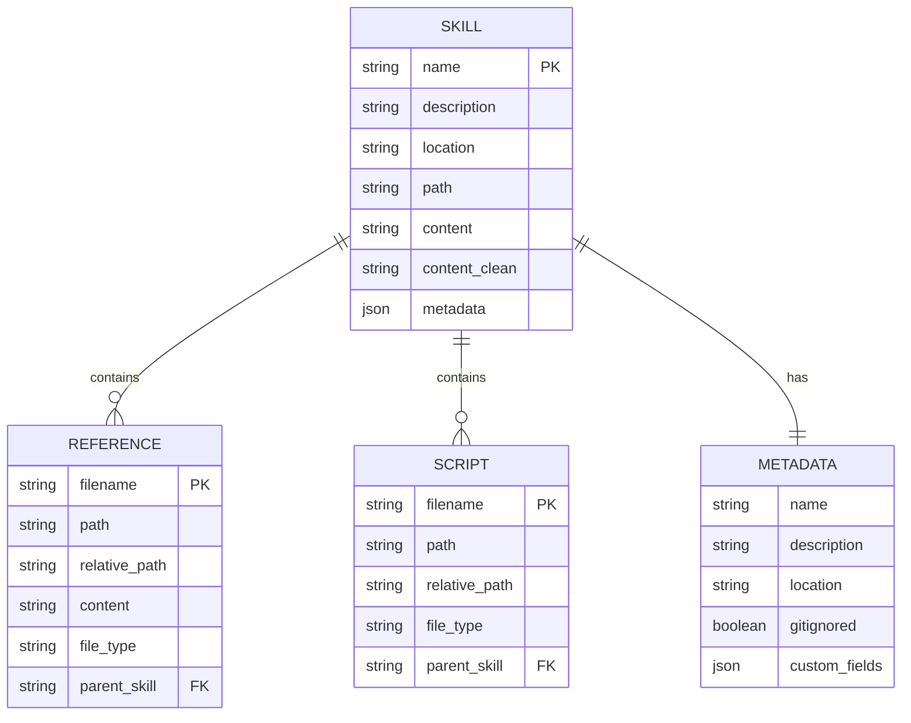
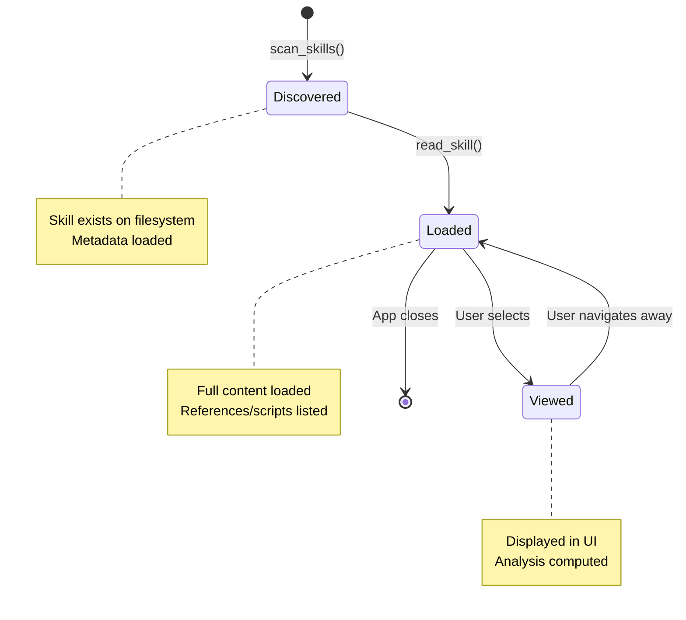

# Data Model

**Document Version**: 1.0.0
**Last Updated**: 2025-11-10
**Status**: Active

## Overview

This document defines the data model for the Skill Debugger application, including all entities, their properties, relationships, and validation rules.

---

## Entity Relationship Diagram



---

## Core Entities

### Entity: Skill

**Description**: Represents a Claude Code skill with all its components and metadata.

**Rust Definition**:
```rust
#[derive(Debug, Clone, Serialize, Deserialize)]
pub struct Skill {
    pub name: String,
    pub description: Option<String>,
    pub location: String,
    pub path: String,
    pub content: String,
    pub content_clean: String,
    pub references: Vec<Reference>,
    pub scripts: Vec<Script>,
    pub metadata: Option<serde_json::Value>,
}
```

**TypeScript Definition**:
```typescript
interface Skill {
  name: string;
  description?: string;
  location: string;
  path: string;
  content: string;
  content_clean: string;
  references: Reference[];
  scripts: Script[];
  metadata?: Record<string, any>;
}
```

**Properties**:

| Property | Type | Required | Description | Validation |
|----------|------|----------|-------------|------------|
| `name` | string | Yes | Skill name from filename or metadata | Non-empty, max 255 chars |
| `description` | string | No | Skill description from frontmatter | Max 1000 chars |
| `location` | string | Yes | "claude" or "opencode" | Enum: ["claude", "opencode"] |
| `path` | string | Yes | Full filesystem path to skill.md | Valid absolute path |
| `content` | string | Yes | Full markdown including frontmatter | Max 10MB |
| `content_clean` | string | Yes | Markdown without frontmatter | Max 10MB |
| `references` | Reference[] | Yes | List of reference files | Empty array if none |
| `scripts` | Script[] | Yes | List of script files | Empty array if none |
| `metadata` | JSON | No | Parsed YAML frontmatter | Valid JSON object |

**Business Rules**:
- BR-SKILL-001: Name must be unique within a location
- BR-SKILL-002: Path must exist and be readable
- BR-SKILL-003: If metadata exists, it must be valid JSON
- BR-SKILL-004: Location must be one of the supported directories
- BR-SKILL-005: Content_clean must not include YAML frontmatter

**Example**:
```json
{
  "name": "plantuml",
  "description": "Generate PlantUML diagrams from text descriptions",
  "location": "claude",
  "path": "/Users/username/.claude/skills/plantuml/skill.md",
  "content": "---\nname: plantuml\n...",
  "content_clean": "# PlantUML Skill\n\n...",
  "references": [...],
  "scripts": [...],
  "metadata": {
    "name": "plantuml",
    "description": "...",
    "location": "user"
  }
}
```

---

### Entity: Reference

**Description**: Represents a reference file within a skill's references/ directory.

**Rust Definition**:
```rust
#[derive(Debug, Clone, Serialize, Deserialize)]
pub struct Reference {
    pub filename: String,
    pub path: String,
    pub relative_path: String,
    pub file_type: String,
}
```

**TypeScript Definition**:
```typescript
interface Reference {
  filename: string;
  path: string;
  relative_path: string;
  file_type: string;
}
```

**Properties**:

| Property | Type | Required | Description | Validation |
|----------|------|----------|-------------|------------|
| `filename` | string | Yes | Name of the reference file | Non-empty, valid filename |
| `path` | string | Yes | Full filesystem path | Valid absolute path |
| `relative_path` | string | Yes | Path relative to skill directory | Starts with "references/" |
| `file_type` | string | Yes | File extension | e.g., "md", "txt", "py" |

**Business Rules**:
- BR-REF-001: Filename must be unique within skill's references directory
- BR-REF-002: Path must exist and be readable
- BR-REF-003: Relative path must start with "references/"
- BR-REF-004: File type determined from extension

**Example**:
```json
{
  "filename": "sequence-diagrams.md",
  "path": "/Users/username/.claude/skills/plantuml/references/sequence-diagrams.md",
  "relative_path": "references/sequence-diagrams.md",
  "file_type": "md"
}
```

---

### Entity: Script

**Description**: Represents a script file within a skill's scripts/ directory.

**Rust Definition**:
```rust
#[derive(Debug, Clone, Serialize, Deserialize)]
pub struct Script {
    pub filename: String,
    pub path: String,
    pub relative_path: String,
    pub file_type: String,
}
```

**TypeScript Definition**:
```typescript
interface Script {
  filename: string;
  path: string;
  relative_path: string;
  file_type: string;
}
```

**Properties**:

| Property | Type | Required | Description | Validation |
|----------|------|----------|-------------|------------|
| `filename` | string | Yes | Name of the script file | Non-empty, valid filename |
| `path` | string | Yes | Full filesystem path | Valid absolute path |
| `relative_path` | string | Yes | Path relative to skill directory | Starts with "scripts/" |
| `file_type` | string | Yes | File extension | e.g., "sh", "py", "js" |

**Business Rules**:
- BR-SCRIPT-001: Filename must be unique within skill's scripts directory
- BR-SCRIPT-002: Path must exist and be readable
- BR-SCRIPT-003: Relative path must start with "scripts/"
- BR-SCRIPT-004: File type determined from extension

**Example**:
```json
{
  "filename": "generate-diagram.sh",
  "path": "/Users/username/.claude/skills/plantuml/scripts/generate-diagram.sh",
  "relative_path": "scripts/generate-diagram.sh",
  "file_type": "sh"
}
```

---

## Supporting Data Structures

### Type: TriggerAnalysis

**Description**: Result of analyzing a skill's trigger patterns (computed, not persisted).

**TypeScript Definition**:
```typescript
interface TriggerAnalysis {
  skill: Skill;
  keywords: TriggerKeyword[];
  examples: string[];
  categories: TriggerCategory[];
  confidence: number;
}

interface TriggerKeyword {
  text: string;
  category: 'action' | 'topic' | 'tool' | 'keyword';
  confidence: number;
}

interface TriggerCategory {
  name: string;
  keywords: string[];
  count: number;
}
```

**Properties**:

| Property | Type | Required | Description |
|----------|------|----------|-------------|
| `skill` | Skill | Yes | The skill being analyzed |
| `keywords` | TriggerKeyword[] | Yes | Extracted trigger keywords |
| `examples` | string[] | Yes | Example queries that would trigger |
| `categories` | TriggerCategory[] | Yes | Categorized triggers |
| `confidence` | number | Yes | Overall confidence (0-1) |

**Business Rules**:
- BR-TRIGGER-001: Keywords extracted from description field
- BR-TRIGGER-002: Confidence calculated based on keyword strength
- BR-TRIGGER-003: Categories determined by keyword patterns
- BR-TRIGGER-004: Examples generated from keyword combinations

---

### Type: MermaidDiagram

**Description**: Generated Mermaid diagram syntax (computed, not persisted).

**TypeScript Definition**:
```typescript
interface MermaidDiagram {
  skill: Skill;
  syntax: string;
  nodeCount: number;
  edgeCount: number;
}
```

**Properties**:

| Property | Type | Required | Description |
|----------|------|----------|-------------|
| `skill` | Skill | Yes | The skill being visualized |
| `syntax` | string | Yes | Mermaid flowchart syntax |
| `nodeCount` | number | Yes | Number of nodes in diagram |
| `edgeCount` | number | Yes | Number of edges in diagram |

**Business Rules**:
- BR-DIAGRAM-001: Syntax must be valid Mermaid flowchart
- BR-DIAGRAM-002: Skill is root node
- BR-DIAGRAM-003: References and scripts are child nodes
- BR-DIAGRAM-004: Nodes have distinct visual styles

---

## Data Relationships

### Skill ↔ Reference (One-to-Many)

**Relationship Type**: Composition (Reference cannot exist without Skill)

**Cardinality**: 1 Skill → 0..N References

**Navigation**:
- From Skill: `skill.references[]`
- From Reference: Via `relative_path` (contains parent context)

**Cascade Rules**:
- Deleting a Skill (conceptually) would delete its References
- References are loaded when Skill is loaded

---

### Skill ↔ Script (One-to-Many)

**Relationship Type**: Composition (Script cannot exist without Skill)

**Cardinality**: 1 Skill → 0..N Scripts

**Navigation**:
- From Skill: `skill.scripts[]`
- From Script: Via `relative_path` (contains parent context)

**Cascade Rules**:
- Deleting a Skill (conceptually) would delete its Scripts
- Scripts are loaded when Skill is loaded

---

### Skill ↔ Metadata (One-to-One)

**Relationship Type**: Aggregation (Metadata is optional)

**Cardinality**: 1 Skill → 0..1 Metadata

**Navigation**:
- From Skill: `skill.metadata`

**Cascade Rules**:
- Metadata is embedded in Skill
- Missing metadata is represented as `null` or `undefined`

---

## Data Validation Rules

### Path Validation

**Rule**: All filesystem paths must be validated before access

**Validation Steps**:
1. Must be absolute path
2. Must exist on filesystem
3. Must be readable
4. Must be within allowed directories
5. Must not contain path traversal patterns (.., ~, etc.)

**Implementation**:
```rust
pub fn validate_path(path: &str) -> Result<PathBuf, String> {
    let path = PathBuf::from(path);

    // Must be absolute
    if !path.is_absolute() {
        return Err("Path must be absolute".to_string());
    }

    // Must exist
    if !path.exists() {
        return Err("Path does not exist".to_string());
    }

    // Must be within allowed directories
    let allowed_dirs = get_skill_directories();
    if !is_within_allowed_dirs(&path, &allowed_dirs) {
        return Err("Path is outside allowed directories".to_string());
    }

    Ok(path)
}
```

---

### Content Validation

**Rule**: Markdown content must be safe for rendering

**Validation Steps**:
1. Must be valid UTF-8
2. File size must be within limits (<10MB)
3. No malicious HTML tags (if HTML is disabled)
4. YAML frontmatter must be valid if present

**Implementation**:
```rust
pub fn validate_content(content: &str) -> Result<(), String> {
    // Check UTF-8 (already guaranteed by String type)

    // Check size
    if content.len() > MAX_CONTENT_SIZE {
        return Err("Content exceeds size limit".to_string());
    }

    // Validate YAML if present
    if let Some(yaml) = extract_frontmatter(content) {
        validate_yaml(&yaml)?;
    }

    Ok(())
}
```

---

### YAML Validation

**Rule**: YAML frontmatter must be parseable and contain valid data

**Validation Steps**:
1. Must be valid YAML syntax
2. Must be enclosed in `---` delimiters
3. Standard fields must have correct types
4. Custom fields can be any valid YAML type

**Implementation**:
```rust
pub fn validate_yaml(yaml_str: &str) -> Result<serde_json::Value, String> {
    match serde_yaml::from_str(yaml_str) {
        Ok(value) => Ok(value),
        Err(e) => Err(format!("Invalid YAML: {}", e))
    }
}
```

---

## Data Serialization

### IPC Serialization (Rust ↔ TypeScript)

**Format**: JSON

**Process**:
1. Rust structures implement `Serialize` (serde)
2. Tauri automatically serializes to JSON for IPC
3. TypeScript receives typed objects
4. TypeScript types match Rust structure

**Example**:
```rust
// Rust
#[tauri::command]
async fn scan_skills() -> Result<Vec<Skill>, String> {
    // Returns Vec<Skill>
}
```

```typescript
// TypeScript
const skills = await invoke<Skill[]>('scan_skills');
// Type-safe Skill[] received
```

---

### File System Serialization

**Skill Files**: Markdown with YAML frontmatter

**Format**:
```markdown
---
name: skill-name
description: Skill description
location: user
gitignored: project
---

# Skill Content

Markdown content here...
```

**Parsing Strategy**:
1. Split file at YAML delimiters (`---`)
2. Parse YAML section separately
3. Parse markdown section separately
4. Combine into Skill structure

---

## Data Lifecycle

### Skill Lifecycle



### Data Loading Strategy

**Phase 1 - Application Startup**:
- Load skill metadata only (name, description, location)
- Don't load full content yet
- Store in Zustand state

**Phase 2 - Skill Selection**:
- Load full skill content on-demand
- Parse YAML frontmatter
- List references and scripts (don't load content)
- Cache in React Query

**Phase 3 - Reference Navigation**:
- Load reference content on-demand
- Render in viewer
- Cache in React Query

**Caching Strategy**:
- Skill list: Cache for 5 minutes
- Skill content: Cache for duration of session
- Reference content: Cache for duration of session

---

## Data Constraints

### Size Constraints

| Entity | Field | Max Size | Rationale |
|--------|-------|----------|-----------|
| Skill | name | 255 chars | Filesystem limits |
| Skill | description | 1000 chars | UI display |
| Skill | content | 10MB | Performance |
| Skill | content_clean | 10MB | Performance |
| Reference | filename | 255 chars | Filesystem limits |
| Script | filename | 255 chars | Filesystem limits |

### Quantity Constraints

| Entity | Max Count | Rationale |
|--------|-----------|-----------|
| Skills | 1000 | Performance target |
| References per Skill | 100 | Practical limit |
| Scripts per Skill | 50 | Practical limit |

---

## Data Integrity Rules

### Rule 1: Unique Skill Names per Location

**Description**: Skill names must be unique within each location (claude or opencode)

**Enforcement**: Application-level (display both if duplicates exist)

**Handling**: Show location badge to distinguish duplicates

---

### Rule 2: Path Consistency

**Description**: All paths must be consistent (absolute vs relative)

**Enforcement**: Backend validation

**Handling**: Reject invalid paths with clear error message

---

### Rule 3: Content Encoding

**Description**: All text content must be UTF-8 encoded

**Enforcement**: Rust String type guarantees

**Handling**: Encoding errors result in file read failure

---

## Data Migration

### Future Considerations

If data format changes in future versions:

1. **Version Field**: Add version field to Skill metadata
2. **Migration Scripts**: Provide migration tools
3. **Backward Compatibility**: Support reading old formats
4. **Schema Versioning**: Document schema changes

**Current Version**: 1.0.0 (initial schema)

---

**Document Maintenance Note**: Update this document when:
- New entities are added
- Entity structures change
- Relationships are modified
- Validation rules change
- Data constraints are adjusted
