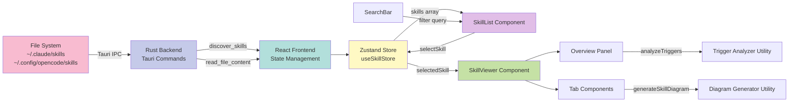
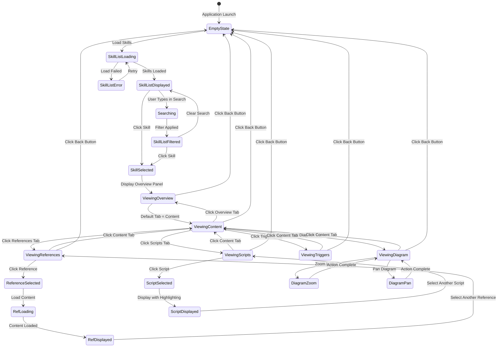
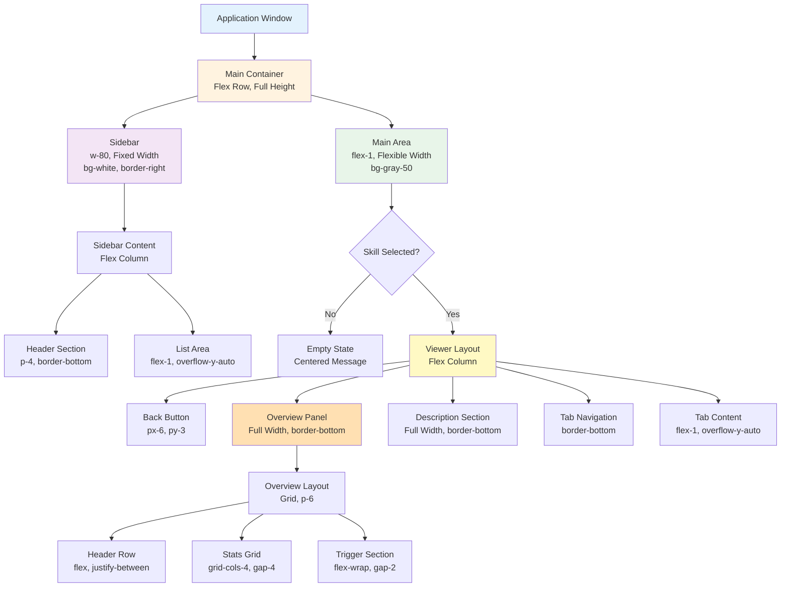
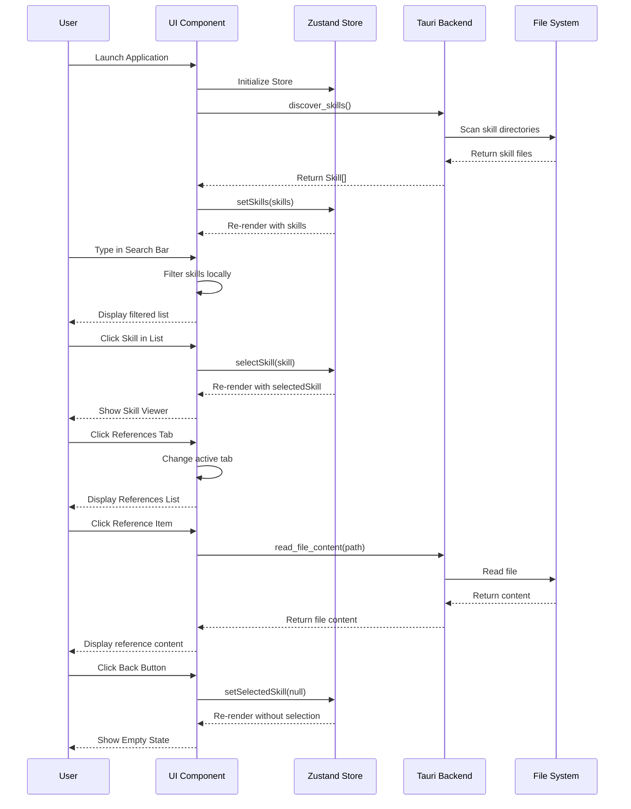

# UI Component Hierarchy Diagram

This diagram illustrates the component hierarchy and data flow of the Skill Debugger user interface.

## Component Tree

```mermaid
graph TD
    App[App.tsx]
    App --> Layout[Layout.tsx]

    Layout --> Sidebar[Sidebar - 320px Fixed]
    Layout --> MainContent[Main Content Area]

    Sidebar --> SidebarHeader[Sidebar Header<br/>Branding & Title]
    Sidebar --> SearchBar[SearchBar<br/>Real-time Filter]
    Sidebar --> SkillCount[Skill Count<br/>X of Y skills]
    Sidebar --> SkillList[SkillList<br/>Scrollable Container]

    SkillList --> SkillListItem1[SkillListItem<br/>Skill 1]
    SkillList --> SkillListItem2[SkillListItem<br/>Skill 2]
    SkillList --> SkillListItemN[SkillListItem<br/>Skill N...]

    MainContent --> EmptyState[Empty State<br/>Welcome Message]
    MainContent --> SkillViewer[SkillViewer<br/>When Skill Selected]

    SkillViewer --> BackNav[Back Navigation<br/>Return to Empty State]
    SkillViewer --> OverviewPanel[Overview Panel<br/>Top Banner]
    SkillViewer --> DescriptionSection[Description Section<br/>YAML Metadata]
    SkillViewer --> TabNav[Tab Navigation<br/>6 Tabs]
    SkillViewer --> TabContent[Tab Content Area<br/>Dynamic Content]

    OverviewPanel --> SkillHeader[Skill Header<br/>Name + Location Badge]
    OverviewPanel --> QuickStats[Quick Stats Grid<br/>2x2 Cards]
    OverviewPanel --> TriggerPreview[Trigger Preview<br/>Top 5 Keywords]

    QuickStats --> RefCard[References Card<br/>Clickable]
    QuickStats --> ScriptCard[Scripts Card<br/>Clickable]
    QuickStats --> TriggerCard[Triggers Card<br/>Clickable]
    QuickStats --> LinesCard[Lines Card<br/>Display Only]

    TabNav --> OverviewTab[Overview Tab<br/>YAML Display]
    TabNav --> ContentTab[Content Tab<br/>Markdown]
    TabNav --> ReferencesTab[References Tab<br/>Master-Detail]
    TabNav --> ScriptsTab[Scripts Tab<br/>Master-Detail]
    TabNav --> TriggersTab[Triggers Tab<br/>Analysis]
    TabNav --> DiagramTab[Diagram Tab<br/>Mermaid]

    TabContent --> ActiveTab[Active Tab Content<br/>Rendered Based on Selection]

    ReferencesTab --> RefList[Reference List<br/>Left Column 320px]
    ReferencesTab --> RefContent[Reference Content<br/>Right Column Flex]

    ScriptsTab --> ScriptList[Script List<br/>Left Column 320px]
    ScriptsTab --> ScriptContent[Script Content<br/>Right Column Flex]

    TriggersTab --> TriggerKeywords[Trigger Keywords<br/>Color-coded Badges]
    TriggersTab --> ExampleQueries[Example Queries<br/>Generated Examples]
    TriggersTab --> AnalysisSummary[Analysis Summary<br/>Category Counts]

    DiagramTab --> DiagramControls[Diagram Controls<br/>Zoom, Pan, Font Size]
    DiagramTab --> DiagramCanvas[Diagram Canvas<br/>Mermaid Rendering]

    style App fill:#e1f5ff
    style Layout fill:#fff4e6
    style Sidebar fill:#f3e5f5
    style MainContent fill:#e8f5e9
    style SkillViewer fill:#fff9c4
    style OverviewPanel fill:#ffe0b2
    style TabNav fill:#ffccbc
    style TabContent fill:#d7ccc8
```

## Data Flow

## User Interaction Flow

## Layout Structure

## State Management Flow

## Component Responsibilities

| Component | Primary Responsibility | State Management | User Interactions |
|-----------|------------------------|------------------|-------------------|
| **Layout** | Overall app structure | None (presentation) | None |
| **SkillList** | Display and filter skills | Local filter state | Search input, skill selection |
| **SearchBar** | Search input field | Controlled by parent | Text input |
| **SkillViewer** | Skill detail container | Active tab state | Tab switching, back navigation |
| **OverviewPanel** | Quick stats display | None (props-based) | Navigate to tabs via stats |
| **DescriptionSection** | Metadata display | None (props-based) | None |
| **TriggerAnalysis** | Trigger keyword analysis | None (computed) | None |
| **DiagramView** | Interactive diagram | Local zoom/pan state | Zoom, pan, font adjust |
| **ReferencesTab** | Reference browser | Selection state, content cache | Select reference, load content |
| **ScriptsTab** | Script browser | Selection state | Select script |

## Key Design Patterns

### Pattern 1: Master-Detail Layout
- Used in References and Scripts tabs
- Left column (320px): List of items
- Right column (flex): Selected item content
- Independent scrolling for each column

### Pattern 2: Tab-Based Navigation
- Single active tab at a time
- Content area updates without page reload
- Tab state managed by SkillViewer parent
- Smooth transitions between tabs

### Pattern 3: Progressive Disclosure
- Overview Panel → Quick summary
- Description Section → Key details
- Tab Content → Deep dive
- User chooses depth of exploration

### Pattern 4: Async Data Loading
- Initial skill list from backend
- Reference content loaded on-demand
- Loading states provide feedback
- Error states allow recovery

### Pattern 5: Real-time Filtering
- Search filters locally (no backend calls)
- Instant results as user types
- Filtered count updates dynamically
- No submit button required

## Related Documents

- **[UI/UX Requirements](../ui-ux-requirements.md)** - Detailed UI requirements
- **[Technical Architecture](../technical-architecture.md)** - System architecture
- **[Component Specifications](../../UI_SPECIFICATION_V2.md)** - UI design specifications
