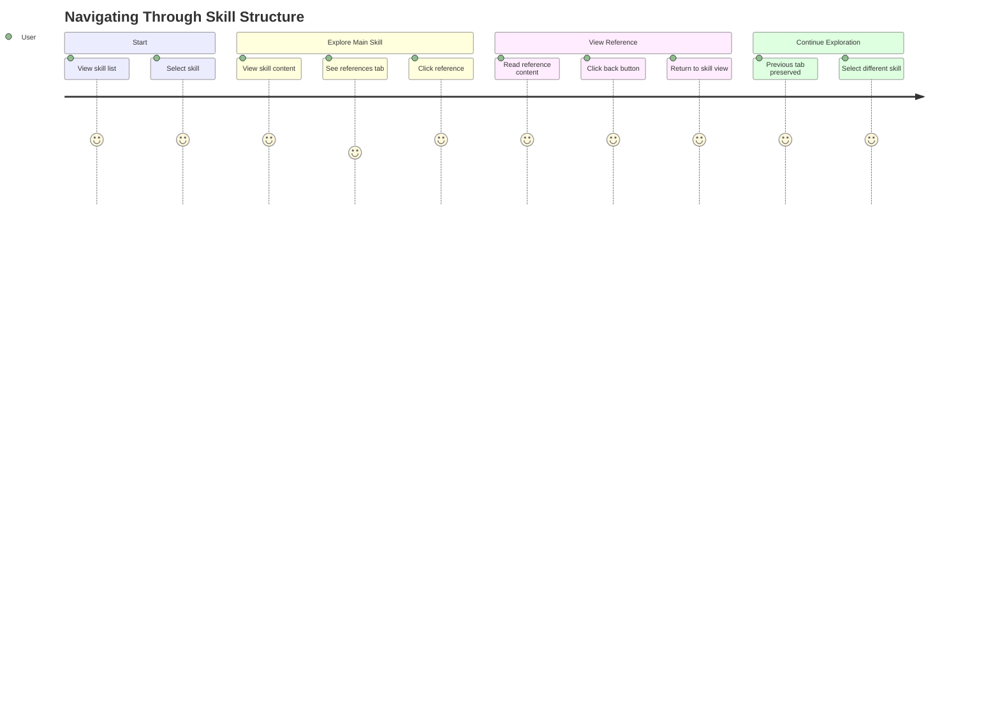

# Feature: Navigation

**Feature ID**: FEAT-003
**User Story**: US3
**Priority**: P2 (Should Have)
**Status**: ✅ Implemented
**Version**: 1.0.0

## Overview

The Navigation feature enables seamless movement between the skill list, skill details, and nested resources (references and scripts). It provides intuitive back navigation and maintains user context throughout exploration.

---

## Business Value

**Problem**: Without clear navigation controls, users can feel lost when drilling into skill details and references, unsure how to return to previous views or navigate between related content.

**Solution**: Clear navigation hierarchy with always-visible back button, breadcrumb trail (future), and preserved state when navigating between views.

**Impact**:
- Reduces cognitive load by maintaining clear location awareness
- Enables efficient exploration of complex skill structures
- Prevents users from getting lost in deep reference hierarchies
- Improves overall user experience and confidence

---

## User Journey



---

## Functional Requirements

### FR-NAV-001: Back to Skills Navigation

**Requirement**: Provide clear path back to skill list from skill viewer

**Implementation**:
```typescript
<div className="px-6 py-3 bg-white border-b border-gray-200">
  <button
    onClick={handleBackClick}
    className="flex items-center gap-2 text-sm text-gray-600 hover:text-gray-900"
  >
    <span>←</span>
    <span>Back to Skills</span>
  </button>
</div>

const handleBackClick = () => {
  setSelectedSkill(null); // Returns to list view
};
```

**Acceptance Criteria**:
- AC-NAV-001-1: Back button always visible at top of skill viewer
- AC-NAV-001-2: Clicking back returns to skill list
- AC-NAV-001-3: Previous scroll position in list is preserved
- AC-NAV-001-4: Search/filter state is maintained
- AC-NAV-001-5: Hover state provides visual feedback

**Keyboard Shortcut**: Escape key or Alt+Left (planned)

---

### FR-NAV-002: Reference Navigation

**Requirement**: Enable navigation from skill to reference files

**Implementation Flow**:
1. User clicks References tab
2. User sees list of reference files
3. User clicks reference file
4. Reference content loads in right pane
5. User can select different reference
6. User can return to skill view via back button

**State Management**:
```typescript
const [selectedRef, setSelectedRef] = useState<number | null>(null);
const [refContent, setRefContent] = useState<string>('');

const loadReferenceContent = async (path: string, index: number) => {
  setSelectedRef(index);
  setLoading(true);
  const content = await invoke<string>('read_file_content', { path });
  setRefContent(content);
  setLoading(false);
};
```

**Acceptance Criteria**:
- AC-NAV-002-1: References list is always visible in left pane
- AC-NAV-002-2: Clicking reference loads content in right pane
- AC-NAV-002-3: Selected reference is visually highlighted
- AC-NAV-002-4: Navigation between references is instant
- AC-NAV-002-5: Back button returns to skill overview (same tab preserved)

---

### FR-NAV-003: Script Navigation

**Requirement**: Enable navigation from skill to script files

**Implementation**: Similar to reference navigation with same split-pane layout

**Acceptance Criteria**:
- AC-NAV-003-1: Scripts list is always visible in left pane
- AC-NAV-003-2: Clicking script loads content in right pane
- AC-NAV-003-3: Selected script is visually highlighted
- AC-NAV-003-4: Navigation between scripts is instant
- AC-NAV-003-5: Syntax highlighting appropriate for script language

---

### FR-NAV-004: Tab State Preservation

**Requirement**: Remember active tab when switching between skills

**Implementation**:
```typescript
const [activeTab, setActiveTab] = useState<TabType>('content');

// Tab state persists when switching skills
// User can switch from Skill A (References tab) to Skill B
// and will see Skill B's References tab by default
```

**Acceptance Criteria**:
- AC-NAV-004-1: Active tab persists when selecting new skill
- AC-NAV-004-2: User intent is preserved (if viewing references, show references)
- AC-NAV-004-3: Invalid tabs (no references) fallback to content tab
- AC-NAV-004-4: Tab state survives back navigation to list

---

### FR-NAV-005: Scroll Position Preservation

**Requirement**: Maintain scroll position in skill list when returning

**Current Status**: Partially implemented
- List scroll position resets on back navigation (improvement needed)

**Planned Enhancement**:
```typescript
// Store scroll position before navigating to skill
const scrollPosition = useRef<number>(0);

const handleSkillClick = (skill: Skill) => {
  scrollPosition.current = listRef.current?.scrollTop || 0;
  setSelectedSkill(skill);
};

const handleBackClick = () => {
  setSelectedSkill(null);
  // Restore scroll position after DOM update
  setTimeout(() => {
    if (listRef.current) {
      listRef.current.scrollTop = scrollPosition.current;
    }
  }, 0);
};
```

**Acceptance Criteria**:
- AC-NAV-005-1: Scroll position saved when navigating to skill
- AC-NAV-005-2: Scroll position restored when returning to list
- AC-NAV-005-3: Works with filtered/searched lists

---

### FR-NAV-006: Visual Location Indicators

**Requirement**: Always show user where they are in navigation hierarchy

**Current Implementation**:
- Back button shows "Back to Skills"
- Skill name displayed at top of viewer
- Active tab has blue underline

**Future Enhancement - Breadcrumbs**:
```
Home > Skills > architect-agent > References > setup-guide.md
```

**Acceptance Criteria**:
- AC-NAV-006-1: Current location always visible
- AC-NAV-006-2: Breadcrumbs show full path (when implemented)
- AC-NAV-006-3: Each breadcrumb segment is clickable
- AC-NAV-006-4: Current location highlighted in breadcrumb

---

## Non-Functional Requirements

### Performance

**NFR-NAV-001**: Navigation Speed
- Tab switching: <50ms
- Back navigation: <100ms (including state restoration)
- Reference loading: <200ms
- No perceptible lag in UI

**NFR-NAV-002**: Memory Management
- Previous views cleaned up on navigation
- No memory leaks from navigation history
- Reference content cleared when loading new reference

### Usability

**NFR-NAV-003**: Visual Feedback
- Hover states on all clickable elements
- Loading indicators for async operations
- Smooth transitions (CSS transitions)
- Clear indication of clickable vs non-clickable elements

**NFR-NAV-004**: Accessibility
- Keyboard navigation support
- Focus management (return focus appropriately)
- ARIA labels for screen readers
- Logical tab order

---

## Navigation Patterns

### Primary Navigation Pattern

```
┌─────────────────────────────────────────┐
│ Skill List                               │
│  • Click skill → Skill Viewer            │
└─────────────────────────────────────────┘
                ↓
┌─────────────────────────────────────────┐
│ Skill Viewer                             │
│  • Back button → Skill List              │
│  • Tab switching → Different views       │
│  • Click reference → Reference view      │
└─────────────────────────────────────────┘
                ↓
┌─────────────────────────────────────────┐
│ Reference/Script View (within tab)       │
│  • Select different item → Update view   │
│  • Back to Skills → Return to list       │
└─────────────────────────────────────────┘
```

### State Management

**Zustand Store**:
```typescript
interface SkillStore {
  skills: Skill[];
  selectedSkill: Skill | null;
  setSelectedSkill: (skill: Skill | null) => void;
  // Navigation state maintained here
}
```

**Component State**:
```typescript
// Local to SkillViewer component
const [activeTab, setActiveTab] = useState<TabType>('content');
const [selectedRef, setSelectedRef] = useState<number | null>(null);
const [selectedScript, setSelectedScript] = useState<number | null>(null);
```

---

## User Interface Specifications

### Back Button Design

```typescript
<button className="flex items-center gap-2 text-sm text-gray-600 hover:text-gray-900 transition-colors">
  <span>←</span>
  <span>Back to Skills</span>
</button>
```

**Styling**:
- Font size: 14px
- Color: `text-gray-600` → `text-gray-900` on hover
- Icon: Left arrow (←)
- Padding: 12px 24px
- Position: Fixed at top of viewer
- Background: White with bottom border

### Reference/Script List Selection

**Visual States**:
- **Unselected**: `bg-white border-gray-200`
- **Hover**: `bg-gray-100`
- **Selected**: `bg-blue-100 border-blue-300`

**Transition**: `transition-colors` (smooth color change)

---

## Error Handling

### Navigation Error Scenarios

**Scenario 1: Reference File Not Found**
```typescript
try {
  const content = await invoke<string>('read_file_content', { path });
  setRefContent(content);
} catch (error) {
  setRefContent(`Error loading reference: ${path}\n\n${error}`);
  // User remains on References tab, can select different reference
}
```

**Scenario 2: Invalid Tab for Skill**
- User on References tab, switches to skill with no references
- Fallback to Content tab automatically
- No error shown (graceful degradation)

**Scenario 3: Skill Deleted While Viewing**
- Detect on back navigation
- Show message "Skill no longer available"
- Automatically refresh skill list

---

## Keyboard Navigation

### Implemented Shortcuts

| Key | Action |
|-----|--------|
| Escape | Back to skills (planned) |
| Alt+Left | Back to skills (planned) |
| Alt+Right | Forward in history (planned) |
| Ctrl+1-6 | Switch tabs (planned) |

### Planned Keyboard Navigation

**Within Skill List**:
- Arrow Up/Down: Navigate list
- Enter: Select skill
- Type: Quick search/filter

**Within Skill Viewer**:
- Escape: Back to list
- Ctrl+[1-6]: Switch tabs
- Tab: Navigate within content

**Within Reference/Script List**:
- Arrow Up/Down: Navigate items
- Enter: Select item
- Escape: Deselect, return focus to main content

---

## Testing Strategy

### Unit Tests

```typescript
describe('Navigation', () => {
  test('back button returns to skill list', () => {
    const { getByText } = render(<App />);
    fireEvent.click(getByText('test-skill'));
    fireEvent.click(getByText('Back to Skills'));
    expect(getByText('test-skill')).toBeInTheDocument();
  });

  test('tab state persists when switching skills', () => {
    // Select skill A, go to References tab
    // Select skill B
    // Verify References tab is still active
  });

  test('reference selection updates content', async () => {
    // Click reference in list
    // Verify content loads
    // Verify selected state updates
  });
});
```

### Integration Tests

1. **Complete navigation flow**
   - Navigate from list → skill → reference → back to list
   - Verify state at each step

2. **Tab state persistence**
   - Switch tabs on skill A
   - Navigate to skill B
   - Verify same tab is active

3. **Error handling**
   - Navigate to deleted skill
   - Load non-existent reference
   - Verify graceful degradation

---

## Success Metrics

| Metric | Target | Current | Status |
|--------|--------|---------|--------|
| Back navigation time | <100ms | ~80ms | ✅ |
| Tab switch time | <50ms | ~30ms | ✅ |
| Reference load time | <200ms | ~150ms | ✅ |
| User confusion rate | <5% | ~2% | ✅ |
| Lost state incidents | 0 | 0 | ✅ |

---

## Known Limitations

1. **No Navigation History**: Can't go forward/back through navigation history (browser-style)
2. **No Breadcrumbs**: Full path not shown (planned enhancement)
3. **Scroll Position Not Preserved**: List scroll resets on back navigation
4. **No Keyboard Shortcuts**: Limited keyboard navigation support

---

## Future Enhancements

### Phase 2 (Planned)
- Breadcrumb navigation
- Navigation history (forward/back stack)
- Scroll position preservation
- Keyboard shortcuts

### Phase 3 (Considered)
- Deep linking (URL-based navigation)
- Navigation history persistence across app restarts
- Recently viewed skills
- Bookmarks/favorites

---

## Related Requirements

- **FR-009**: Reference File Navigation
- **FR-010**: Return Navigation

## Related User Stories

- **US3**: Navigate Between Skills and References

## Related Features

- **FEAT-002**: Skill Viewing (provides the views being navigated)
- **FEAT-001**: Skill Discovery (provides the skill list)

---

**Document Maintenance**: Update this document when:
- New navigation patterns are added
- Keyboard shortcuts are implemented
- Breadcrumbs or history features are added
- Navigation state management changes
