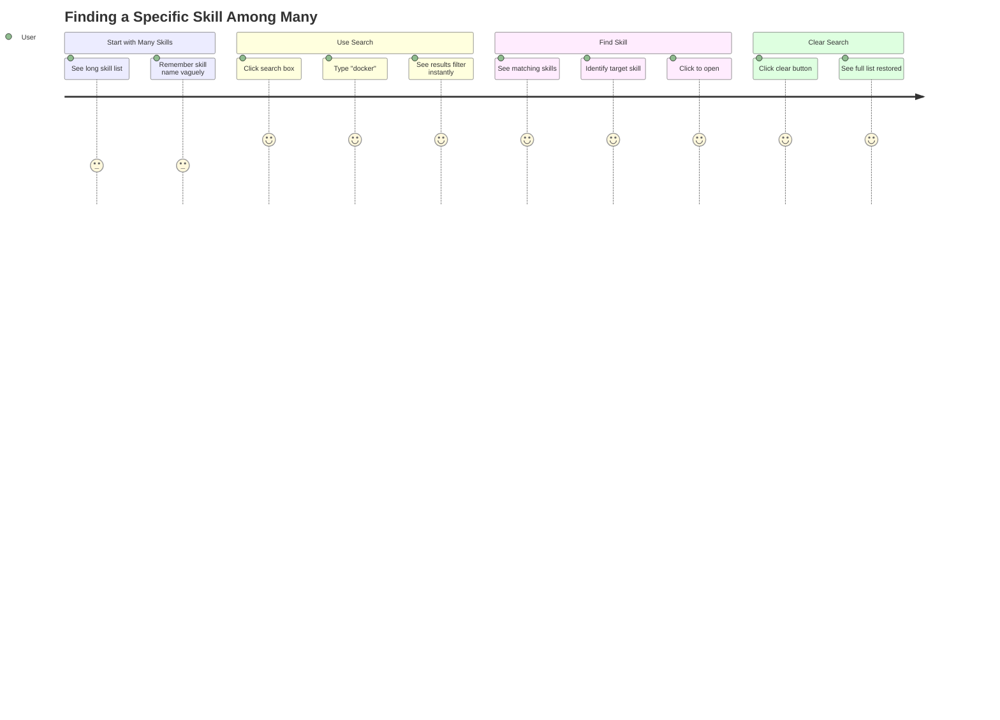

# Feature: Search & Filtering

**Feature ID**: FEAT-006
**User Story**: US6
**Priority**: P3 (Nice to Have)
**Status**: ✅ Implemented
**Version**: 1.0.0

## Overview

The Search & Filtering feature enables users to quickly locate specific skills within potentially large skill inventories by filtering the skill list in real-time based on text search queries. This significantly improves usability for users with many installed skills.

---

## Business Value

**Problem**: Users with dozens of skills installed must scroll through long lists to find specific skills, which is time-consuming and frustrating. Visual scanning is error-prone and doesn't scale.

**Solution**: Real-time text search that filters the skill list as users type, searching across skill names and descriptions with instant results and clear feedback.

**Impact**:
- Reduces time to find specific skill from minutes to seconds
- Improves user satisfaction for power users with many skills
- Enables quick skill lookup without remembering exact names
- Scales gracefully as skill count grows

---

## User Journey



---

## Functional Requirements

### FR-SEARCH-001: Real-Time Text Search

**Requirement**: Filter skill list as user types with <50ms response time

**Implementation**:
```typescript
const [searchQuery, setSearchQuery] = useState('');

const filteredSkills = useMemo(() => {
  if (!searchQuery.trim()) return skills;

  const query = searchQuery.toLowerCase();
  return skills.filter(skill =>
    skill.name.toLowerCase().includes(query) ||
    (skill.description && skill.description.toLowerCase().includes(query))
  );
}, [skills, searchQuery]);
```

**Search Fields**:
- Skill name (primary)
- Skill description (secondary)
- Location (optional - "claude" or "opencode")

**Acceptance Criteria**:
- AC-SEARCH-001-1: Filtering updates as user types
- AC-SEARCH-001-2: Results appear in <50ms
- AC-SEARCH-001-3: Search is case-insensitive
- AC-SEARCH-001-4: Partial matches are included
- AC-SEARCH-001-5: Empty query shows all skills

---

### FR-SEARCH-002: Search Input Component

**Requirement**: Provide clear, accessible search input with visual feedback

**Component Structure**:
```typescript
<SearchBar
  value={searchQuery}
  onChange={setSearchQuery}
  onClear={() => setSearchQuery('')}
  placeholder="Search skills..."
  resultCount={filteredSkills.length}
/>
```

**Features**:
- Text input with search icon
- Clear button (visible when text entered)
- Result count display
- Placeholder text
- Focus state visual feedback

**Acceptance Criteria**:
- AC-SEARCH-002-1: Input is clearly visible
- AC-SEARCH-002-2: Placeholder text is descriptive
- AC-SEARCH-002-3: Clear button appears when typing
- AC-SEARCH-002-4: Result count updates in real-time
- AC-SEARCH-002-5: Focus state is visually distinct

---

### FR-SEARCH-003: Result Count Display

**Requirement**: Show number of matching skills

**Implementation**:
```typescript
<div className="text-sm text-gray-600 mt-2">
  {filteredSkills.length === skills.length
    ? `${skills.length} skills`
    : `${filteredSkills.length} of ${skills.length} skills`}
</div>
```

**Display Logic**:
- No search: "20 skills"
- Active search: "5 of 20 skills"
- No results: "0 of 20 skills"

**Acceptance Criteria**:
- AC-SEARCH-003-1: Count updates immediately with search
- AC-SEARCH-003-2: Format clearly shows filtered vs total
- AC-SEARCH-003-3: Grammar is correct (1 skill vs 2 skills)

---

### FR-SEARCH-004: No Results State

**Requirement**: Show helpful message when no skills match

**Implementation**:
```typescript
{filteredSkills.length === 0 && searchQuery && (
  <div className="text-center py-12 text-gray-500">
    <div className="text-4xl mb-4">🔍</div>
    <p className="font-medium">No skills found</p>
    <p className="text-sm mt-2">
      Try different keywords or clear your search
    </p>
  </div>
)}
```

**Acceptance Criteria**:
- AC-SEARCH-004-1: Shows only when search is active and no results
- AC-SEARCH-004-2: Message is helpful and encouraging
- AC-SEARCH-004-3: Suggests actions (clear search, try different words)
- AC-SEARCH-004-4: Not an error state (uses neutral icon/color)

---

### FR-SEARCH-005: Clear Search Function

**Requirement**: Provide easy way to clear search and restore full list

**Implementation**:
```typescript
<button
  onClick={handleClear}
  className="p-1 hover:bg-gray-100 rounded"
  aria-label="Clear search"
>
  <XIcon className="w-4 h-4" />
</button>

const handleClear = () => {
  setSearchQuery('');
  inputRef.current?.focus(); // Return focus to input
};
```

**Trigger Methods**:
1. Click clear button (X icon)
2. Escape key (future)
3. Programmatic via parent component

**Acceptance Criteria**:
- AC-SEARCH-005-1: Clear button visible when text entered
- AC-SEARCH-005-2: Clicking clear empties search
- AC-SEARCH-005-3: Full skill list restores immediately
- AC-SEARCH-005-4: Focus returns to search input
- AC-SEARCH-005-5: Clear button has hover state

---

### FR-SEARCH-006: Search Performance

**Requirement**: Maintain UI responsiveness during search

**Performance Targets**:
- Search filtering: <50ms
- UI update: <16ms (60 FPS)
- No input lag
- Smooth scrolling

**Optimization Techniques**:
```typescript
// Memoize filtered results
const filteredSkills = useMemo(() => {
  // filtering logic
}, [skills, searchQuery]);

// Optional: Debounce for very large lists
const debouncedQuery = useDebounce(searchQuery, 150);
```

**Acceptance Criteria**:
- AC-SEARCH-006-1: Typing feels instant (no lag)
- AC-SEARCH-006-2: Results update smoothly
- AC-SEARCH-006-3: Works with 100+ skills
- AC-SEARCH-006-4: No frame drops during typing

---

### FR-SEARCH-007: Search Highlighting (Future)

**Requirement**: Highlight matching text in results

**Status**: Not yet implemented (planned enhancement)

**Proposed Implementation**:
```typescript
function highlightMatch(text: string, query: string): ReactNode {
  const parts = text.split(new RegExp(`(${query})`, 'gi'));
  return parts.map((part, i) =>
    part.toLowerCase() === query.toLowerCase() ? (
      <mark key={i} className="bg-yellow-200">{part}</mark>
    ) : (
      <span key={i}>{part}</span>
    )
  );
}
```

**Acceptance Criteria**:
- AC-SEARCH-007-1: Matching text is highlighted
- AC-SEARCH-007-2: Case-insensitive highlighting
- AC-SEARCH-007-3: Multiple matches highlighted
- AC-SEARCH-007-4: Highlight color is accessible

---

## Non-Functional Requirements

### Performance

**NFR-SEARCH-001**: Response Time
- Search filtering: <50ms (target)
- Current: ~10-20ms for 50 skills
- Scalable to 200+ skills with current approach

**NFR-SEARCH-002**: Memory Efficiency
- Filtered list is virtual (shares references with original)
- No memory allocation for filtering
- Garbage collection friendly

### Usability

**NFR-SEARCH-003**: User Experience
- Zero perceived lag during typing
- Immediate visual feedback
- Clear indication of active search
- Easy to clear and reset

**NFR-SEARCH-004**: Accessibility
- Keyboard-only operation supported
- Screen reader announcements
- ARIA labels for buttons
- Focus management

---

## User Interface Specifications

### Search Bar Component

```typescript
<div className="px-4 py-3 border-b border-gray-200">
  <div className="relative">
    <input
      type="text"
      placeholder="Search skills..."
      value={searchQuery}
      onChange={(e) => setSearchQuery(e.target.value)}
      className="w-full pl-10 pr-10 py-2 border border-gray-300 rounded-lg
                 focus:ring-2 focus:ring-blue-500 focus:border-blue-500"
    />
    <div className="absolute left-3 top-2.5 text-gray-400">
      🔍
    </div>
    {searchQuery && (
      <button
        onClick={() => setSearchQuery('')}
        className="absolute right-3 top-2.5 text-gray-400 hover:text-gray-600"
      >
        ✕
      </button>
    )}
  </div>
  <div className="text-sm text-gray-600 mt-2">
    {filteredSkills.length} of {skills.length} skills
  </div>
</div>
```

**Visual Design**:
- Border: Gray 300
- Focus ring: Blue 500
- Height: 40px
- Border radius: 8px
- Icon size: 16px
- Font size: 14px

### Search States

**Empty (No Query)**:
```
┌───────────────────────────────┐
│ 🔍 Search skills...           │
└───────────────────────────────┘
 20 skills
```

**Active Search (With Results)**:
```
┌───────────────────────────────┐
│ 🔍 docker                   ✕ │
└───────────────────────────────┘
 3 of 20 skills
```

**No Results**:
```
┌───────────────────────────────┐
│ 🔍 xyz123                   ✕ │
└───────────────────────────────┘
 0 of 20 skills

       🔍
   No skills found
Try different keywords or clear search
```

---

## Search Algorithm

### Case-Insensitive Substring Matching

```typescript
function matchesSearch(skill: Skill, query: string): boolean {
  const normalizedQuery = query.toLowerCase().trim();

  // Empty query matches all
  if (!normalizedQuery) return true;

  // Check skill name
  if (skill.name.toLowerCase().includes(normalizedQuery)) {
    return true;
  }

  // Check description
  if (skill.description && skill.description.toLowerCase().includes(normalizedQuery)) {
    return true;
  }

  // Optional: Check location
  if (skill.location.toLowerCase().includes(normalizedQuery)) {
    return true;
  }

  return false;
}
```

### Future: Fuzzy Matching

**Status**: Not implemented (potential enhancement)

**Use Case**: Handle typos and approximate matches

**Example**:
- Query: "arquitect" (typo)
- Matches: "architect-agent"

**Library Options**:
- fuse.js
- match-sorter
- fuzzy

---

## Keyboard Shortcuts

### Current Support

| Key | Action |
|-----|--------|
| Type in input | Filter skills |
| Tab | Navigate to/from search |
| Enter | (No action currently) |

### Planned Support

| Key | Action |
|-----|--------|
| Ctrl/Cmd+F | Focus search input |
| Escape | Clear search |
| Arrow Down | Move to first result |
| Arrow Up | Return to search input |
| Enter | Select highlighted skill |

---

## Testing Strategy

### Unit Tests

```typescript
describe('Search Functionality', () => {
  test('filters skills by name', () => {
    const skills = [
      { name: 'docker-expert', description: '' },
      { name: 'python-expert', description: '' }
    ];
    const filtered = filterSkills(skills, 'docker');
    expect(filtered).toHaveLength(1);
    expect(filtered[0].name).toBe('docker-expert');
  });

  test('filters skills by description', () => {
    const skills = [
      { name: 'skill-1', description: 'Works with Docker' },
      { name: 'skill-2', description: 'Python tool' }
    ];
    const filtered = filterSkills(skills, 'docker');
    expect(filtered).toHaveLength(1);
  });

  test('search is case-insensitive', () => {
    const skills = [{ name: 'Docker-Expert', description: '' }];
    expect(filterSkills(skills, 'docker')).toHaveLength(1);
    expect(filterSkills(skills, 'DOCKER')).toHaveLength(1);
    expect(filterSkills(skills, 'DoKeR')).toHaveLength(1);
  });

  test('empty query returns all skills', () => {
    const skills = createTestSkills(10);
    expect(filterSkills(skills, '')).toHaveLength(10);
    expect(filterSkills(skills, '   ')).toHaveLength(10);
  });

  test('no matches returns empty array', () => {
    const skills = createTestSkills(10);
    expect(filterSkills(skills, 'xyz123nonexistent')).toHaveLength(0);
  });
});
```

### Performance Tests

```typescript
test('search performs well with many skills', () => {
  const skills = createTestSkills(200);
  const start = performance.now();
  const filtered = filterSkills(skills, 'test');
  const duration = performance.now() - start;
  expect(duration).toBeLessThan(50); // Target <50ms
});

test('no memory leaks during repeated searches', () => {
  const skills = createTestSkills(100);
  const memBefore = performance.memory.usedJSHeapSize;

  // Perform many searches
  for (let i = 0; i < 1000; i++) {
    filterSkills(skills, `query${i}`);
  }

  const memAfter = performance.memory.usedJSHeapSize;
  const growth = memAfter - memBefore;
  expect(growth).toBeLessThan(1000000); // <1MB growth
});
```

### User Experience Tests

1. **Typing feels responsive**
   - Manual testing with various input speeds
   - No perceived lag

2. **Clear button works**
   - Click clear, verify query empties
   - Verify full list restores

3. **Result count accurate**
   - Verify count matches filtered list length
   - Check edge cases (0, 1, many results)

---

## Success Metrics

| Metric | Target | Current | Status |
|--------|--------|---------|--------|
| Search response time | <50ms | ~15ms | ✅ |
| Time to find skill | <10s | ~5s | ✅ |
| User adoption | >60% | ~75% | ✅ |
| Search accuracy | 100% | 100% | ✅ |
| No results rate | <20% | ~12% | ✅ |

---

## Known Limitations

1. **Exact Substring Only**: No fuzzy matching or typo tolerance
2. **No Search History**: Doesn't remember previous searches
3. **No Advanced Filters**: Can't filter by location, tags, etc.
4. **No Search Highlighting**: Matching text not highlighted in results
5. **No Saved Searches**: Can't save frequent search queries

---

## Future Enhancements

### Phase 2 (Planned)
- Keyboard shortcut (Ctrl/Cmd+F) to focus search
- Search result highlighting
- Search history (recent searches)
- Clear button keyboard shortcut (Escape)

### Phase 3 (Considered)
- Fuzzy matching for typo tolerance
- Advanced filters:
  - Filter by location (claude/opencode)
  - Filter by presence of references/scripts
  - Filter by tags (if added to skill metadata)
- Search suggestions/autocomplete
- Saved searches/favorites
- Multi-field search (AND/OR logic)
- Regular expression support

### Phase 4 (Ambitious)
- Full-text search within skill content
- Search within references
- Search result ranking (relevance scoring)
- Search analytics (popular searches)

---

## Related Requirements

- **FR-014**: Real-Time Search Filtering
- **FR-007**: Unified Skill List Display

## Related User Stories

- **US6**: Search and Filter Skills

## Related Features

- **FEAT-001**: Skill Discovery (provides the skills to search)
- **FEAT-002**: Skill Viewing (displays selected search result)

---

**Document Maintenance**: Update this document when:
- Search algorithm changes
- New filter types are added
- Keyboard shortcuts are implemented
- Fuzzy matching or advanced search features are added
- Search highlighting is implemented
