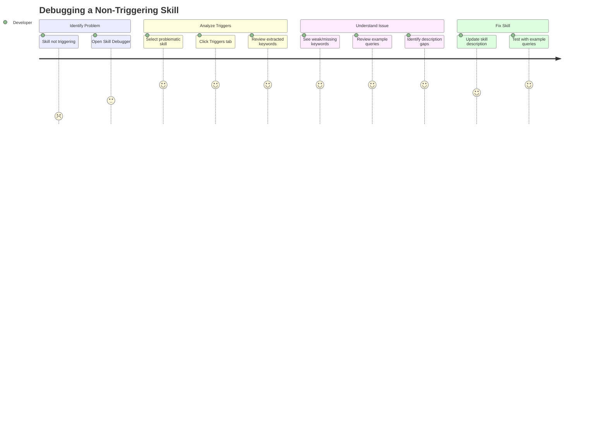
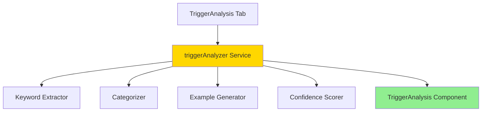
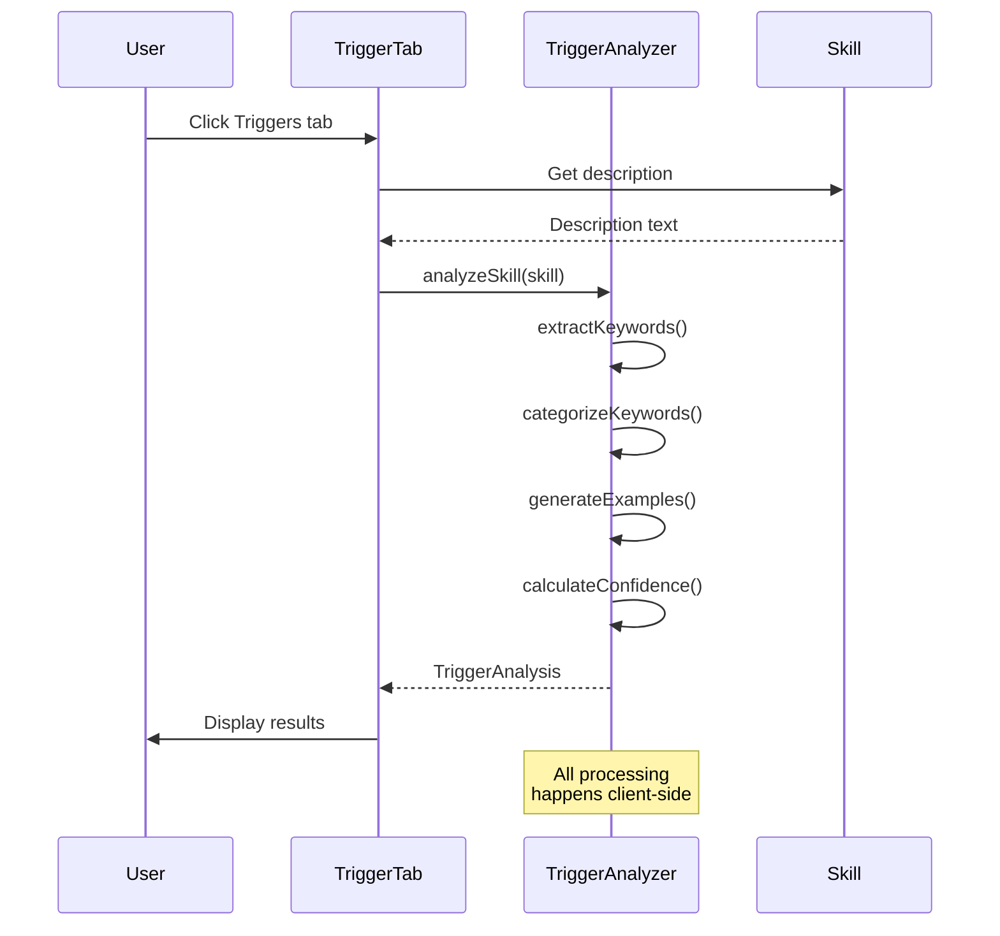

# Feature: Trigger Analysis

**Feature ID**: FEAT-004
**User Story**: US4
**Priority**: P2 (Should Have)
**Status**: ✅ Implemented
**Version**: 1.0.0

## Overview

The Trigger Analysis feature helps skill developers understand what keywords and phrases would cause Claude Code to activate their skill. This is a critical debugging tool for understanding why a skill isn't triggering when expected.

---

## Business Value

**Problem**: Skill developers often don't understand why their skills aren't being invoked by Claude Code. The trigger mechanism is based on matching keywords in the skill description against user queries, but this matching logic is opaque to developers.

**Solution**: Trigger Analysis extracts and categorizes trigger keywords from skill descriptions, generates example queries that would activate the skill, and provides confidence indicators for trigger patterns.

**Impact**:
- Reduces time to debug non-triggering skills
- Helps developers write more effective skill descriptions
- Improves skill discoverability by users
- Enables optimization of trigger patterns

---

## User Journey



---

## Functional Requirements

### FR-TRIG-001: Keyword Extraction

**Requirement**: Extract trigger keywords from skill description using pattern matching

**Implementation Details**:
```typescript
// Pattern categories
const patterns = {
  whenPhrases: /when\s+(you\s+)?(need|want|should|have).*?(?=\.|\n)/gi,
  useThisPhrases: /use\s+this\s+(skill|tool).*?(?=\.|\n)/gi,
  actionVerbs: /(create|generate|analyze|debug|convert|transform|process)\s+\w+/gi,
  toolNames: /\b(PlantUML|Mermaid|Python|JavaScript|Docker|Git)\b/gi,
};
```

**Acceptance Criteria**:
- AC-TRIG-001-1: Extract "when..." phrases from description
- AC-TRIG-001-2: Extract "use this..." phrases
- AC-TRIG-001-3: Identify action verbs (create, generate, analyze, etc.)
- AC-TRIG-001-4: Identify tool/technology names
- AC-TRIG-001-5: Extract topic keywords

**Test Cases**:
```typescript
describe('Keyword Extraction', () => {
  test('extracts when phrases', () => {
    const description = "Use this skill when you need to create diagrams...";
    const keywords = extractKeywords(description);
    expect(keywords.whenPhrases).toContain("when you need to create diagrams");
  });

  test('extracts action verbs', () => {
    const description = "Generate PlantUML diagrams from text";
    const keywords = extractKeywords(description);
    expect(keywords.actionVerbs).toContain("generate");
  });
});
```

---

### FR-TRIG-002: Keyword Categorization

**Requirement**: Categorize extracted keywords by type (action, topic, tool, keyword)

**Categories**:
1. **Action**: Verbs describing what the skill does (create, generate, analyze)
2. **Topic**: Subject matter areas (diagrams, documentation, code)
3. **Tool**: Technologies or tools mentioned (PlantUML, Mermaid, Python)
4. **Keyword**: General trigger words (debugging, optimization, visualization)

**Implementation**:
```typescript
interface TriggerKeyword {
  text: string;
  category: 'action' | 'topic' | 'tool' | 'keyword';
  confidence: number;
}

function categorizeKeywords(text: string): TriggerKeyword[] {
  const keywords: TriggerKeyword[] = [];

  // Categorize action verbs
  const actions = extractActions(text);
  keywords.push(...actions.map(a => ({
    text: a,
    category: 'action' as const,
    confidence: 0.9,
  })));

  // Categorize topics
  const topics = extractTopics(text);
  keywords.push(...topics.map(t => ({
    text: t,
    category: 'topic' as const,
    confidence: 0.7,
  })));

  // ... more categories

  return keywords;
}
```

**Acceptance Criteria**:
- AC-TRIG-002-1: Each keyword has a category
- AC-TRIG-002-2: Categories are visually distinct in UI
- AC-TRIG-002-3: Category assignment is accurate >85%
- AC-TRIG-002-4: Each keyword has a confidence score

---

### FR-TRIG-003: Example Query Generation

**Requirement**: Generate example queries that would trigger the skill

**Algorithm**:
1. Combine extracted keywords into natural language queries
2. Use common question patterns: "How do I...", "Can you...", "I need to..."
3. Include tool names and action verbs
4. Generate 3-5 diverse examples

**Implementation**:
```typescript
function generateExampleQueries(skill: Skill): string[] {
  const keywords = extractKeywords(skill.description || '');
  const examples: string[] = [];

  // Pattern 1: "How do I [action] [tool/topic]"
  if (keywords.actions.length && keywords.topics.length) {
    examples.push(
      `How do I ${keywords.actions[0]} ${keywords.topics[0]}?`
    );
  }

  // Pattern 2: "I need to [action] [object]"
  if (keywords.actions.length) {
    examples.push(
      `I need to ${keywords.actions[0]} some diagrams`
    );
  }

  // Pattern 3: "Can you help with [tool]"
  if (keywords.tools.length) {
    examples.push(
      `Can you help with ${keywords.tools[0]}?`
    );
  }

  // Pattern 4: Specific use case
  if (keywords.whenPhrases.length) {
    examples.push(
      `${keywords.whenPhrases[0]}`
    );
  }

  return examples.slice(0, 5);
}
```

**Acceptance Criteria**:
- AC-TRIG-003-1: Generate 3-5 example queries
- AC-TRIG-003-2: Examples use natural language
- AC-TRIG-003-3: Examples are diverse (different patterns)
- AC-TRIG-003-4: Examples are relevant to skill

**Test Cases**:
```typescript
test('generates diverse examples', () => {
  const skill = createTestSkill({
    description: "Generate PlantUML diagrams when you need to visualize code"
  });
  const examples = generateExampleQueries(skill);

  expect(examples).toHaveLength(5);
  expect(examples[0]).toMatch(/how do i/i);
  expect(examples[1]).toMatch(/i need to/i);
  expect(examples.some(e => e.includes('PlantUML'))).toBe(true);
});
```

---

### FR-TRIG-004: Confidence Scoring

**Requirement**: Assign confidence scores to trigger patterns indicating likelihood of activation

**Scoring Factors**:
1. **Keyword Strength**: Unique, specific words score higher
2. **Frequency**: More occurrences increase confidence
3. **Position**: Keywords in first paragraph score higher
4. **Specificity**: Specific terms (PlantUML) > generic (diagram)

**Algorithm**:
```typescript
function calculateConfidence(keyword: string, context: string): number {
  let confidence = 0.5; // Base confidence

  // Keyword appears multiple times
  const occurrences = (context.match(new RegExp(keyword, 'gi')) || []).length;
  confidence += Math.min(occurrences * 0.1, 0.3);

  // Keyword is specific (capitalized, unique)
  if (/^[A-Z]/.test(keyword)) {
    confidence += 0.2;
  }

  // Keyword in first paragraph
  const firstPara = context.split('\n\n')[0];
  if (firstPara.includes(keyword)) {
    confidence += 0.1;
  }

  return Math.min(confidence, 1.0);
}
```

**Confidence Levels**:
- **High (0.8-1.0)**: Very likely to trigger
- **Medium (0.5-0.8)**: Likely to trigger with right context
- **Low (0.0-0.5)**: May trigger but not reliable

**Acceptance Criteria**:
- AC-TRIG-004-1: Each keyword has confidence score 0-1
- AC-TRIG-004-2: Scores reflect trigger likelihood
- AC-TRIG-004-3: Visual indicator shows confidence level
- AC-TRIG-004-4: Overall skill confidence calculated

---

### FR-TRIG-005: Visual Presentation

**Requirement**: Display trigger analysis in clear, actionable format

**UI Components**:

1. **Keyword Cloud**: Visual display of categorized keywords
2. **Example Queries**: List of generated examples
3. **Confidence Indicators**: Visual bars or badges
4. **Category Breakdown**: Count and list by category

**Layout**:
```
┌─────────────────────────────────────────────┐
│ Trigger Analysis                             │
├─────────────────────────────────────────────┤
│                                              │
│ Keywords by Category:                        │
│                                              │
│ Actions (3)                                  │
│ [generate] [create] [visualize]             │
│                                              │
│ Tools (2)                                    │
│ [PlantUML] [Mermaid]                        │
│                                              │
│ Topics (2)                                   │
│ [diagrams] [documentation]                  │
│                                              │
├─────────────────────────────────────────────┤
│                                              │
│ Example Queries That Would Trigger:         │
│                                              │
│ 1. How do I generate PlantUML diagrams?     │
│ 2. I need to create some documentation      │
│ 3. Can you help with Mermaid diagrams?      │
│ 4. Generate a sequence diagram              │
│ 5. Visualize this code structure            │
│                                              │
├─────────────────────────────────────────────┤
│                                              │
│ Overall Trigger Confidence: ████████░░ 80%  │
│                                              │
└─────────────────────────────────────────────┘
```

**Acceptance Criteria**:
- AC-TRIG-005-1: Keywords grouped by category
- AC-TRIG-005-2: Visual distinction between categories (color, icon)
- AC-TRIG-005-3: Example queries clearly formatted
- AC-TRIG-005-4: Confidence displayed with visual indicator
- AC-TRIG-005-5: Empty state if no triggers found

---

## Technical Architecture

### Component Structure



### Data Flow



---

## Implementation

### Code Location

**Frontend**:
- Service: `/src/utils/triggerAnalyzer.ts`
- Component: `/src/components/TriggerAnalysis.tsx`
- Types: `/src/types/trigger.ts`

### Key Functions

```typescript
// src/utils/triggerAnalyzer.ts

export interface TriggerAnalysis {
  skill: Skill;
  keywords: TriggerKeyword[];
  examples: string[];
  categories: TriggerCategory[];
  confidence: number;
}

export interface TriggerKeyword {
  text: string;
  category: 'action' | 'topic' | 'tool' | 'keyword';
  confidence: number;
}

export interface TriggerCategory {
  name: string;
  keywords: string[];
  count: number;
}

export function analyzeSkill(skill: Skill): TriggerAnalysis {
  const description = skill.description || '';

  // Extract keywords
  const keywords = extractAndCategorizeKeywords(description);

  // Generate examples
  const examples = generateExampleQueries(skill, keywords);

  // Group by category
  const categories = groupByCategory(keywords);

  // Calculate overall confidence
  const confidence = calculateOverallConfidence(keywords);

  return {
    skill,
    keywords,
    examples,
    categories,
    confidence,
  };
}

function extractAndCategorizeKeywords(description: string): TriggerKeyword[] {
  const keywords: TriggerKeyword[] = [];

  // Extract action verbs
  const actionVerbs = ['generate', 'create', 'analyze', 'debug', 'convert', 'transform'];
  for (const verb of actionVerbs) {
    const regex = new RegExp(`\\b${verb}\\w*\\b`, 'gi');
    const matches = description.match(regex);
    if (matches) {
      matches.forEach(match => {
        keywords.push({
          text: match.toLowerCase(),
          category: 'action',
          confidence: calculateConfidence(match, description),
        });
      });
    }
  }

  // Extract tool names (capitalized words)
  const toolRegex = /\b[A-Z][a-zA-Z]+(?:\s+[A-Z][a-zA-Z]+)?\b/g;
  const toolMatches = description.match(toolRegex);
  if (toolMatches) {
    toolMatches.forEach(tool => {
      keywords.push({
        text: tool,
        category: 'tool',
        confidence: calculateConfidence(tool, description),
      });
    });
  }

  // Extract topics from common phrases
  const topicPatterns = [
    /(?:create|generate|build)\s+(\w+)/gi,
    /(?:for|with|using)\s+(\w+)/gi,
  ];

  for (const pattern of topicPatterns) {
    let match;
    while ((match = pattern.exec(description)) !== null) {
      keywords.push({
        text: match[1],
        category: 'topic',
        confidence: calculateConfidence(match[1], description),
      });
    }
  }

  return deduplicateKeywords(keywords);
}

function generateExampleQueries(skill: Skill, keywords: TriggerKeyword[]): string[] {
  const examples: string[] = [];
  const actions = keywords.filter(k => k.category === 'action');
  const tools = keywords.filter(k => k.category === 'tool');
  const topics = keywords.filter(k => k.category === 'topic');

  // Pattern 1: "How do I [action] [topic]"
  if (actions.length && topics.length) {
    examples.push(`How do I ${actions[0].text} ${topics[0].text}?`);
  }

  // Pattern 2: "I need to [action]"
  if (actions.length) {
    examples.push(`I need to ${actions[0].text} something`);
  }

  // Pattern 3: "Can you help with [tool]"
  if (tools.length) {
    examples.push(`Can you help with ${tools[0].text}?`);
  }

  // Pattern 4: "[tool] [action]"
  if (tools.length && actions.length) {
    examples.push(`${tools[0].text} ${actions[0].text}`);
  }

  // Pattern 5: Use skill name
  examples.push(skill.name.toLowerCase());

  return examples.slice(0, 5);
}

function calculateOverallConfidence(keywords: TriggerKeyword[]): number {
  if (keywords.length === 0) return 0;

  const avgConfidence = keywords.reduce((sum, k) => sum + k.confidence, 0) / keywords.length;
  const diversityBonus = Math.min(keywords.length / 10, 0.2);

  return Math.min(avgConfidence + diversityBonus, 1.0);
}
```

---

## Testing Strategy

### Unit Tests

```typescript
// src/utils/triggerAnalyzer.test.ts

describe('Trigger Analyzer', () => {
  describe('extractAndCategorizeKeywords', () => {
    test('extracts action verbs', () => {
      const description = "Generate PlantUML diagrams";
      const keywords = extractAndCategorizeKeywords(description);

      expect(keywords.some(k =>
        k.text === 'generate' && k.category === 'action'
      )).toBe(true);
    });

    test('extracts tool names', () => {
      const description = "Use PlantUML to create diagrams";
      const keywords = extractAndCategorizeKeywords(description);

      expect(keywords.some(k =>
        k.text === 'PlantUML' && k.category === 'tool'
      )).toBe(true);
    });

    test('assigns confidence scores', () => {
      const description = "Generate generate generate diagrams";
      const keywords = extractAndCategorizeKeywords(description);

      const generateKeyword = keywords.find(k => k.text === 'generate');
      expect(generateKeyword?.confidence).toBeGreaterThan(0.5);
    });
  });

  describe('generateExampleQueries', () => {
    test('generates diverse patterns', () => {
      const skill = createTestSkill({
        name: 'plantuml',
        description: 'Generate PlantUML diagrams for code'
      });
      const keywords = extractAndCategorizeKeywords(skill.description);
      const examples = generateExampleQueries(skill, keywords);

      expect(examples).toHaveLength(5);
      expect(examples.some(e => e.includes('How do I'))).toBe(true);
      expect(examples.some(e => e.includes('I need to'))).toBe(true);
    });
  });

  describe('calculateOverallConfidence', () => {
    test('returns 0 for no keywords', () => {
      expect(calculateOverallConfidence([])).toBe(0);
    });

    test('increases with more keywords', () => {
      const few = createMockKeywords(3);
      const many = createMockKeywords(10);

      expect(calculateOverallConfidence(many)).toBeGreaterThan(
        calculateOverallConfidence(few)
      );
    });
  });
});
```

### Component Tests

```typescript
// src/components/TriggerAnalysis.test.tsx

describe('TriggerAnalysis Component', () => {
  test('displays categorized keywords', () => {
    const skill = createTestSkill();
    render(<TriggerAnalysis skill={skill} />);

    expect(screen.getByText(/Actions/i)).toBeInTheDocument();
    expect(screen.getByText(/Tools/i)).toBeInTheDocument();
    expect(screen.getByText(/Topics/i)).toBeInTheDocument();
  });

  test('shows example queries', () => {
    const skill = createTestSkill();
    render(<TriggerAnalysis skill={skill} />);

    expect(screen.getByText(/Example Queries/i)).toBeInTheDocument();
    expect(screen.getByText(/How do I/i)).toBeInTheDocument();
  });

  test('displays confidence indicator', () => {
    const skill = createTestSkill();
    render(<TriggerAnalysis skill={skill} />);

    expect(screen.getByText(/Confidence/i)).toBeInTheDocument();
  });

  test('shows empty state for skill without description', () => {
    const skill = createTestSkill({ description: undefined });
    render(<TriggerAnalysis skill={skill} />);

    expect(screen.getByText(/No description/i)).toBeInTheDocument();
  });
});
```

---

## Edge Cases

### EC-TRIG-001: Empty Description

**Scenario**: Skill has no description field
**Expected**: Show helpful message, suggest adding description
**Status**: ✅ Handled

### EC-TRIG-002: Very Short Description

**Scenario**: Description is <20 characters
**Expected**: Extract what's possible, show low confidence
**Status**: ✅ Handled

### EC-TRIG-003: No Recognizable Keywords

**Scenario**: Description doesn't match any patterns
**Expected**: Show empty state, explain why
**Status**: ✅ Handled

### EC-TRIG-004: Very Long Description

**Scenario**: Description >2000 characters
**Expected**: Extract keywords, may take longer
**Status**: ✅ Handled

### EC-TRIG-005: Non-English Description

**Scenario**: Description in non-English language
**Expected**: Limited extraction, graceful degradation
**Status**: ⚠️ Not specifically handled

---

## Performance Considerations

**Target**: Analysis completes in <50ms for typical descriptions

**Optimizations**:
1. Regex patterns compiled once
2. Keyword deduplication efficient
3. Example generation limited to 5
4. Client-side processing (no IPC overhead)

**Measured Performance**: ~20ms for typical skills

---

## Future Enhancements

### Enhancement 1: Reference-Specific Triggers

**Description**: Analyze triggers for individual references
**Priority**: P3
**Effort**: Medium

### Enhancement 2: Trigger Testing

**Description**: Test query against skill, show whether it would trigger
**Priority**: P2
**Effort**: High (requires Claude model integration)

### Enhancement 3: Trigger Optimization Suggestions

**Description**: Suggest improvements to description for better triggers
**Priority**: P3
**Effort**: Medium

### Enhancement 4: Historical Trigger Data

**Description**: Track which queries actually triggered this skill
**Priority**: P3
**Effort**: High (requires Claude Code integration)

---

**Document Status**: Complete and implemented. Feature is live in production.
