# Technical Architecture

**Document Version**: 1.0.0
**Last Updated**: 2025-11-10
**Status**: Active

## Overview

This document describes the technical architecture of the Skill Debugger application, including system architecture, component design, data flow, and key architectural decisions.

## Architecture Style

**Pattern**: Hybrid Desktop Application with Separation of Concerns

**Key Characteristics**:
- Native desktop shell (Tauri/Rust)
- Web-based UI (React/TypeScript)
- IPC-based communication
- Client-side state management
- File system as data source

---

## System Architecture

### High-Level Architecture

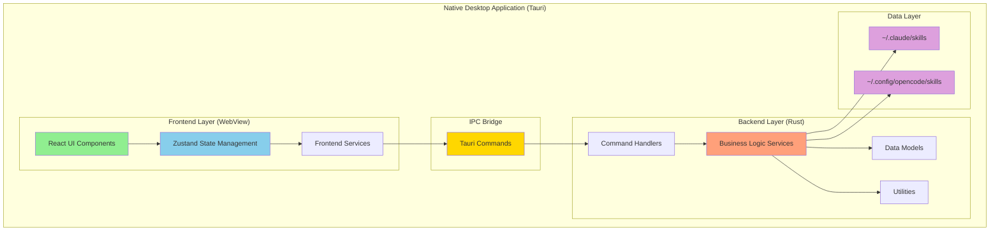

### Architecture Layers

#### 1. Frontend Layer (React/TypeScript)

**Technology**: React 19+, TypeScript 5.3+

**Responsibilities**:
- User interface rendering
- User interaction handling
- Client-side state management
- Data presentation and formatting
- Local computations (trigger analysis, diagram generation)

**Key Components**:
- UI Components (Layout, SkillViewer, SkillList, etc.)
- State Stores (Zustand)
- Custom Hooks (useSkills, useMarkdown)
- Frontend Services (triggerAnalyzer, diagramGenerator)

#### 2. IPC Bridge (Tauri Commands)

**Technology**: Tauri 2.x IPC

**Responsibilities**:
- Frontend-backend communication
- Type-safe command invocation
- Serialization/deserialization
- Error propagation

**Communication Pattern**: Request-Response (async)

#### 3. Backend Layer (Rust)

**Technology**: Rust 1.75+, Tokio async runtime

**Responsibilities**:
- File system operations
- YAML parsing
- Directory scanning
- Path manipulation
- Business logic execution

**Key Modules**:
- Commands (IPC handlers)
- Services (business logic)
- Models (data structures)
- Utils (helpers)

#### 4. Data Layer (File System)

**Technology**: OS File System

**Responsibilities**:
- Persistent storage of skills
- Read-only access
- No write operations from application

---

## Component Architecture

### Frontend Component Hierarchy

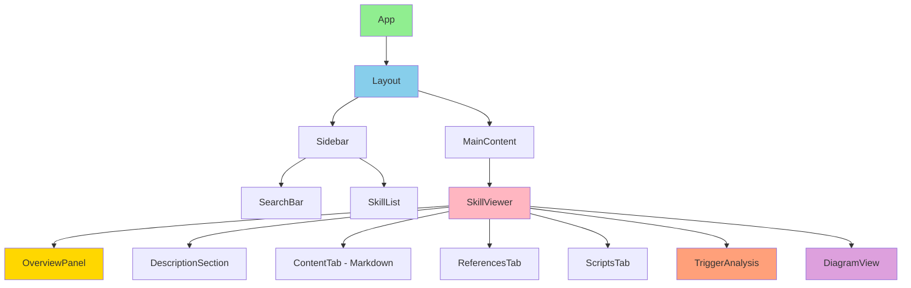

### Backend Module Structure

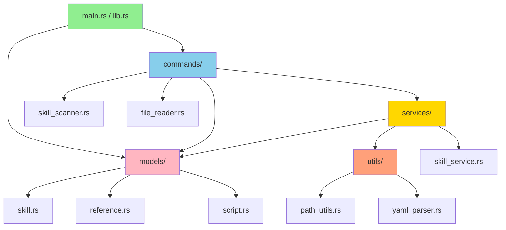

---

## Data Flow

### 1. Application Startup Flow

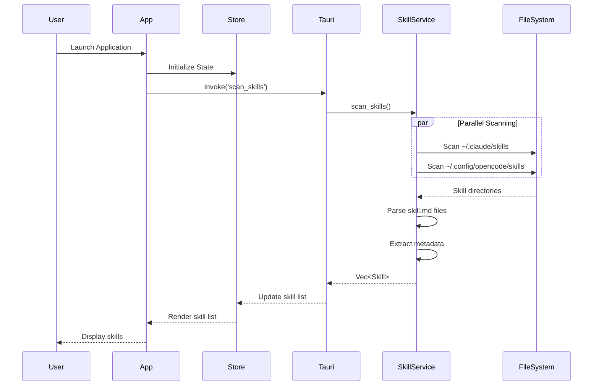

### 2. Skill Selection Flow

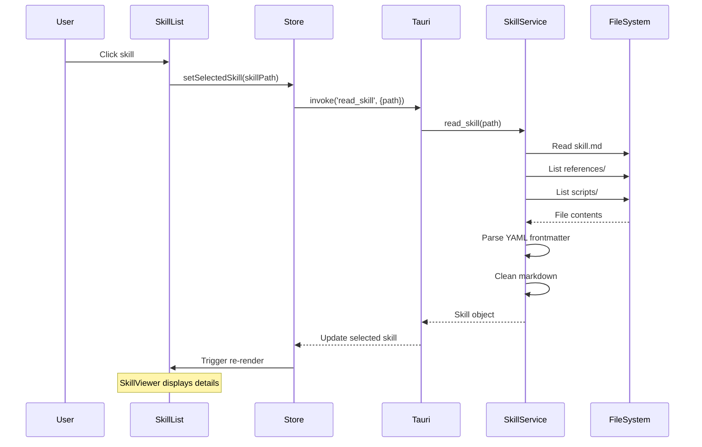

### 3. Reference Navigation Flow

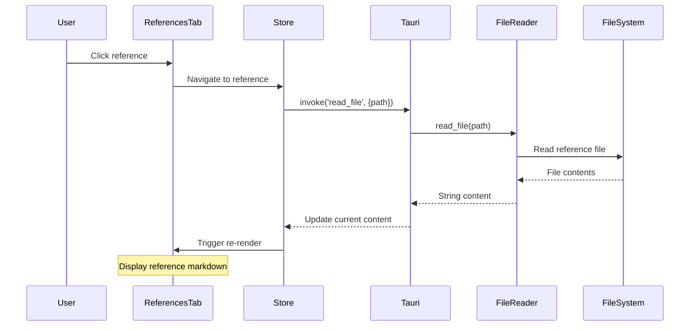

### 4. Trigger Analysis Flow (Frontend Only)

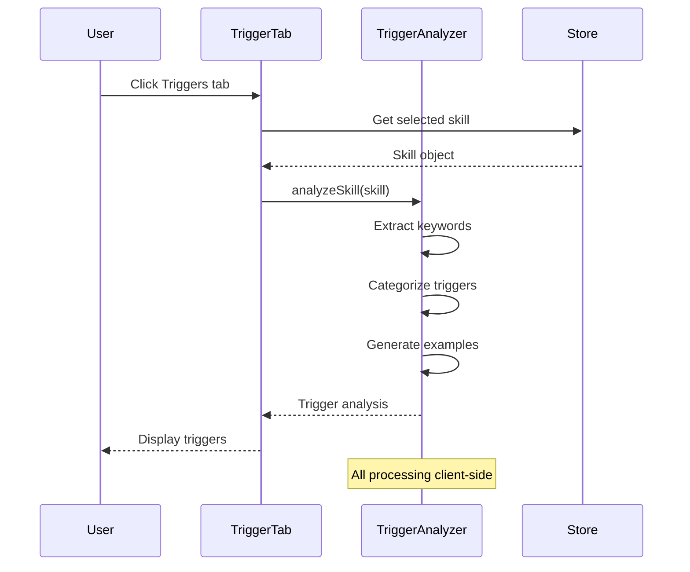

### 5. Diagram Generation Flow (Frontend Only)

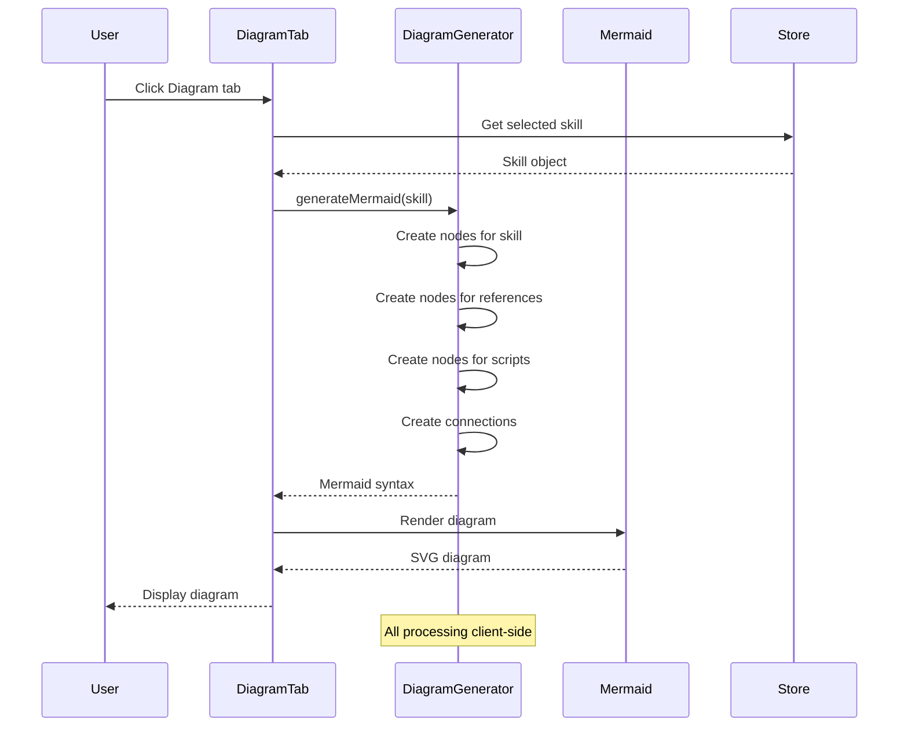

---

## State Management Architecture

### Zustand Store Structure

```typescript
interface SkillStore {
  // State
  skills: Skill[];
  selectedSkill: Skill | null;
  loading: boolean;
  error: string | null;
  searchQuery: string;

  // Actions
  setSkills: (skills: Skill[]) => void;
  setSelectedSkill: (skill: Skill | null) => void;
  setLoading: (loading: boolean) => void;
  setError: (error: string | null) => void;
  setSearchQuery: (query: string) => void;

  // Computed/Derived
  filteredSkills: Skill[]; // Computed from skills + searchQuery
}
```

### State Flow Diagram

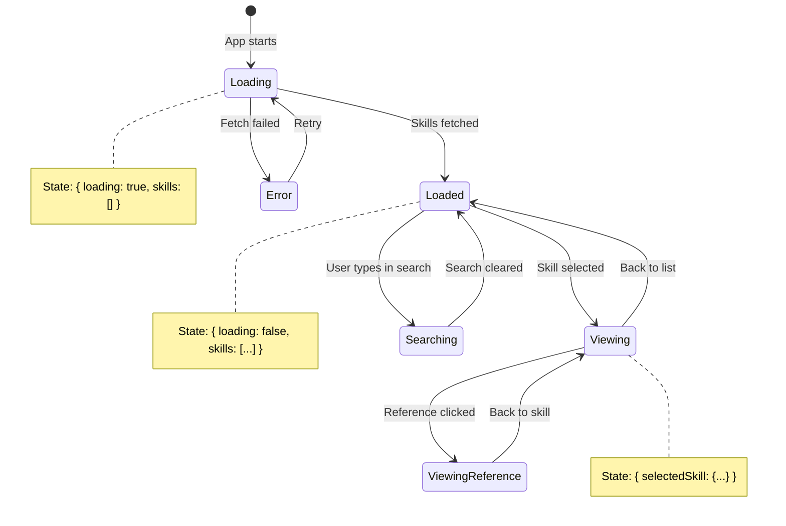

---

## Key Architectural Decisions

### Decision 1: Tauri Over Electron

**Decision**: Use Tauri 2.x instead of Electron

**Rationale**:
- **Bundle Size**: Tauri produces ~10MB binaries vs Electron's 100MB+
- **Performance**: Rust backend is faster than Node.js
- **Memory**: Lower memory footprint (~50MB vs ~150MB)
- **Security**: Rust's memory safety and Tauri's permission model
- **Native Feel**: Better OS integration

**Trade-offs**:
- Smaller ecosystem than Electron
- Fewer third-party plugins
- Learning curve for Rust

**Alternative Considered**: Electron
- Rejected due to bundle size and memory overhead

---

### Decision 2: React + TypeScript Frontend

**Decision**: Use React with TypeScript for UI

**Rationale**:
- **Familiarity**: Most developers know React
- **Ecosystem**: Large component library ecosystem
- **Type Safety**: TypeScript catches errors at compile time
- **Tooling**: Excellent IDE support and debugging
- **Performance**: Virtual DOM is efficient for this use case

**Trade-offs**:
- Larger learning curve than vanilla JS
- More complex build setup
- Bundle size larger than lightweight alternatives

**Alternative Considered**: Svelte
- Rejected for familiarity and ecosystem reasons

---

### Decision 3: Zustand State Management

**Decision**: Use Zustand instead of Redux or Context API

**Rationale**:
- **Simplicity**: Minimal boilerplate compared to Redux
- **Size**: <1KB bundle size
- **Performance**: No unnecessary re-renders
- **TypeScript Support**: Excellent type inference
- **Sufficient**: Meets all state management needs for this app

**Trade-offs**:
- Less powerful than Redux for complex state
- Smaller community than Redux
- No built-in DevTools (though available)

**Alternative Considered**: Redux
- Rejected as over-engineering for this scope

---

### Decision 4: Backend File I/O in Rust

**Decision**: Handle all file operations in Rust backend

**Rationale**:
- **Security**: Tauri restricts frontend file access
- **Performance**: Rust async I/O is faster
- **Cross-platform**: Rust stdlib handles OS differences
- **Validation**: Backend can validate paths before access
- **Separation**: Clear separation of concerns

**Trade-offs**:
- IPC overhead for each file operation
- More complex communication layer

**Alternative Considered**: Frontend file access via Tauri plugins
- Rejected for security and architecture reasons

---

### Decision 5: Client-Side Trigger Analysis

**Decision**: Perform trigger analysis in frontend (not backend)

**Rationale**:
- **Simplicity**: No ML or complex NLP needed
- **Real-time**: Instant updates without IPC round-trip
- **Future Extension**: Easier to add UI-driven analysis
- **Performance**: Regex/pattern matching is fast in JS

**Trade-offs**:
- Less powerful than server-side NLP
- Limited to pattern matching

**Alternative Considered**: Rust-based analysis
- Rejected as unnecessary complexity

---

### Decision 6: Lazy Loading for Mermaid

**Decision**: Lazy load Mermaid.js library (code splitting)

**Rationale**:
- **Initial Load**: Reduces initial bundle size
- **Usage**: Not all users view diagrams
- **Performance**: Only load when Diagram tab is opened
- **Size**: Mermaid is ~500KB library

**Trade-offs**:
- Slight delay on first diagram view
- More complex bundle configuration

**Alternative Considered**: Bundle Mermaid in main bundle
- Rejected due to unnecessary initial load cost

---

### Decision 7: Virtual Scrolling for Skill List

**Decision**: Implement virtual scrolling for skill list

**Rationale**:
- **Scalability**: Handles 100+ skills smoothly
- **Performance**: Only renders visible items
- **Memory**: Reduces DOM node count
- **UX**: Instant scrolling with no lag

**Trade-offs**:
- Additional library dependency
- More complex list component

**Alternative Considered**: Standard scrolling
- Would work for <50 skills but not scalable

---

## Security Architecture

### Threat Model

**Potential Threats**:
1. **Malicious Skill Files**: Skills with script injection attempts
2. **Path Traversal**: Attempts to access files outside skill directories
3. **XSS Attacks**: Malicious markdown content
4. **Permission Escalation**: Attempts to gain elevated file access

### Security Measures

#### 1. File System Access Control

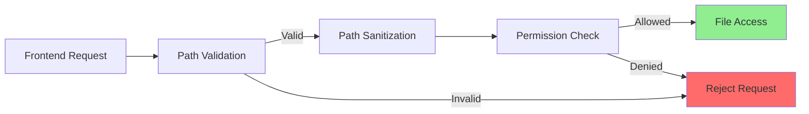

**Implementation**:
- Whitelist allowed directories
- Sanitize all file paths
- Reject path traversal attempts (.., ~, etc.)
- Check permissions before access

#### 2. Content Security Policy

```json
{
  "tauri": {
    "security": {
      "csp": "default-src 'self'; script-src 'self'; style-src 'self' 'unsafe-inline'; img-src 'self' data:;"
    }
  }
}
```

**Protection Against**:
- Remote script loading
- External resource requests
- XSS injection

#### 3. Markdown Rendering Security

**Measures**:
- Use react-markdown safe mode
- Disable raw HTML rendering
- Sanitize all code blocks
- Escape special characters

#### 4. IPC Security

**Measures**:
- Type validation on all commands
- Command whitelisting in Tauri config
- No eval() or dynamic code execution
- Error messages don't leak system info

---

## Performance Architecture

### Performance Targets

| Operation | Target | Current Status |
|-----------|--------|----------------|
| Cold Start | <2 seconds | ✅ ~1.5s |
| Skill Scan | <500ms for 50 skills | ✅ ~300ms |
| Markdown Render | <100ms per file | ✅ ~50ms |
| Search Filter | <50ms update | ✅ ~30ms |
| Diagram Generation | <1s for 20 refs | ✅ ~400ms |
| Memory Usage | <200MB typical | ✅ ~120MB |

### Performance Optimizations

#### 1. Parallel Directory Scanning

```rust
async fn scan_skills() -> Vec<Skill> {
    let (claude_skills, opencode_skills) = tokio::join!(
        scan_directory("~/.claude/skills"),
        scan_directory("~/.config/opencode/skills"),
    );
    // Merge results
}
```

#### 2. Virtual Scrolling

```typescript
import { useVirtualizer } from '@tanstack/react-virtual';

// Only renders visible items
const virtualizer = useVirtualizer({
  count: skills.length,
  getScrollElement: () => parentRef.current,
  estimateSize: () => 50,
});
```

#### 3. Debounced Search

```typescript
const debouncedSearch = useMemo(
  () => debounce((query: string) => {
    setFilteredSkills(filterSkills(query));
  }, 300),
  []
);
```

#### 4. Lazy Component Loading

```typescript
const DiagramView = lazy(() => import('./DiagramView'));

// Mermaid loaded only when needed
```

#### 5. React Query Caching

```typescript
const { data: skills } = useQuery({
  queryKey: ['skills'],
  queryFn: () => invoke('scan_skills'),
  staleTime: 5 * 60 * 1000, // 5 minutes
});
```

---

## Deployment Architecture

### Build Process

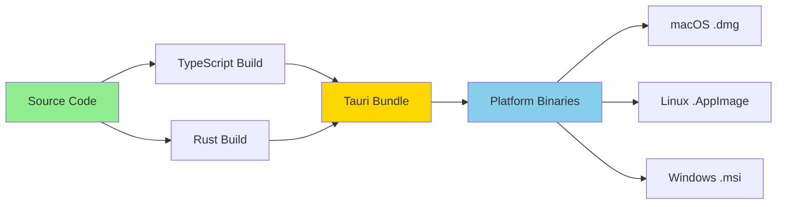

### Platform-Specific Artifacts

| Platform | Format | Size | Installer |
|----------|--------|------|-----------|
| macOS | .dmg, .app | ~8MB | Drag & drop |
| Linux | .AppImage, .deb | ~9MB | Package manager |
| Windows | .msi, .exe | ~10MB | Windows Installer |

---

## Scalability Considerations

### Current Scale

- **Skills**: Optimized for 5-100 skills
- **References per Skill**: Up to 50 references
- **File Size**: Up to 1MB per file
- **Total Size**: Up to 500MB of skill data

### Future Scale

If scale increases (100+ skills, larger files):
1. **Pagination**: Implement pagination for skill list
2. **Indexing**: Add search indexing (Tantivy or similar)
3. **Streaming**: Stream large files instead of loading entirely
4. **Caching**: Enhanced caching strategies
5. **Database**: Consider SQLite for metadata caching

---

## Maintainability Considerations

### Code Organization Principles

1. **Separation of Concerns**: Clear layer boundaries
2. **Single Responsibility**: Each component has one job
3. **DRY (Don't Repeat Yourself)**: Shared utilities and hooks
4. **Type Safety**: TypeScript and Rust type systems
5. **Testability**: Components designed for unit testing

### Extensibility Points

1. **New Tabs**: Add new tabs to SkillViewer easily
2. **New Analysis**: Add analysis tools alongside trigger analysis
3. **New File Types**: Support additional file types in references/scripts
4. **Custom Themes**: Tailwind makes theming straightforward
5. **Plugins**: Future plugin system for community extensions

---

**Document Maintenance Note**: Update this document when:
- Major architectural changes occur
- New components or layers are added
- Performance characteristics change significantly
- Security measures are updated
- Scalability limits are reached
