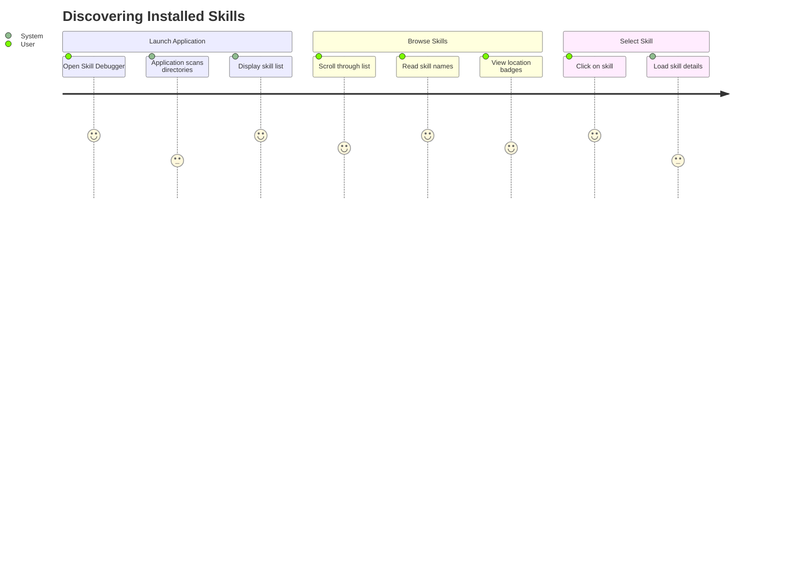
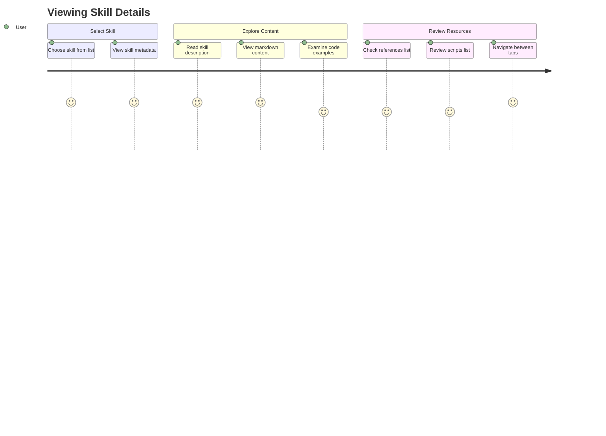
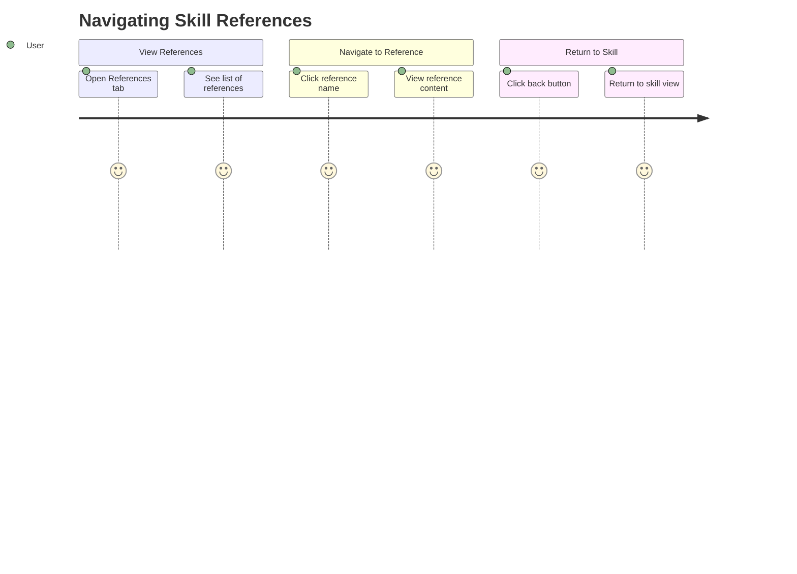
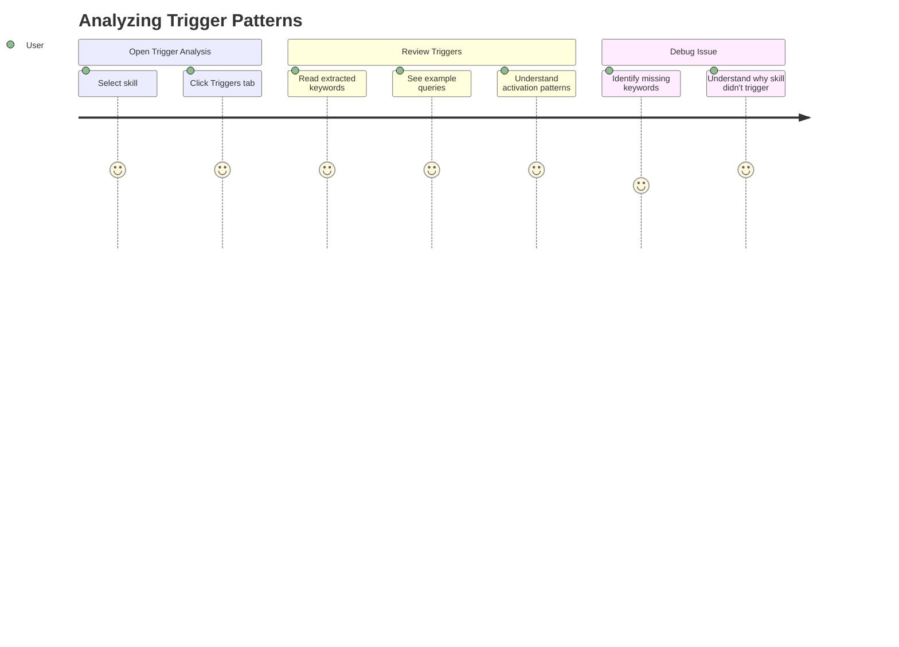
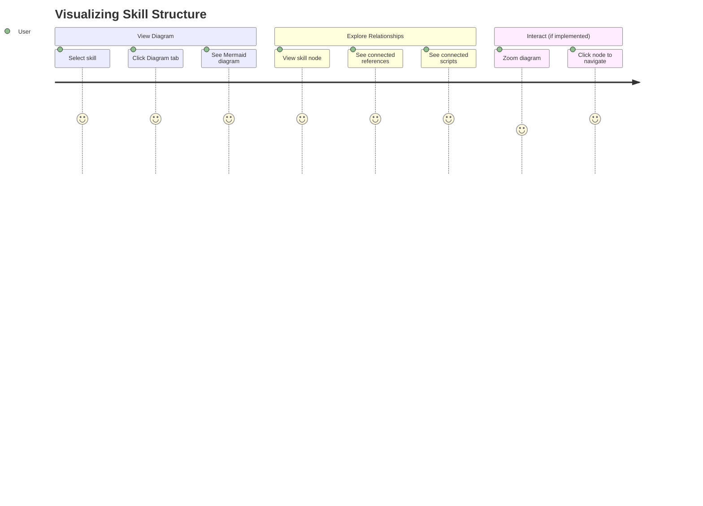
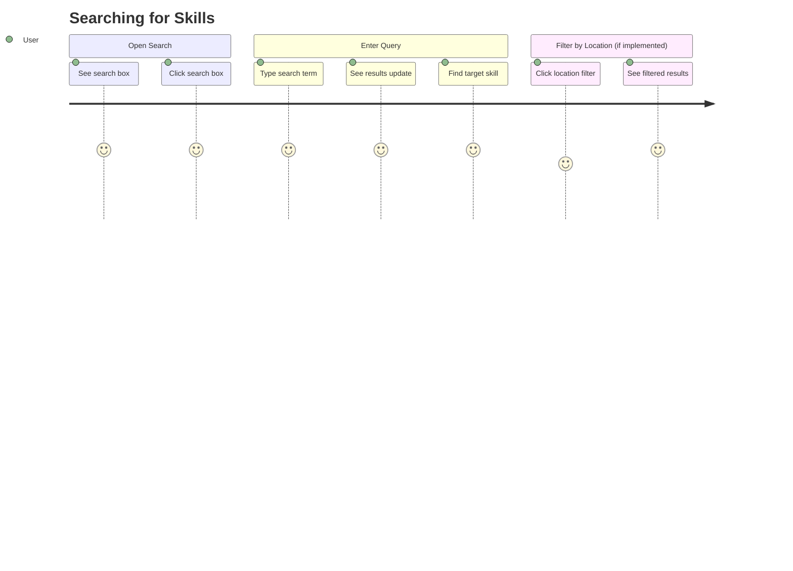
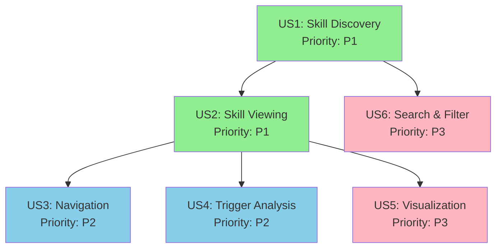

# User Stories & Acceptance Criteria

**Document Version**: 1.0.0
**Last Updated**: 2025-11-10
**Status**: Active

## Overview

This document captures all user stories for the Skill Debugger application, organized by priority. Each story includes detailed acceptance scenarios, testing criteria, and success metrics.

## User Story Priority Levels

- **P1 (Must Have)**: Core functionality - application is not usable without these
- **P2 (Should Have)**: Important features that significantly enhance usability
- **P3 (Nice to Have)**: Enhancements that improve experience but are not critical

---

## P1 - Must Have Features

### User Story 1: Discover and Browse All Installed Skills

**Story ID**: US1
**Priority**: P1
**Status**: ✅ Implemented

#### Story Statement

As a Claude Code skill developer, I want to see a complete list of all my installed skills from both directories so I can quickly understand what skills I have available and select one to explore in detail.

#### Business Value

This is the foundation of the application - users must first see what skills exist before they can debug or analyze them. Without this capability, the application provides no value.

#### User Journey

#### Acceptance Criteria

**AC-US1-001**: Skills from ~/.claude/skills directory
- **Given** I have skills installed in `~/.claude/skills`
- **When** I launch the application
- **Then** I see all skills from that directory listed with their names
- **And** each skill displays a "claude" location badge

**AC-US1-002**: Skills from ~/.config/opencode/skills directory
- **Given** I have skills installed in `~/.config/opencode/skills`
- **When** I launch the application
- **Then** I see all skills from that directory listed with their names
- **And** each skill displays an "opencode" location badge

**AC-US1-003**: Unified skill list
- **Given** I have skills in both directories
- **When** I launch the application
- **Then** I see skills from both locations in a unified list
- **And** I can distinguish between them by their location badges
- **And** the list is sorted alphabetically by skill name

**AC-US1-004**: Empty state handling
- **Given** I have no skills installed
- **When** I launch the application
- **Then** I see a helpful empty state message
- **And** the message explains where to install skills
- **And** the message shows both supported directory paths

**AC-US1-005**: Skill selection
- **Given** the skill list is displayed
- **When** I click on a skill name
- **Then** the skill details panel opens
- **And** I see the full skill information
- **And** the selected skill is highlighted in the list

**AC-US1-006**: Loading states
- **Given** the application is scanning directories
- **When** the scan is in progress
- **Then** I see a loading indicator
- **And** the UI remains responsive
- **And** I see a progress message

**AC-US1-007**: Error handling
- **Given** a skill directory doesn't exist
- **When** the application tries to scan it
- **Then** the application continues to scan other directories
- **And** I see a warning message about the missing directory
- **And** skills from available directories still display

#### Technical Requirements

- **TR-US1-001**: Scan both `~/.claude/skills` and `~/.config/opencode/skills` in parallel
- **TR-US1-002**: Complete directory scan in <500ms for up to 50 skills
- **TR-US1-003**: Parse skill.md files to extract name and location
- **TR-US1-004**: Handle missing directories gracefully without errors
- **TR-US1-005**: Use virtual scrolling for lists with >100 skills

#### Success Metrics

- Skill discovery completes in <500ms (SC-002)
- Users can see complete inventory within 2 seconds (SC-001)
- 100% of installed skills are discovered and displayed
- Zero errors for missing directories

---

### User Story 2: View Skill Details and Structure

**Story ID**: US2
**Priority**: P1
**Status**: ✅ Implemented

#### Story Statement

As a Claude Code skill developer, I want to view the complete structure of a selected skill including its main markdown file, references directory, and scripts directory so I can understand how the skill is organized and what resources it uses.

#### Business Value

Understanding skill structure is essential for debugging and optimization. This delivers core value by making skill internals transparent and accessible.

#### User Journey

#### Acceptance Criteria

**AC-US2-001**: Markdown rendering
- **Given** a skill is selected
- **When** the details panel loads
- **Then** I see the rendered markdown content from skill.md
- **And** markdown is formatted properly (headings, lists, links)
- **And** code blocks have syntax highlighting
- **And** images are displayed if present

**AC-US2-002**: References display
- **Given** a skill has a references/ directory
- **When** viewing skill details
- **Then** I see a "References" tab
- **And** clicking it shows a list of all reference files
- **And** each reference shows its name and relative path
- **And** I can see file extensions (e.g., .md, .txt)

**AC-US2-003**: Scripts display
- **Given** a skill has a scripts/ directory
- **When** viewing skill details
- **Then** I see a "Scripts" tab
- **And** clicking it shows a list of all script files
- **And** each script shows its name, path, and file type
- **And** file type is indicated by icon or badge

**AC-US2-004**: Metadata display
- **Given** a skill has YAML frontmatter
- **When** viewing the Overview tab
- **Then** I see the metadata displayed prominently
- **And** metadata fields are clearly labeled
- **And** metadata values are formatted appropriately
- **And** nested metadata structures are displayed hierarchically

**AC-US2-005**: Content tab
- **Given** I'm viewing skill details
- **When** I click the "Content" tab
- **Then** I see the full markdown content
- **And** the content is rendered with proper formatting
- **And** code blocks use appropriate syntax highlighting
- **And** content is scrollable for long documents

**AC-US2-006**: Empty states
- **Given** a skill has no references directory
- **When** I view the References tab
- **Then** I see a message indicating no references exist
- **And** the message is helpful and not an error

**AC-US2-007**: Malformed YAML handling
- **Given** a skill has invalid YAML frontmatter
- **When** the details panel loads
- **Then** the application doesn't crash
- **And** I see the raw markdown content
- **And** I see a warning message about the YAML error
- **And** the rest of the skill is still viewable

#### Technical Requirements

- **TR-US2-001**: Use react-markdown for content rendering
- **TR-US2-002**: Apply syntax highlighting with rehype-highlight
- **TR-US2-003**: Parse YAML frontmatter in Rust backend
- **TR-US2-004**: Send clean markdown (without frontmatter) to frontend
- **TR-US2-005**: Render markdown in <100ms per file
- **TR-US2-006**: Support GitHub-flavored markdown
- **TR-US2-007**: Handle files up to 1MB without performance issues

#### Success Metrics

- Markdown rendering completes in <100ms (SC-003)
- 100% of valid YAML frontmatter is parsed correctly
- Graceful degradation for malformed content (SC-011)
- Users can view all skill components in <2 clicks (SC-004)

---

## P2 - Should Have Features

### User Story 3: Navigate Between Skills and References

**Story ID**: US3
**Priority**: P2
**Status**: ✅ Implemented

#### Story Statement

As a Claude Code skill developer, I want to easily navigate from a skill to its references and from one reference to another so I can trace dependencies and understand how skill knowledge is organized.

#### Business Value

Navigation enables deep exploration and understanding of complex skills with many references. Critical for debugging skills that don't trigger as expected.

#### User Journey

#### Acceptance Criteria

**AC-US3-001**: Reference navigation
- **Given** I'm viewing a skill's reference list
- **When** I click on a reference file
- **Then** the reference markdown content is displayed
- **And** the content is rendered with syntax highlighting
- **And** I see the reference filename in the header

**AC-US3-002**: Back navigation
- **Given** I'm viewing a reference file
- **When** I want to return to the main skill
- **Then** I can click a "Back to Skill" button
- **And** I'm returned to the previous view
- **And** my previous tab selection is preserved

**AC-US3-003**: Breadcrumb navigation (if implemented)
- **Given** I've navigated through multiple views
- **When** I look at the top of the interface
- **Then** I see a breadcrumb trail showing my path
- **And** I can click any breadcrumb to jump to that level
- **And** the current location is highlighted

**AC-US3-004**: Navigation history (if implemented)
- **Given** I've navigated between multiple references
- **When** I use back/forward navigation
- **Then** I can step through my navigation history
- **And** the view updates appropriately for each step

#### Technical Requirements

- **TR-US3-001**: Implement navigation state in Zustand store
- **TR-US3-002**: Track navigation history for back/forward
- **TR-US3-003**: Support keyboard shortcuts (Alt+Left, Alt+Right)
- **TR-US3-004**: Maintain scroll position when navigating back

#### Success Metrics

- Navigation between skill and references in <2 clicks (SC-004)
- Navigation response time <100ms
- 100% of references are accessible from skill view

---

### User Story 4: Analyze Skill Trigger Patterns

**Story ID**: US4
**Priority**: P2
**Status**: ✅ Implemented

#### Story Statement

As a Claude Code skill developer, I want to see what keywords and phrases trigger my skill and what triggers specific references to load so I can optimize trigger descriptions and debug skills that aren't activating when expected.

#### Business Value

Trigger analysis is the key debugging feature - helping developers understand WHY a skill does or doesn't activate. This differentiates the tool from a simple file browser.

#### User Journey

#### Acceptance Criteria

**AC-US4-001**: Keyword extraction
- **Given** a skill has a description field
- **When** I view trigger analysis
- **Then** I see extracted trigger keywords highlighted
- **And** keywords are categorized by type (actions, topics, tools)
- **And** keywords are displayed with visual prominence

**AC-US4-002**: Example queries
- **Given** a skill's description mentions specific use cases
- **When** viewing triggers
- **Then** I see example queries that would activate this skill
- **And** each example is clearly formatted
- **And** I can see which keywords each example would match

**AC-US4-003**: Reference triggers (if implemented)
- **Given** references have specific topics or keywords
- **When** viewing trigger analysis
- **Then** I see what contextual keywords would cause those references to load
- **And** reference triggers are grouped by reference

**AC-US4-004**: Confidence indicators (if implemented)
- **Given** I'm viewing trigger analysis
- **When** I see the extracted triggers
- **Then** I see confidence levels for each trigger pattern
- **And** confidence is indicated visually (color, icon, percentage)

#### Technical Requirements

- **TR-US4-001**: Extract keywords using regex patterns for "when...", "use this...", etc.
- **TR-US4-002**: Identify action verbs, tool names, and topic keywords
- **TR-US4-003**: Generate example queries from trigger patterns
- **TR-US4-004**: Perform all analysis client-side (no backend required)

#### Success Metrics

- Users can identify why skill isn't triggering in <30 seconds (SC-010)
- Trigger extraction accuracy >85% for well-formed descriptions
- Zero performance impact on skill viewing

---

## P3 - Nice to Have Features

### User Story 5: Visualize Skill Relationships and Dependencies

**Story ID**: US5
**Priority**: P3
**Status**: ✅ Implemented

#### Story Statement

As a Claude Code skill developer, I want to see a visual diagram showing how my skill connects to its references and scripts so I can understand the skill architecture at a glance and identify potential issues.

#### Business Value

Visualization helps with understanding complex skills, but the skill is still usable without it. This enhances the experience for power users.

#### User Journey

#### Acceptance Criteria

**AC-US5-001**: Diagram generation
- **Given** a skill is selected
- **When** I switch to diagram view
- **Then** I see a Mermaid flowchart
- **And** the skill is displayed as the root node
- **And** references and scripts are shown as child nodes

**AC-US5-002**: Reference representation
- **Given** a skill has references
- **When** viewing the diagram
- **Then** references appear as child nodes connected to the skill
- **And** reference nodes have distinct visual styling
- **And** reference names are clearly readable

**AC-US5-003**: Script representation
- **Given** a skill has scripts
- **When** viewing the diagram
- **Then** scripts appear as distinct nodes
- **And** scripts are visually distinguished from references
- **And** script file types are indicated

**AC-US5-004**: Interactive features (if implemented)
- **Given** the diagram is complex
- **When** I interact with it
- **Then** I can zoom in and out
- **And** I can pan to see different areas
- **And** I can click nodes to navigate to those files

**AC-US5-005**: Export functionality (if implemented)
- **Given** I want to export the diagram
- **When** I use export functionality
- **Then** I can save as PNG image
- **Or** I can copy the Mermaid source code
- **And** the export maintains visual quality

#### Technical Requirements

- **TR-US5-001**: Generate Mermaid syntax from skill structure
- **TR-US5-002**: Render diagrams using mermaid.js library
- **TR-US5-003**: Lazy load mermaid library for code splitting
- **TR-US5-004**: Generate and render in <1 second for skills with up to 20 references

#### Success Metrics

- Diagram generation and rendering in <1 second (SC-008)
- 100% of skill structures can be visualized
- Diagrams are readable and provide insight

---

### User Story 6: Search and Filter Skills

**Story ID**: US6
**Priority**: P3
**Status**: ✅ Implemented

#### Story Statement

As a Claude Code skill developer with many installed skills, I want to search and filter the skill list by name, keywords, or location so I can quickly find specific skills without scrolling through a long list.

#### Business Value

Search improves usability for users with many skills but isn't essential for the core value proposition. Can be added later without affecting fundamental functionality.

#### User Journey

#### Acceptance Criteria

**AC-US6-001**: Real-time search
- **Given** many skills are installed
- **When** I type in the search box
- **Then** the list filters in real-time
- **And** only skills matching the query are shown
- **And** matching happens on skill name and description

**AC-US6-002**: Location filtering (if implemented)
- **Given** I want to filter by location
- **When** I use a location filter
- **Then** I see only skills from the selected directory
- **And** I can choose "claude", "opencode", or "all"

**AC-US6-003**: Clear search
- **Given** search results are displayed
- **When** I clear the search
- **Then** the full skill list is restored
- **And** previous scroll position is preserved

**AC-US6-004**: No results state
- **Given** no skills match my search
- **When** viewing results
- **Then** I see a helpful "no results" message
- **And** the message suggests how to refine my search

**AC-US6-005**: Search performance
- **Given** I'm typing in the search box
- **When** I enter characters
- **Then** results update with no perceptible lag
- **And** the UI remains responsive

#### Technical Requirements

- **TR-US6-001**: Implement client-side search with 300ms debounce
- **TR-US6-002**: Search across skill name, description, and metadata
- **TR-US6-003**: Support keyboard shortcut (Cmd/Ctrl+F) to focus search
- **TR-US6-004**: Update results in <50ms

#### Success Metrics

- Search filtering updates in real-time with <50ms lag (SC-005)
- 90% of users find specific skill within 10 seconds (SC-009)
- Search accuracy >95% for skill names

---

## Edge Cases & Error Scenarios

### Global Edge Cases

**EC-001**: Missing skill directories
- **Scenario**: Skill directories don't exist (never used Claude Code with skills)
- **Expected**: Show informative message, don't crash
- **Status**: Must be handled

**EC-002**: Corrupted skill files
- **Scenario**: Malformed skill.md files with invalid YAML frontmatter
- **Expected**: Display raw content, show warning, continue operation
- **Status**: Must be handled

**EC-003**: Missing skill.md
- **Scenario**: Skill directory exists but skill.md is missing
- **Expected**: Show error for that skill, list in UI with error indicator
- **Status**: Should be handled

**EC-004**: Very large files
- **Scenario**: Skill files >1MB
- **Expected**: Render without performance degradation or show warning
- **Status**: Should be handled

**EC-005**: Permission errors
- **Scenario**: File permissions prevent reading skill directory
- **Expected**: Show clear error message with path, suggest solution
- **Status**: Must be handled

**EC-006**: Circular dependencies (if implementing navigation graph)
- **Scenario**: Skills with circular reference dependencies
- **Expected**: Detect and handle gracefully, show warning
- **Status**: Nice to have

**EC-007**: Non-markdown references
- **Scenario**: References contain non-markdown files (.sh, .py, .txt)
- **Expected**: Display file, apply appropriate syntax highlighting
- **Status**: Should be handled

**EC-008**: Special characters in names
- **Scenario**: Skill names with Unicode or special characters
- **Expected**: Display correctly with proper encoding
- **Status**: Must be handled

**EC-009**: Duplicate skill names
- **Scenario**: Both directories contain skills with identical names
- **Expected**: Both appear in list with location badges to distinguish
- **Status**: Must be handled

**EC-010**: Performance at scale
- **Scenario**: 100+ installed skills
- **Expected**: Maintain performance targets with virtual scrolling
- **Status**: Should be handled

---

## User Story Dependencies

## Traceability Matrix

| Requirement ID | User Story | Acceptance Criteria | Implementation Status |
|----------------|-----------|---------------------|----------------------|
| FR-001 | US1 | AC-US1-001, AC-US1-002 | ✅ Implemented |
| FR-002 | US2 | AC-US2-004 | ✅ Implemented |
| FR-003 | US2 | AC-US2-002 | ✅ Implemented |
| FR-004 | US2 | AC-US2-003 | ✅ Implemented |
| FR-005 | US2 | AC-US2-001, AC-US2-005 | ✅ Implemented |
| FR-006 | US2 | AC-US2-004 | ✅ Implemented |
| FR-007 | US1 | AC-US1-003 | ✅ Implemented |
| FR-008 | US2 | AC-US2-005 | ✅ Implemented |
| FR-009 | US3 | AC-US3-001 | ✅ Implemented |
| FR-010 | US3 | AC-US3-002 | ✅ Implemented |
| FR-011 | US4 | AC-US4-001, AC-US4-002 | ✅ Implemented |
| FR-012 | US5 | AC-US5-001 | ✅ Implemented |
| FR-013 | US5 | AC-US5-001 | ✅ Implemented |
| FR-014 | US6 | AC-US6-001 | ✅ Implemented |
| FR-015 | US1 | AC-US1-004, AC-US1-007 | ✅ Implemented |
| FR-016 | US2 | AC-US2-007 | ✅ Implemented |

---

**Document Maintenance Note**: This document should be updated whenever user stories are added, modified, or completed. Each story should maintain traceability to functional requirements and implementation tasks.
