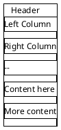

# UI Mockups for Skill Debugger

This directory contains PlantUML Salt wireframe mockups and their generated PNG images for the Skill Debugger UI design.

## Files

### Original Three-Column Design

**01_main_layout.puml / .png**
- Complete three-column layout
- Left: Sidebar with search, filters, skill list
- Middle: Overview panel with quick stats and trigger preview
- Right: Detail panel with tabs and content


### Tab View Mockups

**02_content_tab.puml / .png**
- Content tab showing rendered markdown
- Clean typography and formatting
- Syntax-highlighted code blocks


**03_triggers_tab.puml / .png**
- Trigger keyword analysis
- Color-coded badges by category (Action, Technology, Format, Topic)
- Example queries that trigger the skill
- Summary statistics


**04_diagram_tab.puml / .png**
- Skill architecture visualization
- Mermaid diagram showing relationships
- Export options and legend


### Revised Design (RECOMMENDED)

**05_revised_layout_v2.puml / .png**
- Two-column layout with top overview panel
- Top banner: Quick stats + trigger preview
- Description section below overview
- Full-width detail panel with tabs


## Key Differences: Original vs. Revised

### Original (Three-Column)
- Left: Sidebar (250px)
- Middle: Overview panel (350px) - **Takes space from detail**
- Right: Detail content (flexible)

**Problem**: Middle column reduces space for detailed content reading.

### Revised (Two-Column + Top Panel) ✅ RECOMMENDED
- Left: Sidebar (250px)
- Right: Main content area with:
  - Top: Overview banner (180px height)
  - Middle: Description section
  - Bottom: Tabs + full-width content

**Benefits**:
- Full-width content for comfortable reading
- Overview provides context without stealing space
- Description prominently displayed
- Better information hierarchy

## Design Principles

### Visual Hierarchy
1. **Primary**: Skill name and quick stats (overview panel)
2. **Secondary**: Description and tab navigation
3. **Tertiary**: Detailed content within tabs

### Information Density
- **Scannable**: Quick stats answer "what is this?" immediately
- **Progressive**: Overview → Description → Tabs → Details
- **Organized**: Related information grouped in cards

### Typography
- H1 (Skill Name): 24px bold
- H2 (Section Titles): 20px semibold
- H3 (Subsections): 16px semibold
- Body: 14px regular
- Small: 12px regular

### Colors
- **Primary Blue**: #4F46E5 (Indigo-600) - Accents, active states
- **Purple Badge**: #8B5CF6 - Claude location
- **Green Badge**: #10B981 - OpenCode location
- **Blue Badges**: Action keywords
- **Purple Badges**: Technology keywords
- **Green Badges**: Format keywords
- **Orange Badges**: Topic keywords

### Spacing (8px Grid)
- Tight: 8px
- Normal: 16px
- Loose: 24px
- Extra Loose: 32px

## Generating Images

These mockups use PlantUML Salt syntax to create wireframes. To regenerate the images:

```bash
# Navigate to this directory
cd docs/mockups

# Convert all .puml files to PNG
plantuml -tpng *.puml

# Or convert individual files
plantuml -tpng 01_main_layout.puml
```

### Requirements
- PlantUML installed (`brew install plantuml` on macOS)
- Java runtime (PlantUML dependency)

## Usage in Documentation

These images are referenced in:
- `../UI_SPECIFICATION.md` - Original three-column design
- `../UI_SPECIFICATION_V2.md` - Revised two-column + top panel design
- `../UI_DESIGN_PROPOSAL.md` - Comparison and proposal document

## Editing Mockups

The `.puml` files use PlantUML Salt wireframe syntax. Example:



### Salt Syntax Basics
- `{+` - Start bordered container
- `{/` - Start table/grid
- `{SI` - Start scrollable area
- `{#` - Start list
- `|` - Column separator
- `--` - Row separator
- `[Button]` - Button element
- `<b>Text</b>` - Bold text
- `<color:blue>Text</color>` - Colored text
- `<size:16>Text</size>` - Sized text

## Feedback

To provide feedback on these designs:
1. Review the images above
2. Consider the layout differences
3. Refer to the full specifications:
   - `../UI_SPECIFICATION_V2.md` (recommended approach)
   - `../UI_DESIGN_PROPOSAL.md` (comparison document)

## Implementation

These mockups guide the implementation of:
- Component structure (`src/components/`)
- Layout architecture (`src/components/Layout.tsx`)
- Visual styling (`src/App.css`)
- Color palette and typography scale

See `../UI_SPECIFICATION_V2.md` for implementation checklist and code examples.
