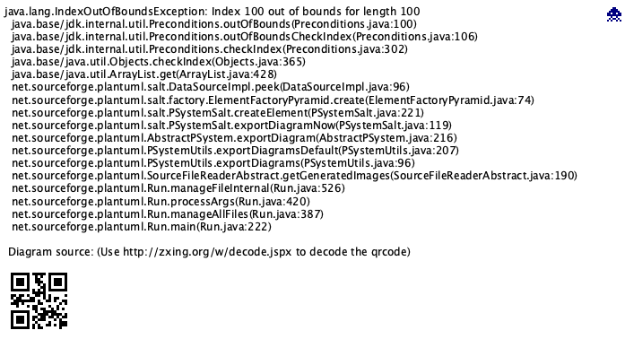
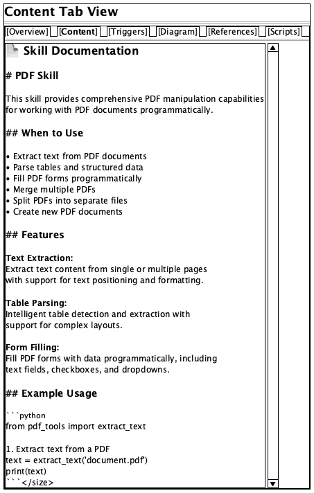
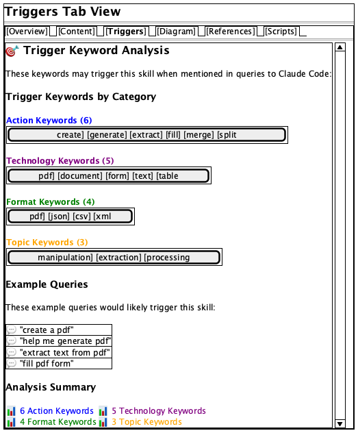

# UI Design Proposal for Skill Debugger

## Executive Summary

I've created a comprehensive UI specification for the Skill Debugger that addresses the current design issues and proposes a professional, modern, and user-friendly interface.

## Key Documents Created

1. **`docs/UI_SPECIFICATION.md`** - Complete UI specification with:
   - Design principles
   - Layout structure
   - Component specifications
   - Color palette
   - Typography scale
   - Spacing system
   - User interactions
   - Accessibility guidelines

2. **`docs/mockups/`** - PlantUML Salt mockups showing:
   - `01_main_layout.puml` - Complete three-column layout
   - `02_content_tab.puml` - Content tab view
   - `03_triggers_tab.puml` - Triggers tab with color-coded keywords
   - `04_diagram_tab.puml` - Diagram visualization view

## Visual Mockups

### Original Three-Column Design


### Revised Two-Column + Top Panel Design (RECOMMENDED)


### Tab Views
| Content Tab | Triggers Tab | Diagram Tab |
|-------------|--------------|-------------|
|  |  |  |

## Major Design Improvements

### 1. Three-Column Layout (vs. Current Single Column)

**Current Problem**: Everything is stacked vertically in one column, making it hard to scan and navigate.

**Proposed Solution**:
```
┌──────────────────────────────────────────────────────────┐
│ Sidebar  │  Overview Panel  │  Detail Panel             │
│  250px   │      350px       │    Flexible               │
├──────────┼──────────────────┼───────────────────────────┤
│ • Search │ Skill Name       │ Tab Navigation            │
│ • Filter │ Description      │ ┌───────────────────────┐ │
│ • Skills │ Quick Stats      │ │ [Overview] [Content]  │ │
│   List   │ - References: 12 │ │ [Triggers] [Diagram]  │ │
│          │ - Scripts: 3     │ └───────────────────────┘ │
│          │ - Triggers: 24   │                           │
│          │ - Lines: 1,245   │ Content Area              │
│          │ Trigger Preview  │                           │
│          │ [View Details→]  │                           │
└──────────┴──────────────────┴───────────────────────────┘
```

**Benefits**:
- **Progressive disclosure**: Browse → Summarize → Deep dive
- **Efficient use of screen space**: No wasted vertical scrolling
- **Better information architecture**: Related info grouped logically

### 2. Quick Stats Panel (New Feature)

Shows at-a-glance information before opening full details:

```
┌─────────────────────────────┐
│ Quick Stats                 │
├─────────────┬───────────────┤
│📚 References│ 🔧 Scripts    │
│     12      │      3        │
├─────────────┼───────────────┤
│🎯 Triggers  │ 📏 Lines      │
│     24      │    1,245      │
└─────────────┴───────────────┘
```

**Benefits**:
- Understand skill scope immediately
- No need to open skill to see basic info
- Visual, scannable format vs. raw JSON

### 3. Color-Coded Trigger Keywords (vs. Plain Text)

**Current**: Plain list of keywords, hard to categorize

**Proposed**: Color-coded badges by category
- 🔵 **Blue**: Action keywords (create, generate, build)
- 🟣 **Purple**: Technology keywords (pdf, excel, word)
- 🟢 **Green**: Format keywords (xlsx, docx, json)
- 🟠 **Orange**: Topic keywords (database, api, cloud)

**Benefits**:
- Quick visual scanning for specific trigger types
- Professional appearance
- Better understanding of skill capabilities

### 4. Structured Metadata Display (vs. Raw JSON)

**Current**: Raw JSON dump at bottom of page

**Proposed**: Organized cards and sections

```
┌────────────────────────────┐
│ 📝 Description             │
│ Clear, readable summary... │
└────────────────────────────┘

┌────────────────────────────┐
│ 📚 References (12)         │
│ ├ 📄 reference1.md         │
│ ├ 📄 reference2.md         │
│ └ ... and 10 more          │
│ [Expand All →]             │
└────────────────────────────┘

┌────────────────────────────┐
│ 🔧 Scripts (3)             │
│ ├ 🐍 setup.py              │
│ ├ 📜 convert.sh            │
│ └ 🟦 process.ts            │
└────────────────────────────┘
```

**Benefits**:
- Much easier to scan and understand
- Professional appearance
- Collapsible sections for optional details

### 5. Enhanced Visual Hierarchy

**Typography Scale**:
- H1 (Skill Name): 24px, bold
- H2 (Section): 20px, semibold
- H3 (Subsection): 16px, semibold
- Body: 14px, regular

**Spacing System** (8px grid):
- Tight: 8px
- Normal: 16px
- Loose: 24px
- Extra Loose: 32px

**Colors**:
- Primary: Indigo (#4F46E5)
- Background: Light Gray (#F9FAFB)
- Text: Dark Gray (#111827)
- Borders: Medium Gray (#E5E7EB)

**Benefits**:
- Clear visual hierarchy guides the eye
- Consistent spacing reduces cognitive load
- Professional color palette

## Current UI Issues Addressed

| Issue | Current State | Proposed Solution |
|-------|---------------|-------------------|
| **Layout** | Single column, everything stacked | Three-column progressive disclosure |
| **Overview** | Must open skill to see ANY details | Quick stats panel shows summary |
| **Metadata** | Raw JSON dump | Structured cards and sections |
| **Hierarchy** | Flat, hard to scan | Clear typography and spacing |
| **Clutter** | Too much info at once | Progressive disclosure, collapsible sections |
| **Navigation** | Basic list | Search + filter + organized list |
| **Triggers** | Plain text list | Color-coded badges by category |
| **Stats** | Hidden in JSON | Prominent quick stats cards |

## Viewing the Mockups

The PlantUML Salt mockups can be viewed by:

1. **Open the `.puml` files directly** in an editor (they're readable as text)
2. **Convert to images** (requires PlantUML):
   ```bash
   cd docs/mockups
   java -jar ~/plantuml.jar *.puml
   ```
3. **Use online PlantUML viewer**: Copy the content to https://www.plantuml.com/plantuml/

## Implementation Phases

### Phase 1: Core Layout (Foundation)
- Three-column flexbox/grid layout
- Basic card components
- Typography and color system

### Phase 2: Components (Features)
- Styled skill list items
- Quick stats cards
- Trigger keyword badges
- Tab navigation

### Phase 3: Polish (Refinement)
- Smooth transitions
- Hover states
- Loading states
- Responsive behavior

### Phase 4: Enhancement (Advanced)
- Search highlighting
- Collapsible sections
- Export functionality
- Keyboard shortcuts

## Design Rationale

### Why Three Columns?

**Progressive Information Disclosure:**
1. **Sidebar**: Browse and filter (navigation layer)
2. **Overview**: Quick understanding (summary layer)
3. **Detail**: Deep dive (comprehensive layer)

This mirrors how users actually work:
- "What skills are available?" → Sidebar
- "What does this skill do?" → Overview
- "How do I use this skill?" → Detail

### Why Cards and Sections?

1. **Visual Grouping**: Related information stays together
2. **Scannability**: Find specific info quickly
3. **Expandability**: Add sections without cluttering
4. **Professional**: Modern, clean aesthetic

### Why Color-Coded Badges?

1. **Quick Recognition**: Learn category colors instantly
2. **Visual Scanning**: Spot trigger types at a glance
3. **Professional**: Adds visual interest without clutter
4. **Accessible**: Used WITH text labels, not instead of

## Next Steps

1. **Review this specification** and the mockup files
2. **Provide feedback** on the proposed design
3. **Prioritize features** for implementation
4. **Begin Phase 1** implementation with core layout

## Questions for Discussion

1. **Layout Preference**: Do you prefer the three-column layout, or would you like a different approach?
2. **Color Scheme**: Do you like the proposed indigo/gray palette, or prefer different colors?
3. **Stats to Show**: Are the proposed quick stats (refs, scripts, triggers, lines) the right ones?
4. **Additional Features**: Any features not mentioned that you'd like to see?
5. **Implementation Priority**: Which phase should we start with?

---

**Files to Review**:
- `/docs/UI_SPECIFICATION.md` - Complete technical specification
- `/docs/mockups/*.puml` - Visual mockups (can be converted to images)

Let me know your thoughts on this design proposal!
