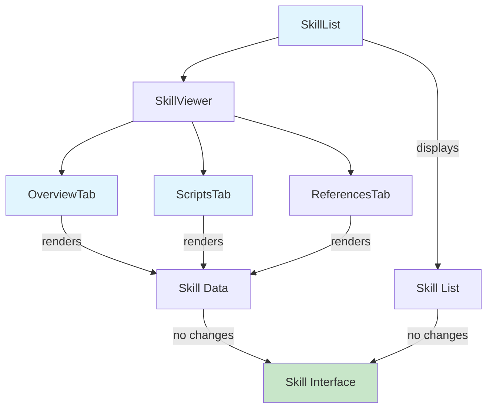

# Data Model: UI/UX Polish and Fixes

**Feature**: 004-ui-ux-polish
**Date**: 2025-01-12
**Phase**: 1 (Design & Contracts)

## Overview

This feature focuses on UI/UX improvements and does not introduce new data entities or backend models. All changes are presentational (view layer) modifications to existing React components that consume the already-defined `Skill` type.

## Existing Data Model

### Skill Interface (No Changes)

Located in `src/types/skill.ts`, the `Skill` interface remains unchanged:

```typescript
export interface Skill {
  name: string;
  path: string;
  content: string;
  description?: string;
  metadata: Record<string, any>;
  references: Reference[];
  scripts: Script[];
  triggers?: string[];
  location: 'claude' | 'opencode';
}
```

**No modifications required** - This feature only changes how this data is displayed, not the data structure itself.

## Component State Model

### 1. OverviewTab Component State

**Purpose**: Display skill information in logical order with proper spacing

**Local State**:
```typescript
interface OverviewTabState {
  // No new state required - renders props directly
}
```

**Props** (from parent SkillViewer):
```typescript
interface OverviewTabProps {
  skill: Skill;
}
```

**Derived Display Order**:
1. `skill.name` (h1)
2. `skill.location` (badge)
3. `skill.description` (if present)
4. `skill.metadata.version` (if present)
5. `skill.triggers` (preview of first 5)
6. Stats: `skill.references.length`, `skill.scripts.length`, `skill.triggers?.length`, content line count
7. Filtered metadata (excluding name, description, version to prevent duplicates)

**State Changes**: None - purely presentational reordering

---

### 2. SkillList Component State

**Purpose**: Display skill list with proper margins and text truncation

**Local State**:
```typescript
interface SkillListState {
  hoveredSkillPath: string | null; // Track hovered item for tooltip
}
```

**Props**:
```typescript
interface SkillListProps {
  skills: Skill[];
  selectedSkillPath: string | null;
  onSelectSkill: (skill: Skill) => void;
}
```

**Rendering Behavior**:
- Each skill name applies `.truncate` class
- Native `title` attribute shows full name on hover
- `hoveredSkillPath` tracks which item is hovered (for future tooltip enhancements)

**State Changes**:
- Add `hoveredSkillPath: string | null` local state
- Update on mouse enter/leave events

---

### 3. ScriptsTab Component State

**Purpose**: Display Python scripts with consistent syntax highlighting

**Local State** (New):
```typescript
interface ScriptsTabState {
  // No state needed - ReactMarkdown with rehype-highlight handles highlighting declaratively
}
```

**Current State** (to be removed):
```typescript
// OLD: Direct highlight.js usage with useEffect
const [highlightedCode, setHighlightedCode] = useState<string>('');

useEffect(() => {
  // Buggy imperative approach
  hljs.highlightAll();
}, [script]);
```

**New Approach** (Declarative):
```typescript
// NEW: ReactMarkdown with rehype-highlight (no state needed)
<ReactMarkdown rehypePlugins={[rehypeHighlight]}>
  {`\`\`\`${script.language}\n${script.content}\n\`\`\``}
</ReactMarkdown>
```

**Props**:
```typescript
interface ScriptsTabProps {
  scripts: Script[];
}
```

**State Changes**:
- Remove `highlightedCode` state
- Remove buggy `useEffect` hook
- Use declarative rendering via ReactMarkdown

---

### 4. Global State (Zustand Store)

**No changes required** to the global Zustand store. All UI polish changes are local component concerns.

**Existing Store** (`src/stores/skillStore.ts`):
```typescript
interface SkillStore {
  skills: Skill[];
  selectedSkill: Skill | null;
  loading: boolean;
  error: string | null;
  // ... other fields unchanged
}
```

---

## Component Relationships



**Legend**:
- Blue: Components being modified (UI/UX changes only)
- Green: Data model (unchanged)

---

## CSS/Styling Model

### TailwindCSS Spacing Utilities

**Standard Spacing Scale** (from TailwindCSS 4.1.17):
- `*-2` = 8px (0.5rem) - **Primary choice for minimum margins**
- `*-3` = 12px (0.75rem)
- `*-4` = 16px (1rem)
- `*-6` = 24px (1.5rem)

**Applied Classes**:

| Component | Current | New | Rationale |
|-----------|---------|-----|-----------|
| OverviewTab | `p-4` | `p-6` | Increase padding to 24px for better breathing room |
| SkillList items | `p-3` | `px-4 py-3` | Horizontal padding 16px, vertical 12px |
| ScriptsTab | `p-4` | `p-6` | Match OverviewTab consistency |
| ReferencesTab | `p-4` | `p-6` | Match OverviewTab consistency |
| Container divs | varies | `space-y-4` | Consistent 16px vertical spacing between sections |

### Text Truncation Classes

**TailwindCSS `.truncate` utility**:
```css
/* Built-in utility - no custom CSS needed */
.truncate {
  overflow: hidden;
  text-overflow: ellipsis;
  white-space: nowrap;
}
```

**Applied to**:
- Skill names in SkillList
- Trigger keywords (if exceeding container width)
- File paths in references (if needed)

---

## Validation Rules

### Spacing Validation

**Rule**: All text content must have minimum 8px margin from borders

**Verification**:
```typescript
// E2E test validation
const textElements = await page.locator('p, h1, h2, h3, li, span').all();
for (const el of textElements) {
  const box = await el.boundingBox();
  const parentBox = await el.locator('..').boundingBox();

  const marginLeft = box.x - parentBox.x;
  const marginRight = (parentBox.x + parentBox.width) - (box.x + box.width);

  expect(marginLeft).toBeGreaterThanOrEqual(8);
  expect(marginRight).toBeGreaterThanOrEqual(8);
}
```

### Ordering Validation

**Rule**: Overview tab displays information in this exact order

**Verification**:
```typescript
// Unit test validation
const { container } = render(<OverviewTab skill={mockSkill} />);
const children = container.firstChild.children;

expect(children[0].tagName).toBe('H1'); // Name
expect(children[1].className).toContain('badge'); // Location
expect(children[2].tagName).toBe('P'); // Description
expect(children[3].textContent).toContain('Version'); // Version (if present)
expect(children[4].textContent).toContain('Triggers'); // Triggers preview
```

### Truncation Validation

**Rule**: Text longer than container width must truncate with ellipsis

**Verification**:
```typescript
// E2E test validation
const longSkillName = 'A'.repeat(200);
await page.fill('[data-testid="skill-name-input"]', longSkillName);

const el = page.locator('[data-testid="skill-name-display"]');
const styles = await el.evaluate((node) => {
  const computed = window.getComputedStyle(node);
  return {
    overflow: computed.overflow,
    textOverflow: computed.textOverflow,
    whiteSpace: computed.whiteSpace,
  };
});

expect(styles.overflow).toBe('hidden');
expect(styles.textOverflow).toBe('ellipsis');
expect(styles.whiteSpace).toBe('nowrap');
```

### Syntax Highlighting Validation

**Rule**: Python syntax highlighting must work on every visit

**Verification**:
```typescript
// Integration test validation
for (let i = 0; i < 20; i++) {
  await page.click('[data-testid="overview-tab"]');
  await page.click('[data-testid="scripts-tab"]');

  const codeBlock = page.locator('code.language-python');
  const hasHighlightClasses = await codeBlock.evaluate((node) => {
    return node.querySelector('.hljs-keyword') !== null;
  });

  expect(hasHighlightClasses).toBe(true);
}
```

---

## Migration Strategy

### Phase 1: Component Modifications (Non-Breaking)

1. **Add new spacing classes** to components (backwards compatible)
2. **Update OverviewTab JSX** to reorder elements (visible change)
3. **Add `.truncate` classes** to skill names (graceful degradation)
4. **Switch ScriptsTab to ReactMarkdown** (improved reliability)

**Rollback**: Revert CSS classes, restore old JSX order

### Phase 2: Cleanup (Post-Validation)

1. Remove old `highlightedCode` state from ScriptsTab
2. Remove unused useEffect hooks
3. Remove duplicate description rendering logic

**No data migrations required** - all changes are view layer only.

---

## Dependencies

### Existing Dependencies (No New Installs)
- `tailwindcss` 4.1.17 - Provides spacing utilities
- `react-markdown` 10.1.0 - Already used in ReferencesTab
- `rehype-highlight` 7.0.2 - Already installed and working
- `@types/react` 19.1.0 - TypeScript types

### No Database/Storage Changes
This feature does not modify:
- File system operations
- Skill file parsing
- Metadata extraction
- Storage mechanisms

**All changes are in-memory presentation logic.**

---

## Testing Data Model

### Test Fixtures

**Mock Skill with Edge Cases**:
```typescript
export const mockSkillWithLongName: Skill = {
  name: 'A'.repeat(200), // Test truncation
  path: '/path/to/skill',
  content: '# Content',
  description: 'Test description',
  metadata: {},
  references: [],
  scripts: [{
    name: 'test.py',
    language: 'python',
    content: 'def hello():\n    print("world")',
    path: '/path/to/test.py',
  }],
  triggers: ['trigger1', 'trigger2'],
  location: 'claude',
};

export const mockSkillWithoutMetadata: Skill = {
  name: 'Minimal Skill',
  path: '/path/to/minimal',
  content: '# Minimal',
  // No description, no triggers, no version
  metadata: {},
  references: [],
  scripts: [],
  location: 'opencode',
};

export const mockSkillWithAllFields: Skill = {
  name: 'Complete Skill',
  path: '/path/to/complete',
  content: '# Complete',
  description: 'Full description',
  metadata: {
    version: '1.2.3',
    author: 'Test Author',
    tags: ['test', 'example'],
  },
  references: [/* ... */],
  scripts: [/* ... */],
  triggers: ['trigger1', 'trigger2', 'trigger3', 'trigger4', 'trigger5', 'trigger6'],
  location: 'claude',
};
```

---

## Summary

**Data Model Status**: ✅ No changes required

This feature is purely presentational. The existing `Skill` interface and Zustand store remain unchanged. All improvements are:
- CSS/TailwindCSS utility class updates
- JSX reordering in components
- Replacing imperative highlight.js with declarative ReactMarkdown
- Adding local component state for hover tracking

**Next Phase**: Generate TypeScript contracts for component interfaces in `specs/004-ui-ux-polish/contracts/`.
